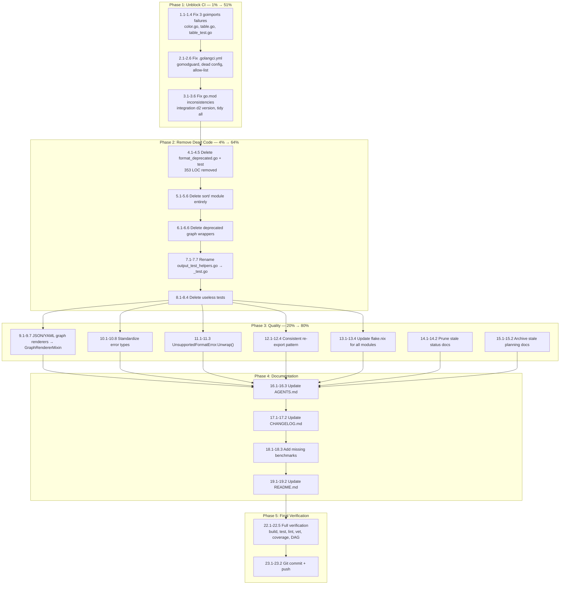

# Post-Modularization Polish & Ship — Execution Plan

**Date:** 2026-05-25
**Branch:** `modularize/extract-d2-graph`
**Status:** IN PROGRESS
**Scope:** 1% → 51% + 4% → 64% + 20% → 80% Pareto tiers

---

## Pareto Breakdown

### 1% → 51% (Blocking bugs, trivial fixes, immediate CI relief)

| ID | Task                                                         | Why                     |
| -- | ------------------------------------------------------------ | ----------------------- |
| A  | Fix 3 goimports failures (color.go, table.go, table_test.go) | Lint is RED — blocks CI |
| B  | Fix `.golangci.yml` invalid linter `gomodguard_v2`           | Linter silently skipped |
| C  | Fix `integration/go.mod` d2 pseudo-version                   | go.mod inconsistency    |

### 4% → 64% (Remove dead code + fix design smell)

| ID | Task                                                                        | Why                           |
| -- | --------------------------------------------------------------------------- | ----------------------------- |
| D  | Delete `format_deprecated.go` + test (353 LOC)                              | Dead deprecated API           |
| E  | Delete `sort/` module (only `ByField` remains, trivially replaceable)       | Dead deprecated module        |
| F  | Delete deprecated `MermaidFlowchartRenderer`/`MermaidTreeRenderer` wrappers | Dead code in graph/           |
| G  | Rename `output_test_helpers.go` → `_test.go`                                | Production dep on testhelpers |
| H  | Delete `TestContainsString` (tests stdlib `strings.Contains`)               | Useless test                  |

### 20% → 80% (Quality improvements)

| ID | Task                                                                              | Why                      |
| -- | --------------------------------------------------------------------------------- | ------------------------ |
| I  | `JSONGraphRenderer`/`YAMLGraphRenderer` → embed `GraphRendererMixin`              | Eliminate duplication    |
| J  | Clean `.golangci.yml` dead config (globally-enabled linters immediately excluded) | Config clarity           |
| K  | Prune stale docs (status/ reports, planning/ files)                               | Noise reduction          |
| L  | Update `flake.nix` to verify all 10 modules                                       | CI coverage gap          |
| M  | Standardize error types (sentinel → rich struct)                                  | API consistency          |
| N  | `go mod tidy` all modules                                                         | Hygiene                  |
| O  | Consistent re-export pattern for d2/ and graph/ branded IDs                       | Cross-module consistency |

### Deferred (80% effort → 20% result)

| ID | Task                                                                  | Why deferred              |
| -- | --------------------------------------------------------------------- | ------------------------- |
| P  | Normalize renderer naming (`MarkdownTable` → `MarkdownTableRenderer`) | Breaking change, cosmetic |
| Q  | Standardize `FromTableData` naming pattern                            | Breaking change, cosmetic |
| R  | Add streaming + XML benchmarks                                        | Nice-to-have              |
| S  | Remove or deprecate registry (zero production usage)                  | Low urgency               |
| T  | Update `.pre-commit-config.yaml`                                      | Non-nix users only        |
| U  | Add `EdgeStyle.Style` as defined type                                 | Minor type safety         |

---

## Execution Graph

---

## Comprehensive Plan (23 tasks, 30-100min each)

| #  | Task                                                           | Impact          | Effort | Tier  | Depends on |
| -- | -------------------------------------------------------------- | --------------- | ------ | ----- | ---------- |
| 1  | Fix 3 goimports failures (color.go, table.go, table_test.go)   | Unblocks CI     | 30min  | 1%    | —          |
| 2  | Fix `.golangci.yml` (gomodguard name, dead config, allow-list) | Config fix      | 45min  | 1%    | —          |
| 3  | Fix `integration/go.mod` + `go mod tidy` all modules           | Correctness     | 30min  | 1%    | —          |
| 4  | Delete `format_deprecated.go` + test (353 LOC)                 | Dead code       | 45min  | 4%    | 1,2,3      |
| 5  | Delete `sort/` module entirely                                 | Dead module     | 30min  | 4%    | 4          |
| 6  | Delete deprecated graph wrappers                               | Dead code       | 30min  | 4%    | 4          |
| 7  | Rename `output_test_helpers.go` → `_test.go`                   | Design fix      | 45min  | 4%    | 4          |
| 8  | Delete useless tests (`TestContainsString`)                    | Test quality    | 30min  | 4%    | 4          |
| 9  | JSON/YAML graph → `GraphRendererMixin`                         | Dedup           | 60min  | 20%   | 4          |
| 10 | Standardize error types (sentinel → rich struct)               | API consistency | 60min  | 20%   | 4          |
| 11 | Add `UnsupportedFormatError.Unwrap()`                          | Error handling  | 45min  | 20%   | 10         |
| 12 | Consistent re-export pattern d2/graph                          | Consistency     | 30min  | 20%   | 4          |
| 13 | Update `flake.nix` for all 10 modules                          | CI coverage     | 45min  | 20%   | 5          |
| 14 | Prune stale docs/status/                                       | Noise reduction | 15min  | 20%   | —          |
| 15 | Archive stale docs/planning/                                   | Noise reduction | 15min  | 20%   | —          |
| 16 | Update `AGENTS.md`                                             | Documentation   | 30min  | 20%   | 4-13       |
| 17 | Update `CHANGELOG.md`                                          | Documentation   | 30min  | 20%   | 4-13       |
| 18 | Add missing benchmarks (streaming, XML)                        | Perf coverage   | 45min  | 20%   | 9          |
| 19 | Update `README.md`                                             | Documentation   | 30min  | 20%   | 4-13       |
| 20 | Update `.pre-commit-config.yaml`                               | Non-nix users   | 30min  | defer | —          |
| 21 | Deprecate registry (zero production usage)                     | Dead code       | 45min  | defer | —          |
| 22 | Final full verification (build/test/lint/vet/coverage/DAG)     | Quality gate    | 30min  | —     | 1-21       |
| 23 | Git commit + push                                              | Delivery        | 15min  | —     | 22         |

---

## Detailed Breakdown (87 tasks, max 15min each)

### Phase 1: Unblock CI (Tasks 1-3)

#### Task 1: Fix 3 goimports failures

| Sub | Action                                                  | File(s)               | Effort |
| --- | ------------------------------------------------------- | --------------------- | ------ |
| 1.1 | Separate local `enum` import from third-party `x/term`  | `color.go`            | 3min   |
| 1.2 | Separate local `go-output` import from `lipgloss`       | `table/table.go`      | 3min   |
| 1.3 | Separate local `testhelpers` from `lipgloss`            | `table/table_test.go` | 3min   |
| 1.4 | Verify: `golangci-lint run ./...` clean on root + table | —                     | 5min   |

#### Task 2: Fix `.golangci.yml`

| Sub | Action                             | Detail                                                | Effort |
| --- | ---------------------------------- | ----------------------------------------------------- | ------ |
| 2.1 | Fix linter name                    | `gomodguard_v2` → `gomodguard`                        | 3min   |
| 2.2 | Add to allow-list                  | Add `testhelpers` to `replace-allow-list`             | 3min   |
| 2.3 | Remove dead config                 | Remove linters from enable that are globally excluded | 5min   |
| 2.4 | Remove duplicate rules             | Deduplicate `_test.go$` exclusion rules               | 3min   |
| 2.5 | Remove empty config                | Remove `formats: {}` if present                       | 2min   |
| 2.6 | Verify: lint passes on all modules | —                                                     | 5min   |

#### Task 3: Fix go.mod + tidy all

| Sub | Action                           | Module                                                        | Effort |
| --- | -------------------------------- | ------------------------------------------------------------- | ------ |
| 3.1 | Fix d2 pseudo-version → `v0.0.0` | integration                                                   | 2min   |
| 3.2 | `go mod tidy`                    | d2                                                            | 3min   |
| 3.3 | `go mod tidy`                    | graph                                                         | 3min   |
| 3.4 | `go mod tidy`                    | root                                                          | 3min   |
| 3.5 | `go mod tidy`                    | enum, escape, table, sort, testhelpers, integration, examples | 5min   |
| 3.6 | Verify: all modules build        | all                                                           | 5min   |

### Phase 2: Remove Dead Code (Tasks 4-8)

#### Task 4: Delete `format_deprecated.go` + test

| Sub | Action                           | Detail                                                  | Effort |
| --- | -------------------------------- | ------------------------------------------------------- | ------ |
| 4.1 | Delete file                      | `format_deprecated.go` (96 LOC)                         | 2min   |
| 4.2 | Delete file                      | `format_deprecated_test.go` (257 LOC)                   | 2min   |
| 4.3 | Search for references            | `OutputFormat`, `FormatCategory`, `IsTableFormat`, etc. | 5min   |
| 4.4 | Remove references found          | integration tests, examples, etc.                       | 10min  |
| 4.5 | Verify: root builds + tests pass | —                                                       | 5min   |

#### Task 5: Delete `sort/` module

| Sub | Action                            | Detail                                | Effort |
| --- | --------------------------------- | ------------------------------------- | ------ |
| 5.1 | Delete directory                  | `sort/` and all contents              | 2min   |
| 5.2 | Search for imports                | `go-output/sort` across all modules   | 3min   |
| 5.3 | Remove references                 | tests, examples, go.mod files         | 10min  |
| 5.4 | Remove from go.mod files          | replace/require blocks in all modules | 5min   |
| 5.5 | `go mod tidy` in affected modules | —                                     | 5min   |
| 5.6 | Verify: all modules build         | —                                     | 5min   |

#### Task 6: Delete deprecated graph wrappers

| Sub | Action                                   | Detail                                 | Effort |
| --- | ---------------------------------------- | -------------------------------------- | ------ |
| 6.1 | Read mermaid.go                          | Identify deprecated wrappers           | 3min   |
| 6.2 | Remove `MermaidFlowchartRenderer`        | Deprecated wrapper in graph/mermaid.go | 5min   |
| 6.3 | Remove `MermaidTreeRenderer`             | Deprecated wrapper in graph/mermaid.go | 5min   |
| 6.4 | Search for callers                       | Across all modules                     | 3min   |
| 6.5 | Update callers found                     | examples, integration                  | 5min   |
| 6.6 | Verify: graph module builds + tests pass | —                                      | 5min   |

#### Task 7: Rename `output_test_helpers.go` → `_test.go`

| Sub | Action                           | Detail                                                   | Effort |
| --- | -------------------------------- | -------------------------------------------------------- | ------ |
| 7.1 | Read file                        | Understand contents                                      | 5min   |
| 7.2 | Rename file                      | `output_test_helpers.go` → `output_test_helpers_test.go` | 2min   |
| 7.3 | Unexport `AssertTreeNodeDepth`   | Rename to `assertTreeNodeDepth`                          | 3min   |
| 7.4 | Update `tree_test.go`            | Use unexported version                                   | 2min   |
| 7.5 | Remove testhelpers from go.mod   | Remove from direct require block                         | 3min   |
| 7.6 | `go mod tidy` in root            | —                                                        | 3min   |
| 7.7 | Verify: root builds + tests pass | No production testhelpers dep                            | 5min   |

#### Task 8: Delete useless tests

| Sub | Action                       | Detail                               | Effort |
| --- | ---------------------------- | ------------------------------------ | ------ |
| 8.1 | Delete `TestContainsString`  | `graph/graph_test.go` — tests stdlib | 2min   |
| 8.2 | Scan for other useless tests | Tests that test stdlib behavior      | 5min   |
| 8.3 | Remove any found             | —                                    | 5min   |
| 8.4 | Verify: all tests still pass | —                                    | 5min   |

### Phase 3: Quality Improvements (Tasks 9-13)

#### Task 9: JSON/YAML graph → GraphRendererMixin

| Sub | Action                           | Detail                     | Effort |
| --- | -------------------------------- | -------------------------- | ------ |
| 9.1 | Read `JSONGraphRenderer`         | `json_renderers.go`        | 5min   |
| 9.2 | Read `YAMLGraphRenderer`         | `yaml_renderers.go`        | 5min   |
| 9.3 | Read `GraphRendererMixin`        | `graph.go`                 | 5min   |
| 9.4 | Refactor `JSONGraphRenderer`     | Embed `GraphRendererMixin` | 10min  |
| 9.5 | Refactor `YAMLGraphRenderer`     | Embed `GraphRendererMixin` | 10min  |
| 9.6 | Update tests for both            | —                          | 10min  |
| 9.7 | Verify: root builds + tests pass | —                          | 5min   |

#### Task 10: Standardize error types

| Sub  | Action                         | Detail                                                | Effort |
| ---- | ------------------------------ | ----------------------------------------------------- | ------ |
| 10.1 | Audit all sentinel errors      | List: `ErrInvalidShape`, `ErrInvalidGraphShape`, etc. | 5min   |
| 10.2 | Design consistent pattern      | Rich struct with `Value` + `Allowed` fields           | 10min  |
| 10.3 | Replace `ErrInvalidShape`      | → `InvalidShapeError` struct                          | 5min   |
| 10.4 | Replace `ErrInvalidGraphShape` | → `InvalidGraphShapeError` struct                     | 5min   |
| 10.5 | Replace `ErrInvalidSortBy`     | → `InvalidSortByError` struct                         | 5min   |
| 10.6 | Replace `ErrInvalidColorMode`  | → `InvalidColorModeError` struct                      | 5min   |
| 10.7 | Update all callers/tests       | —                                                     | 10min  |
| 10.8 | Verify: all tests pass         | —                                                     | 5min   |

#### Task 11: `UnsupportedFormatError.Unwrap()`

| Sub  | Action                | Detail                              | Effort |
| ---- | --------------------- | ----------------------------------- | ------ |
| 11.1 | Add `Unwrap()` method | `render_tabledata.go`               | 3min   |
| 11.2 | Add test              | Verify `errors.Is`/`errors.As` work | 5min   |
| 11.3 | Verify consistency    | All error types support chain       | 5min   |

#### Task 12: Consistent re-export pattern

| Sub  | Action                     | Detail                                       | Effort |
| ---- | -------------------------- | -------------------------------------------- | ------ |
| 12.1 | Check d2/ re-exports       | `D2NodeID`, `D2NodeLabel` type aliases       | 3min   |
| 12.2 | Add graph/ re-exports      | `GraphNodeID`, `GraphNodeLabel` type aliases | 10min  |
| 12.3 | Update graph/ tests        | Use re-exported types                        | 5min   |
| 12.4 | Verify: both modules build | —                                            | 5min   |

#### Task 13: Update `flake.nix` for all modules

| Sub  | Action                           | Detail                                 | Effort |
| ---- | -------------------------------- | -------------------------------------- | ------ |
| 13.1 | Read current flake.nix           | Understand build checks                | 5min   |
| 13.2 | Add per-module build checks      | All 9 remaining modules (sort removed) | 10min  |
| 13.3 | Add per-module test checks       | All modules with tests                 | 10min  |
| 13.4 | Verify: `nix flake check` passes | —                                      | 10min  |

### Phase 4: Documentation (Tasks 14-19)

#### Task 14: Prune stale status docs

| Sub  | Action                       | Detail                            | Effort |
| ---- | ---------------------------- | --------------------------------- | ------ |
| 14.1 | Delete 3 oldest reports      | Keep latest 2 from `docs/status/` | 3min   |
| 14.2 | Verify docs/ structure clean | —                                 | 2min   |

#### Task 15: Archive stale planning docs

| Sub  | Action                       | Detail                                         | Effort |
| ---- | ---------------------------- | ---------------------------------------------- | ------ |
| 15.1 | Archive 3 stale plans        | Pre-modularization plans from `docs/planning/` | 5min   |
| 15.2 | Verify planning docs current | —                                              | 2min   |

#### Task 16: Update `AGENTS.md`

| Sub  | Action                | Detail                            | Effort |
| ---- | --------------------- | --------------------------------- | ------ |
| 16.1 | Update module table   | Remove sort/, update LOC counts   | 10min  |
| 16.2 | Update build commands | Remove sort/ from per-module loop | 5min   |
| 16.3 | Update coverage table | Current coverage numbers          | 5min   |

#### Task 17: Update `CHANGELOG.md`

| Sub  | Action                               | Detail                  | Effort |
| ---- | ------------------------------------ | ----------------------- | ------ |
| 17.1 | Add entries for all breaking changes | Deprecated API removals | 10min  |
| 17.2 | Verify format                        | Keep a Changelog format | 5min   |

#### Task 18: Add missing benchmarks

| Sub  | Action                   | Detail               | Effort |
| ---- | ------------------------ | -------------------- | ------ |
| 18.1 | Add streaming benchmarks | `benchmarks_test.go` | 10min  |
| 18.2 | Add XML benchmarks       | `benchmarks_test.go` | 5min   |
| 18.3 | Run benchmarks to verify | —                    | 5min   |

#### Task 19: Update `README.md`

| Sub  | Action                           | Detail                              | Effort |
| ---- | -------------------------------- | ----------------------------------- | ------ |
| 19.1 | Remove deprecated API references | OutputFormat, FormatCategory, sort/ | 10min  |
| 19.2 | Remove sort/ module references   | Import examples                     | 5min   |

### Phase 5: Final Verification (Tasks 20-23)

#### Task 20: Update `.pre-commit-config.yaml` (if time permits)

| Sub  | Action                  | Detail                      | Effort |
| ---- | ----------------------- | --------------------------- | ------ |
| 20.1 | Update hook versions    | pre-commit-hooks v5.0.0     | 10min  |
| 20.2 | Add per-module coverage | Sub-module build/test hooks | 10min  |

#### Task 21: Deprecate registry (if time permits)

| Sub  | Action                      | Detail                     | Effort |
| ---- | --------------------------- | -------------------------- | ------ |
| 21.1 | Add `// Deprecated` notices | All registry functions     | 10min  |
| 21.2 | Update docs                 | Explain registry is unused | 5min   |

#### Task 22: Final verification

| Sub  | Action           | Detail                                 | Effort |
| ---- | ---------------- | -------------------------------------- | ------ |
| 22.1 | Full test suite  | All modules: `go test ./...`           | 10min  |
| 22.2 | Full lint        | All modules: `golangci-lint run ./...` | 5min   |
| 22.3 | Full vet         | All modules: `go vet ./...`            | 5min   |
| 22.4 | DAG verification | Root has zero sub-module imports       | 5min   |
| 22.5 | Coverage check   | Verify no regression                   | 5min   |

#### Task 23: Commit + push

| Sub  | Action         | Detail                                | Effort |
| ---- | -------------- | ------------------------------------- | ------ |
| 23.1 | Stage + commit | Detailed message covering all changes | 10min  |
| 23.2 | Push to remote | `git push`                            | 3min   |

---

## Summary Statistics

| Metric                      | Value                |
| --------------------------- | -------------------- |
| Total tasks (comprehensive) | 23                   |
| Total sub-tasks (detailed)  | 87                   |
| Estimated total effort      | ~12-14 hours         |
| Phase 1 (unblock CI)        | ~1.5 hours           |
| Phase 2 (dead code)         | ~3 hours             |
| Phase 3 (quality)           | ~4 hours             |
| Phase 4 (docs)              | ~2 hours             |
| Phase 5 (verify)            | ~1.5 hours           |
| Deferred tasks              | 6 (P, Q, R, S, T, U) |
