# Superb Outputs — Dead Code Cleanup & Color Integration

**Date:** 2026-05-25 21:19
**Branch:** `feature/superb-outputs`
**Scope:** Delete dead code, wire ColorMode into renderers, make terminal output actually superb
**Constraint:** Each task ≤ 15 min

---

## Executive Summary

This library promises "consistent output formatting for CLI applications" but delivers **monochrome output** for every format except `table/` (which has hardcoded lipgloss colors with no ColorMode control). The `ColorMode` type exists with full terminal detection — `ShouldColor()`, `NO_COLOR` support, CI detection — but **nothing uses it**.

This plan does two things:

1. **Delete genuinely dead code** (deprecated registry, SortBy) — 173 LOC removed
2. **Wire color infrastructure** into every terminal-facing renderer — the 1% that delivers 51%

---

## Pareto Analysis

### The 1% that delivers 51% of the result

**Wire ColorMode → table renderer.** The table is the most visible output format. Right now it always emits ANSI codes even when piped to a file. Fixing this one thing makes the library "not broken" for the primary use case.

### The 4% that delivers 64% of the result

**Colored tree output.** `ASCIITreeRenderer` is the second most terminal-visible format. Adding colors to tree nodes (depth-based coloring, dimmed connectors, bold labels) transforms it from "meh" to "wow". Plus: delete dead registry + sort code.

### The 20% that delivers 80% of the result

**ColorMode in RenderOptions + colored markdown-in-terminal.** Make `RenderTableData` propagate ColorMode. Add optional ANSI enhancement to MarkdownTable when stdout is a TTY. This makes the dispatcher color-aware and gives users rich terminal output for the two most common formats.

---

## What We're NOT Doing (deferred)

- New formats (TOML, JSONL, PlantUML, AsciiDoc)
- Color themes/profiles
- Per-renderer color customization API
- `internal/gentest` migration decision
- Pre-commit hook fixes
- Community posting
- Release tagging

---

## Dependency Analysis

### Dead Code — Zero External Callers

| Symbol                                                        | File          | External Prod Callers | Verdict |
| ------------------------------------------------------------- | ------------- | --------------------- | ------- |
| Register, Unregister, Create, RegisteredFormats, IsRegistered | `registry.go` | ZERO                  | DELETE  |
| SortBy, ParseSortBy                                           | `sort.go`     | ZERO                  | DELETE  |

### Alive Code — Must Keep & Wire

| Symbol                 | File         | External Prod Callers        | Verdict                |
| ---------------------- | ------------ | ---------------------------- | ---------------------- |
| ColorMode, ShouldColor | `color.go`   | ZERO — but designed for this | KEEP & WIRE            |
| FilledStrings          | `slices.go`  | ZERO — trivial wrapper       | DELETE (inline)        |
| BrandedValue           | `marshal.go` | ZERO — dead export           | DELETE from marshal.go |

---

## Overall Progress

| Phase     | Description                                            | Status    | Tasks    |
| --------- | ------------------------------------------------------ | --------- | -------- |
| Phase 1   | 1%→51%: Wire ColorMode → table                         | ⬜ TODO   | 0/7      |
| Phase 2   | 4%→64%: Delete dead code + colored tree                | ⬜ TODO   | 0/12     |
| Phase 3   | 20%→80%: ColorMode in RenderOptions + colored markdown | ⬜ TODO   | 0/14     |
| Phase 4   | Fix external refs + clean go.mod                       | ⬜ TODO   | 0/8      |
| Phase 5   | Documentation + examples                               | ⬜ TODO   | 0/8      |
| Phase 6   | Verify all modules                                     | ⬜ TODO   | 0/4      |
| **Total** |                                                        | **⬜ 0%** | **0/53** |

---

## Execution Graph

```mermaid
graph TD
    subgraph "Phase 1: 1% → 51% — Wire ColorMode → Table"
        P1A["01-02: Delete registry.go + sort.go"]
        P1B["03: Add ColorMode to table.New()"]
        P1C["04: Table respects ShouldColor"]
        P1D["05: Table tests for color modes"]
        P1E["06: Update table examples"]
        P1F["07: Verify table module"]
    end

    subgraph "Phase 2: 4% → 64% — Colored Tree + Dead Code"
        P2A["08: Delete registry_test.go + sort_test.go"]
        P2B["09: Delete slices.go + slices_test.go"]
        P2C["10: Fix FilledStrings refs in integration"]
        P2C2["10b: Delete BrandedValue from marshal.go"]
        P2D["11: Delete TestFormatRegistry from integration"]
        P2E["12: Add color support to ASCIITreeRenderer"]
        P2F["13: Tree color tests"]
        P2G["14: Verify root + all modules"]
    end

    subgraph "Phase 3: 20% → 80% — RenderOptions + Colored Markdown"
        P3A["15: Add ColorMode to RenderOptions"]
        P3B["16: RenderTableData propagates ColorMode"]
        P3C["17: MarkdownTable respects ColorMode"]
        P3D["18: Colored markdown tests"]
        P3E["19: Sub-modules pass ColorMode through"]
        P3F["20: StreamingRenderer color support"]
        P3G["21: Verify all format modules"]
    end

    subgraph "Phase 4: Cleanup"
        P4A["22: Clean dead code from test helpers"]
        P4B["23: Search & fix all stale refs"]
        P4C["24: go mod tidy all modules"]
        P4D["25: Remove x/term from depguard if color.go stays"]
    end

    subgraph "Phase 5: Documentation"
        P5A["26: Update AGENTS.md"]
        P5B["27: Update CHANGELOG.md"]
        P5C["28: Update README.md with color examples"]
        P5D["29: Update FEATURES.md"]
        P5E["30: Update DEPENDENCY_GRAPH.md"]
        P5F["31: Update examples/basic with --color flag"]
        P5G["32: Verify docs accuracy"]
    end

    subgraph "Phase 6: Final Verification"
        P6A["33: Full root test suite"]
        P6B["34: All sub-module tests"]
        P6C["35: Lint all modules"]
        P6D["36: Final git status check"]
    end

    P1A --> P1B --> P1C --> P1D --> P1E --> P1F
    P1F --> P2A
    P2A --> P2B --> P2C --> P2C2 --> P2D --> P2E --> P2F --> P2G
    P2G --> P3A
    P3A --> P3B --> P3C --> P3D --> P3E --> P3F --> P3G
    P3G --> P4A
    P4A --> P4B --> P4C --> P4D
    P4D --> P5A
    P5A --> P5B --> P5C --> P5D --> P5E --> P5F --> P5G
    P5G --> P6A
    P6A --> P6B --> P6C --> P6D
```



---

## Micro-Task Breakdown (53 tasks, max 15 min each)

### Phase 1: 1% → 51% — Wire ColorMode → Table Renderer

| #  | Task                                                                                                                                                                                                                                                 | File(s)                  | Impact      | Effort  | Est |
| -- | ---------------------------------------------------------------------------------------------------------------------------------------------------------------------------------------------------------------------------------------------------- | ------------------------ | ----------- | ------- | --- |
| 01 | Delete `registry.go` — all 5 functions deprecated, zero external prod callers                                                                                                                                                                        | `registry.go`            | 🔴 Critical | Trivial | 1m  |
| 02 | Delete `sort.go` — deprecated SortBy enum, zero external callers                                                                                                                                                                                     | `sort.go`                | 🔴 Critical | Trivial | 1m  |
| 03 | Add `ColorMode` field to `table.Table` struct. Add `table.WithColorMode(mode output.ColorMode)` option. When `ColorModeNever`, set lipgloss `RenderMarkdown()` (no ANSI). When `ColorModeAlways`, force ANSI. When `ColorModeAuto`, detect terminal. | `table/table.go`         | 🔴 Critical | Small   | 10m |
| 04 | Update `table.New()` to accept `ColorMode` via functional options. Default: `ColorModeAuto`. Pass to lipgloss `HasDarkBackground` or use conditional `StyleFunc` — when colors disabled, use `lipgloss.NewStyle()` without `Foreground()`.           | `table/table.go`         | 🔴 Critical | Small   | 10m |
| 05 | Add tests: `TestTableColorModeNever`, `TestTableColorModeAlways`, `TestTableColorModeAuto`. Verify no ANSI codes when `Never`, ANSI present when `Always`.                                                                                           | `table/table_test.go`    | 🟠 High     | Small   | 10m |
| 06 | Update `examples/basic/main.go` table section to pass `ColorMode` from a `--color` CLI flag                                                                                                                                                          | `examples/basic/main.go` | 🟡 Medium   | Trivial | 5m  |
| 07 | Verify: `cd table && go build ./... && go test ./...` passes. Verify `cd examples && go build ./...` passes.                                                                                                                                         | `table/`, `examples/`    | 🔴 Critical | Trivial | 3m  |

**Phase 1 Commit:** `feat(table): wire ColorMode into table renderer, delete dead registry and sort`

---

### Phase 2: 4% → 64% — Dead Code Cleanup + Colored Tree

| #  | Task                                                                                                                                                                                                                                    | File(s)                        | Impact      | Effort  | Est |
| -- | --------------------------------------------------------------------------------------------------------------------------------------------------------------------------------------------------------------------------------------- | ------------------------------ | ----------- | ------- | --- |
| 08 | Delete `registry_test.go` — tests for deleted deprecated registry                                                                                                                                                                       | `registry_test.go`             | 🟠 High     | Trivial | 1m  |
| 09 | Delete `sort_test.go` — tests for deleted SortBy enum                                                                                                                                                                                   | `sort_test.go`                 | 🟠 High     | Trivial | 1m  |
| 10 | Delete `slices.go` + `slices_test.go` — FilledStrings is a trivial `slices.Repeat` wrapper with zero external callers                                                                                                                   | `slices.go`, `slices_test.go`  | 🟢 Low      | Trivial | 1m  |
| 11 | Replace `output.FilledStrings(10, "Col")` in `integration/workflow_test.go` with inline `slices.Repeat([]string{"Col"}, 10)`. Add `"slices"` import if missing.                                                                         | `integration/workflow_test.go` | 🔴 Critical | Trivial | 3m  |
| 12 | Delete `BrandedValue()` from `marshal.go` — zero production callers. Remove the function and its comment.                                                                                                                               | `marshal.go`                   | 🟡 Medium   | Trivial | 2m  |
| 13 | Delete `TestFormatRegistry` from `integration/format_test.go` (lines 112-136) — tests deleted registry API                                                                                                                              | `integration/format_test.go`   | 🟠 High     | Trivial | 2m  |
| 14 | Clean `testing_test.go` — verify `testParseEnum`, `testEnumString`, `testAllowedValues` still used after sort/color test deletion. Remove any that became unused.                                                                       | `testing_test.go`              | 🟡 Medium   | Small   | 5m  |
| 15 | Clean `output_test_helpers_test.go` — remove any helpers only used by deleted test files                                                                                                                                                | `output_test_helpers_test.go`  | 🟡 Medium   | Trivial | 3m  |
| 16 | Add `ColorMode` field to `ASCIITreeRenderer`. Add `WithColorMode()` method. When colors enabled: bold node labels, dimmed connectors (`│`, `├──`, `└──`) in gray, metadata in cyan. Use simple ANSI escape sequences (no external dep). | `tree.go`                      | 🔴 Critical | Small   | 12m |
| 17 | Add `shouldColor()` private method on `ASCIITreeRenderer` that checks ColorMode (auto→terminal detect, always→true, never→false). Use `color.go` logic.                                                                                 | `tree.go`                      | 🟠 High     | Trivial | 5m  |
| 18 | Add `coloredRenderNode()` method — same as `renderNode()` but wraps segments with ANSI codes. Bold for labels, dim for connectors, cyan for metadata.                                                                                   | `tree.go`                      | 🟠 High     | Small   | 10m |
| 19 | Add tree color tests: `TestTreeColorModeNever` (no ANSI), `TestTreeColorModeAlways` (ANSI present), `TestTreeColoredMetadata`                                                                                                           | `tree_test.go`                 | 🟠 High     | Small   | 10m |
| 20 | Verify: root `go build ./... && go test ./...` passes. Verify `integration/ go test ./...` passes.                                                                                                                                      | root, integration              | 🔴 Critical | Trivial | 3m  |

**Phase 2 Commit:** `feat(tree): add colored tree output, delete dead code (registry, sort, slices, BrandedValue)`

---

### Phase 3: 20% → 80% — ColorMode in RenderOptions + Colored Markdown

| #  | Task                                                                                                                                                                                                                | File(s)               | Impact      | Effort  | Est |
| -- | ------------------------------------------------------------------------------------------------------------------------------------------------------------------------------------------------------------------- | --------------------- | ----------- | ------- | --- |
| 21 | Add `ColorMode` field to `RenderOptions` in `render_tabledata.go`                                                                                                                                                   | `render_tabledata.go` | 🟠 High     | Trivial | 2m  |
| 22 | Update `RenderTableData()` to resolve `ColorMode` from options (default: `ColorModeAuto`). Pass resolved mode to format-specific renderers via the `TableDataMarshaler` signature or `RenderOptions`.               | `render_tabledata.go` | 🟠 High     | Small   | 8m  |
| 23 | Add `ColorMode` to `MarkdownTable` struct. Add `SetColorMode()` method. When colors enabled and terminal detected: bold headers, dimmed separators, colored alignment markers.                                      | `markdown.go`         | 🟠 High     | Small   | 10m |
| 24 | Update `renderMarkdownTableData()` in `render_tabledata.go` to pass `ColorMode` from `RenderOptions` to `MarkdownTable`                                                                                             | `render_tabledata.go` | 🟠 High     | Trivial | 3m  |
| 25 | Add markdown color tests: `TestMarkdownColorModeNever`, `TestMarkdownColorModeAlways`. Verify ANSI codes present/absent.                                                                                            | `markdown_test.go`    | 🟠 High     | Small   | 8m  |
| 26 | Update `TableDataMarshaler` type to receive `ColorMode` via `RenderOptions` (already has `RenderOptions` param — just ensure ColorMode is populated). Verify delimited/markup/serialization sub-modules receive it. | `render_tabledata.go` | 🟡 Medium   | Trivial | 5m  |
| 27 | Update `renderTreeTableData()` to pass `ColorMode` from `RenderOptions` to `ASCIITreeRenderer`                                                                                                                      | `render_tabledata.go` | 🟡 Medium   | Trivial | 3m  |
| 28 | Add `ColorMode` to `StreamingRendererFromRenderer` adapter — pass through to wrapped renderer if it supports `SetColorMode()`                                                                                       | `streaming.go`        | 🟢 Low      | Trivial | 5m  |
| 29 | Verify: `go build ./... && go test ./...` in root passes. Sub-module tests still pass.                                                                                                                              | all                   | 🔴 Critical | Trivial | 3m  |

**Phase 3 Commit:** `feat(color): add ColorMode to RenderOptions, colored markdown output, color propagation`

---

### Phase 4: Cleanup + go.mod Hygiene

| #  | Task                                                                                                                                                                                                             | File(s)                       | Impact      | Effort  | Est |
| -- | ---------------------------------------------------------------------------------------------------------------------------------------------------------------------------------------------------------------- | ----------------------------- | ----------- | ------- | --- |
| 30 | Remove `errorRenderer` type from `format_test.go` — replaced by `testhelpers.ErrorRenderer` in prior commit. Verify no references remain.                                                                        | `format_test.go`              | 🟢 Low      | Trivial | 2m  |
| 31 | Search entire codebase for stale refs: `Register(`, `Unregister(`, `Create(format`, `IsRegistered`, `RegisteredFormats`, `SortBy`, `FilledStrings`, `BrandedValue`, `errTest`, `RendererFactory`. Fix any found. | all files                     | 🔴 Critical | Small   | 8m  |
| 32 | Run `go mod tidy` in root — verify no unnecessary deps remain.                                                                                                                                                   | `go.mod`                      | 🟠 High     | Trivial | 2m  |
| 33 | Run `go mod tidy` in all sub-modules (delimited, markup, serialization, d2, graph, table, integration, examples)                                                                                                 | all `go.mod`                  | 🟡 Medium   | Small   | 5m  |
| 34 | Update `.golangci.yml` — remove any depguard entries for deleted code. Verify no references to `x/term` removal needed (we're KEEPING color.go).                                                                 | `.golangci.yml`               | 🟡 Medium   | Trivial | 3m  |
| 35 | Verify `testing_errorwriter_test.go` — check `errWrite` var not needed after cleanup                                                                                                                             | `testing_errorwriter_test.go` | 🟢 Low      | Trivial | 2m  |
| 36 | Run `golangci-lint run ./...` in root. Fix any lint issues.                                                                                                                                                      | root                          | 🟠 High     | Small   | 5m  |

**Phase 4 Commit:** `chore: cleanup stale refs, tidy go.mod, fix lint issues`

---

### Phase 5: Documentation + Examples

| #  | Task                                                                                                                                                                                                  | File(s)                  | Impact    | Effort  | Est |
| -- | ----------------------------------------------------------------------------------------------------------------------------------------------------------------------------------------------------- | ------------------------ | --------- | ------- | --- |
| 37 | Update `AGENTS.md` — remove registry.go, sort.go, slices.go from project structure. Add ColorMode wiring notes. Update module table. Update build commands if changed.                                | `AGENTS.md`              | 🟠 High   | Small   | 10m |
| 38 | Update `CHANGELOG.md` — add `[Unreleased]` section: removed deprecated registry/sort, added ColorMode wiring to table/tree/markdown renderers.                                                        | `CHANGELOG.md`           | 🟠 High   | Trivial | 5m  |
| 39 | Update `README.md` — replace deprecated registry examples with direct constructors. Add ColorMode usage examples. Show `--color` flag example. Show colored output description.                       | `README.md`              | 🟠 High   | Small   | 10m |
| 40 | Update `FEATURES.md` — mark registry as REMOVED. Mark SortBy as REMOVED. Update ColorMode status from "FULLY_FUNCTIONAL" (misleading — was unused) to "WIRED" with note about which renderers use it. | `FEATURES.md`            | 🟡 Medium | Small   | 8m  |
| 41 | Update `docs/modularization/DEPENDENCY_GRAPH.md` — update root LOC/file count. Remove registry/sort references.                                                                                       | `DEPENDENCY_GRAPH.md`    | 🟢 Low    | Trivial | 3m  |
| 42 | Update `examples/basic/main.go` — add `--color` flag. Pass ColorMode to table and tree renderers. Show colored vs uncolored output.                                                                   | `examples/basic/main.go` | 🟠 High   | Small   | 8m  |
| 43 | Update `docs/planning/root-cleanup-plan.md` — mark as SUPERSEDED by this plan. Add note that color.go was kept and wired instead of deleted.                                                          | `root-cleanup-plan.md`   | 🟢 Low    | Trivial | 2m  |
| 44 | Verify all documentation is accurate — read through AGENTS.md, README.md, FEATURES.md and check for stale refs.                                                                                       | docs                     | 🟡 Medium | Small   | 5m  |

**Phase 5 Commit:** `docs: update all docs for color integration, remove dead code references`

---

### Phase 6: Final Verification

| #  | Task                                                                                         | File(s)     | Impact      | Effort  | Est |
| -- | -------------------------------------------------------------------------------------------- | ----------- | ----------- | ------- | --- |
| 45 | Run full root test suite: `go test -v ./...` in root. Verify all pass, no skips.             | root        | 🔴 Critical | Trivial | 3m  |
| 46 | Run all sub-module tests: for each module, `go test -v ./...`. Fix any failures immediately. | all modules | 🔴 Critical | Small   | 8m  |
| 47 | Run lint: `golangci-lint run ./...` in root. Fix any issues.                                 | root        | 🟠 High     | Small   | 5m  |
| 48 | Final `git status` — verify clean working tree. `git diff` — verify no unintended changes.   | repo        | 🔴 Critical | Trivial | 2m  |

**Phase 6 Commit:** (fix only if needed)

---

## Summary Table

| #                          | Phase | Task                                                  | Impact      | Est       |
| -------------------------- | ----- | ----------------------------------------------------- | ----------- | --------- |
| **Phase 1: 1% → 51%**      |       |                                                       |             |           |
| 01                         | P1    | Delete `registry.go`                                  | 🔴 Critical | 1m        |
| 02                         | P1    | Delete `sort.go`                                      | 🔴 Critical | 1m        |
| 03                         | P1    | Add ColorMode to table struct + options               | 🔴 Critical | 10m       |
| 04                         | P1    | Update table.New() with ColorMode conditional styling | 🔴 Critical | 10m       |
| 05                         | P1    | Table color mode tests                                | 🟠 High     | 10m       |
| 06                         | P1    | Update examples with --color flag                     | 🟡 Medium   | 5m        |
| 07                         | P1    | Verify table + examples build                         | 🔴 Critical | 3m        |
| **Phase 2: 4% → 64%**      |       |                                                       |             |           |
| 08                         | P2    | Delete `registry_test.go`                             | 🟠 High     | 1m        |
| 09                         | P2    | Delete `sort_test.go`                                 | 🟠 High     | 1m        |
| 10                         | P2    | Delete `slices.go` + `slices_test.go`                 | 🟢 Low      | 1m        |
| 11                         | P2    | Fix FilledStrings in integration tests                | 🔴 Critical | 3m        |
| 12                         | P2    | Delete BrandedValue from marshal.go                   | 🟡 Medium   | 2m        |
| 13                         | P2    | Delete TestFormatRegistry from integration            | 🟠 High     | 2m        |
| 14                         | P2    | Clean testing_test.go unused helpers                  | 🟡 Medium   | 5m        |
| 15                         | P2    | Clean output_test_helpers_test.go                     | 🟡 Medium   | 3m        |
| 16                         | P2    | Add ColorMode to ASCIITreeRenderer + color styling    | 🔴 Critical | 12m       |
| 17                         | P2    | Add shouldColor() private method                      | 🟠 High     | 5m        |
| 18                         | P2    | Add coloredRenderNode() method                        | 🟠 High     | 10m       |
| 19                         | P2    | Tree color tests                                      | 🟠 High     | 10m       |
| 20                         | P2    | Verify root + integration                             | 🔴 Critical | 3m        |
| **Phase 3: 20% → 80%**     |       |                                                       |             |           |
| 21                         | P3    | Add ColorMode to RenderOptions                        | 🟠 High     | 2m        |
| 22                         | P3    | RenderTableData propagates ColorMode                  | 🟠 High     | 8m        |
| 23                         | P3    | MarkdownTable color support                           | 🟠 High     | 10m       |
| 24                         | P3    | renderMarkdownTableData passes ColorMode              | 🟠 High     | 3m        |
| 25                         | P3    | Markdown color tests                                  | 🟠 High     | 8m        |
| 26                         | P3    | Verify sub-modules receive ColorMode                  | 🟡 Medium   | 5m        |
| 27                         | P3    | renderTreeTableData passes ColorMode                  | 🟡 Medium   | 3m        |
| 28                         | P3    | StreamingRenderer ColorMode pass-through              | 🟢 Low      | 5m        |
| 29                         | P3    | Verify all format modules                             | 🔴 Critical | 3m        |
| **Phase 4: Cleanup**       |       |                                                       |             |           |
| 30                         | P4    | Remove errorRenderer from format_test.go              | 🟢 Low      | 2m        |
| 31                         | P4    | Search & fix all stale references                     | 🔴 Critical | 8m        |
| 32                         | P4    | go mod tidy root                                      | 🟠 High     | 2m        |
| 33                         | P4    | go mod tidy all sub-modules                           | 🟡 Medium   | 5m        |
| 34                         | P4    | Update .golangci.yml                                  | 🟡 Medium   | 3m        |
| 35                         | P4    | Verify testing_errorwriter_test.go                    | 🟢 Low      | 2m        |
| 36                         | P4    | Lint root                                             | 🟠 High     | 5m        |
| **Phase 5: Documentation** |       |                                                       |             |           |
| 37                         | P5    | Update AGENTS.md                                      | 🟠 High     | 10m       |
| 38                         | P5    | Update CHANGELOG.md                                   | 🟠 High     | 5m        |
| 39                         | P5    | Update README.md                                      | 🟠 High     | 10m       |
| 40                         | P5    | Update FEATURES.md                                    | 🟡 Medium   | 8m        |
| 41                         | P5    | Update DEPENDENCY_GRAPH.md                            | 🟢 Low      | 3m        |
| 42                         | P5    | Update examples with --color                          | 🟠 High     | 8m        |
| 43                         | P5    | Mark root-cleanup-plan as superseded                  | 🟢 Low      | 2m        |
| 44                         | P5    | Verify docs accuracy                                  | 🟡 Medium   | 5m        |
| **Phase 6: Verification**  |       |                                                       |             |           |
| 45                         | P6    | Full root test suite                                  | 🔴 Critical | 3m        |
| 46                         | P6    | All sub-module tests                                  | 🔴 Critical | 8m        |
| 47                         | P6    | Lint all modules                                      | 🟠 High     | 5m        |
| 48                         | P6    | Final git status check                                | 🔴 Critical | 2m        |
|                            |       | **Total: 48 tasks, 6 phases**                         |             | **~280m** |

---

## Risks

| Risk                                                | Mitigation                                                        |
| --------------------------------------------------- | ----------------------------------------------------------------- |
| ANSI escape codes in non-terminal output            | ColorMode auto-detects TTY; Never strips all codes; tests verify  |
| Table module API break — adding ColorMode to New()  | Use functional options — `WithColorMode()` — backward compatible  |
| lipgloss color rendering when colors disabled       | Use empty lipgloss.Style{} when ShouldColor()=false               |
| Import cycle — tree.go uses color.go (same package) | No issue — both in `package output`                               |
| Sub-modules need ColorMode passed through           | RenderOptions already flows to sub-modules via TableDataMarshaler |

---

## What Success Looks Like

```bash
# Auto-detect terminal, use colors
output.RenderTableData(data, output.FormatTable)
# → Beautiful lipgloss table with header colors, zebra striping

# Explicit color control
output.RenderTableData(data, output.FormatTree, output.RenderOptions{ColorMode: output.ColorModeAlways})
# → Colored tree with bold labels, dimmed connectors, cyan metadata

# No colors when piped
output.RenderTableData(data, output.FormatMarkdown)
# → Clean markdown table with ANSI headers when terminal, plain when piped

# CLI flag integration
--color=auto|always|never
```
