# go-output Completion Plan

**Created:** 2026-03-22_07-54
**Status:** Ready for Execution

## Executive Summary

Complete the go-output library to production-ready state with full test coverage, clean linter output, and documentation.

## Pareto Analysis

### 1% → 51% Impact (Critical Path)

Fix doc comments and simplify code - these affect every file and block clean linter output.

| Task                                     | Impact                       | Effort |
| ---------------------------------------- | ---------------------------- | ------ |
| Add doc comments to exported types/funcs | Unblocks 70+ linter warnings | 30 min |
| Use slices.Contains for IsValid methods  | Code quality                 | 5 min  |

### 4% → 64% Impact (Quality Foundation)

Tests and error handling establish trust and enable future changes.

| Task                       | Impact                | Effort |
| -------------------------- | --------------------- | ------ |
| Add tests for all packages | Enables refactoring   | 90 min |
| Fix wrapcheck errors       | Proper error handling | 15 min |

### 20% → 80% Impact (Production Ready)

Examples, CI/CD, and integration testing ensure real-world usability.

| Task                       | Impact        | Effort |
| -------------------------- | ------------- | ------ |
| Add working examples       | User adoption | 30 min |
| Add GitHub CI workflow     | Reliability   | 15 min |
| Dogfood in target projects | Validation    | 30 min |

---

## Execution Graph

```mermaid
flowchart TD
    subgraph P1["Phase 1: Foundation (1% → 51%)"]
        A1[Add doc comments to format.go]
        A2[Add doc comments to color.go]
        A3[Add doc comments to sort.go]
        A4[Add doc comments to json.go]
        A5[Add doc comments to csv.go]
        A6[Add doc comments to markdown.go]
        A7[Add doc comments to yaml.go]
        A8[Add doc comments to d2.go]
        A9[Add doc comments to table/table.go]
        A10[Add doc comments to sort/sort.go]
        A11[Add doc comments to cmdguard/*.go]
        A12[Use slices.Contains in IsValid methods]
    end

    subgraph P2["Phase 2: Quality (4% → 64%)"]
        B1[Fix wrapcheck errors in json.go]
        B2[Fix wrapcheck errors in csv.go]
        B3[Fix wrapcheck errors in cmdguard/*.go]
        B4[Fix exhaustruct in sort/sort.go]
        B5[Add tests for format.go]
        B6[Add tests for color.go]
        B7[Add tests for sort.go]
        B8[Add tests for json.go]
        B9[Add tests for csv.go]
        B10[Add tests for markdown.go]
        B11[Add tests for yaml.go]
        B12[Add tests for d2.go]
        B13[Add tests for table/table.go]
        B14[Add tests for sort/sort.go]
        B15[Add tests for cmdguard/*.go]
    end

    subgraph P3["Phase 3: Production (20% → 80%)"]
        C1[Add examples/basic/main.go]
        C2[Add examples/advanced/main.go]
        C3[Add dogfood command to justfile]
        C4[Add GitHub CI workflow]
        C5[Update README with examples]
        C6[Run final lint and fix remaining]
    end

    A1 --> A2 --> A3 --> A4 --> A5
    A5 --> A6 --> A7 --> A8 --> A9
    A9 --> A10 --> A11 --> A12

    A12 --> B1 --> B2 --> B3 --> B4
    B4 --> B5 --> B6 --> B7 --> B8
    B8 --> B9 --> B10 --> B11 --> B12
    B12 --> B13 --> B14 --> B15

    B15 --> C1 --> C2 --> C3 --> C4
    C4 --> C5 --> C6
```



---

## Task Breakdown (15 min each)

### Phase 1: Foundation (12 tasks, ~3 hours)

#### 1.1 Doc Comments - Root Package (8 tasks)

| #   | File        | Add Comments To                                                                               | Est |
| --- | ----------- | --------------------------------------------------------------------------------------------- | --- |
| 1   | format.go   | OutputFormat, ParseOutputFormat, String, AllowedValues, IsValid                               | 15m |
| 2   | color.go    | ColorMode, ParseColorMode, String, AllowedValues, IsValid, ShouldColor, ToANSI                | 15m |
| 3   | sort.go     | SortBy, ParseSortBy, String, AllowedValues, IsValid                                           | 15m |
| 4   | json.go     | MarshalJSON, MarshalJSONIndent, UnmarshalJSON, JSONWriter, NewJSONWriter, Encode              | 15m |
| 5   | csv.go      | CSVWriter, NewCSVWriter, WriteHeader, WriteRow, WriteRows, Flush, Error                       | 15m |
| 6   | markdown.go | MarkdownTable, NewMarkdownTable, SetHeaders, SetAlign, AddRow, Render, AlignLeft/Right/Center | 15m |
| 7   | yaml.go     | MarshalYAML, UnmarshalYAML                                                                    | 10m |
| 8   | d2.go       | D2Shape, D2Column, D2Diagram, NewD2Diagram, AddTable, Render                                  | 15m |

#### 1.2 Doc Comments - Sub Packages (3 tasks)

| #   | File           | Add Comments To                                                                                  | Est |
| --- | -------------- | ------------------------------------------------------------------------------------------------ | --- |
| 9   | table/table.go | Table, New, SetHeaders, AddRow, StyleFunc, Render                                                | 15m |
| 10  | sort/sort.go   | Package doc, Comparator, CompareString, CompareInt, CompareTime, Sorter, New, WithLessFunc, Sort | 15m |
| 11  | cmdguard/\*.go | All 3 files: package doc, types, constructors, methods                                           | 15m |

#### 1.3 Code Simplification (1 task)

| #   | Task                | Files                                          | Est |
| --- | ------------------- | ---------------------------------------------- | --- |
| 12  | Use slices.Contains | format.go, color.go, sort.go (IsValid methods) | 10m |

### Phase 2: Quality (15 tasks, ~3.75 hours)

#### 2.1 Error Wrapping (3 tasks)

| #   | Task                 | Files                                               | Est |
| --- | -------------------- | --------------------------------------------------- | --- |
| 13  | Wrap json errors     | json.go (Marshal, MarshalIndent, Unmarshal, Encode) | 15m |
| 14  | Wrap csv errors      | csv.go (WriteHeader, WriteRow, WriteRows, Error)    | 15m |
| 15  | Wrap cmdguard errors | cmdguard/\*.go (Parse methods)                      | 15m |

#### 2.2 Struct Initialization (1 task)

| #   | Task            | Files                                | Est |
| --- | --------------- | ------------------------------------ | --- |
| 16  | Fix exhaustruct | sort/sort.go (Sorter initialization) | 10m |

#### 2.3 Tests - Root Package (8 tasks)

| #   | File             | Test Coverage                                             | Est |
| --- | ---------------- | --------------------------------------------------------- | --- |
| 17  | format_test.go   | ParseOutputFormat, String, AllowedValues, IsValid         | 15m |
| 18  | color_test.go    | ParseColorMode, ShouldColor (with env mocking), ToANSI    | 15m |
| 19  | sort_test.go     | ParseSortBy, String, AllowedValues, IsValid               | 15m |
| 20  | json_test.go     | MarshalJSON, MarshalJSONIndent, UnmarshalJSON, JSONWriter | 15m |
| 21  | csv_test.go      | CSVWriter all methods                                     | 15m |
| 22  | markdown_test.go | MarkdownTable all methods, alignment                      | 15m |
| 23  | yaml_test.go     | MarshalYAML, UnmarshalYAML                                | 15m |
| 24  | d2_test.go       | D2Diagram all methods                                     | 15m |

#### 2.4 Tests - Sub Packages (3 tasks)

| #   | File                 | Test Coverage                                    | Est |
| --- | -------------------- | ------------------------------------------------ | --- |
| 25  | table/table_test.go  | Table all methods                                | 15m |
| 26  | sort/sort_test.go    | Comparator functions, Sorter, WithLessFunc, Sort | 15m |
| 27  | cmdguard/\*\_test.go | All flag types                                   | 15m |

### Phase 3: Production (6 tasks, ~1.5 hours)

| #   | Task                     | Details                           | Est |
| --- | ------------------------ | --------------------------------- | --- |
| 28  | Create examples/basic    | Simple demo of all formats        | 15m |
| 29  | Create examples/advanced | Sort, color modes, custom styles  | 15m |
| 30  | Add dogfood command      | justfile: `dogfood` runs examples | 10m |
| 31  | Add CI workflow          | .github/workflows/ci.yml          | 15m |
| 32  | Update README            | Add usage examples from code      | 15m |
| 33  | Final lint pass          | Fix any remaining issues          | 15m |

---

## Total Estimate

| Phase               | Tasks  | Time   |
| ------------------- | ------ | ------ |
| Phase 1: Foundation | 12     | 2.75h  |
| Phase 2: Quality    | 15     | 3.75h  |
| Phase 3: Production | 6      | 1.5h   |
| **Total**           | **33** | **8h** |

---

## Execution Order

Execute sequentially within phases. All tasks are designed to be completable in 15 minutes or less.

### Start Command

```bash
just verify
```

### Success Criteria

- [ ] `just build` passes
- [ ] `just test` passes with >80% coverage
- [ ] `just lint` passes with 0 warnings
- [ ] Examples run successfully
- [ ] CI workflow passes
