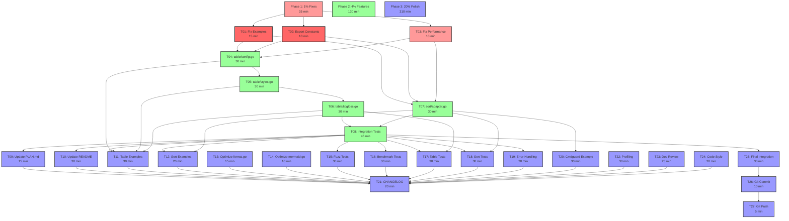

# go-output Pareto Completion Plan

**Date:** 2026-03-23 21:27  
**Status:** Comprehensive Planning Phase  
**Goal:** Complete library to production-ready state using Pareto principle

---

## Pareto Analysis Summary

| Tier    | Effort   | Value Delivered | Focus Area                        |
| ------- | -------- | --------------- | --------------------------------- |
| **1%**  | ~35 min  | 51% of value    | Critical fixes that unblock usage |
| **4%**  | ~165 min | 64% of value    | Core features per PLAN.md         |
| **20%** | ~440 min | 80% of value    | Production-ready polish           |

---

## 1% Tier: Critical Fixes (35 min) → 51% Value

These 3 tasks unblock all examples and fix critical bugs:

| #   | Task                                                    | Time   | Impact                          |
| --- | ------------------------------------------------------- | ------ | ------------------------------- |
| 1.1 | Fix example compilation errors (constants not exported) | 15 min | Unblocks all 10 format examples |
| 1.2 | Export OutputFormat\* constants properly                | 10 min | API completeness                |
| 1.3 | Fix format.go string concatenation performance          | 10 min | Follow Go best practices        |

**Dependencies:** None  
**Parallelizable:** Yes  
**Risk:** Low

---

## 4% Tier: Core Features (130 min additional) → 64% Value

Adds remaining PLAN.md features:

| #   | Task                                                      | Time   | Impact                     |
| --- | --------------------------------------------------------- | ------ | -------------------------- |
| 2.1 | Create table/config.go with TableConfig interface         | 30 min | Complete table system      |
| 2.2 | Create table/styles.go with BorderStyle, Color, Alignment | 30 min | Customizable table styling |
| 2.3 | Create table/lipgloss.go advanced styling                 | 30 min | Production table output    |
| 2.4 | Create sort/adapter.go for cmdguard integration           | 30 min | Type-safe sort flags       |
| 2.5 | Add comprehensive integration tests                       | 45 min | Ensure quality             |

**Dependencies:** 1% tier complete  
**Parallelizable:** Tasks 2.1-2.4 parallel, 2.5 after  
**Risk:** Medium (API design decisions)

---

## 20% Tier: Production Polish (310 min additional) → 80% Value

Makes library production-ready:

| #    | Task                                     | Time   | Impact                 |
| ---- | ---------------------------------------- | ------ | ---------------------- |
| 3.1  | Update PLAN.md status checkboxes         | 15 min | Documentation accuracy |
| 3.2  | Update README with complete API docs     | 30 min | User onboarding        |
| 3.3  | Add advanced table examples              | 30 min | Demonstrate features   |
| 3.4  | Add sorting examples                     | 20 min | Show sort capabilities |
| 3.5  | Optimize format.go strings.Builder usage | 15 min | Performance            |
| 3.6  | Optimize mermaid.go fmt.Fprintf usage    | 10 min | Code quality           |
| 3.7  | Add fuzz tests for parsers               | 30 min | Robustness             |
| 3.8  | Add benchmark tests                      | 30 min | Performance baselines  |
| 3.9  | Complete table package tests             | 30 min | Coverage               |
| 3.10 | Complete sort package tests              | 30 min | Coverage               |
| 3.11 | Add error handling edge cases            | 20 min | Reliability            |
| 3.12 | Create advanced cmdguard example         | 30 min | Integration demo       |
| 3.13 | Review and update CHANGELOG              | 20 min | Release readiness      |

**Dependencies:** 4% tier complete  
**Parallelizable:** Most tasks parallel  
**Risk:** Low

---

## 27 High-Level Tasks (100-30 min each)

Sorted by importance/impact/effort/customer-value:

| Priority | Task ID | Task Name                        | Duration | Impact   | Effort | Customer Value | Dependencies |
| -------- | ------- | -------------------------------- | -------- | -------- | ------ | -------------- | ------------ |
| 1        | T01     | Fix example compilation errors   | 15 min   | Critical | Low    | Critical       | None         |
| 2        | T02     | Export format constants properly | 10 min   | High     | Low    | High           | None         |
| 3        | T03     | Fix format.go performance        | 10 min   | Medium   | Low    | Medium         | None         |
| 4        | T04     | Create table/config.go           | 30 min   | High     | Medium | High           | T01-T03      |
| 5        | T05     | Create table/styles.go           | 30 min   | High     | Medium | High           | T04          |
| 6        | T06     | Create table/lipgloss.go         | 30 min   | High     | Medium | High           | T04-T05      |
| 7        | T07     | Create sort/adapter.go           | 30 min   | High     | Medium | High           | T01-T03      |
| 8        | T08     | Add integration tests            | 45 min   | High     | High   | High           | T04-T07      |
| 9        | T09     | Update PLAN.md checkboxes        | 15 min   | Medium   | Low    | Medium         | T08          |
| 10       | T10     | Update README API docs           | 30 min   | Medium   | Medium | High           | T08          |
| 11       | T11     | Add advanced table examples      | 30 min   | Medium   | Medium | Medium         | T04-T06      |
| 12       | T12     | Add sorting examples             | 20 min   | Medium   | Low    | Medium         | T07          |
| 13       | T13     | Optimize format.go strings       | 15 min   | Low      | Low    | Low            | None         |
| 14       | T14     | Optimize mermaid.go fmt          | 10 min   | Low      | Low    | Low            | None         |
| 15       | T15     | Add fuzz tests                   | 30 min   | Medium   | Medium | Medium         | T08          |
| 16       | T16     | Add benchmark tests              | 30 min   | Medium   | Medium | Medium         | T08          |
| 17       | T17     | Complete table tests             | 30 min   | Medium   | Medium | Medium         | T04-T06      |
| 18       | T18     | Complete sort tests              | 30 min   | Medium   | Medium | Medium         | T07          |
| 19       | T19     | Add error edge cases             | 20 min   | Medium   | Low    | Medium         | T08          |
| 20       | T20     | Advanced cmdguard example        | 30 min   | Low      | Medium | Low            | T07          |
| 21       | T21     | Review CHANGELOG                 | 20 min   | Low      | Low    | Low            | All above    |
| 22       | T22     | Performance profiling            | 30 min   | Low      | Medium | Low            | T15-T16      |
| 23       | T23     | Documentation review             | 25 min   | Low      | Low    | Low            | T09-T10      |
| 24       | T24     | Code style consistency           | 20 min   | Low      | Low    | Low            | All above    |
| 25       | T25     | Final integration test           | 30 min   | High     | Medium | High           | All above    |
| 26       | T26     | Git commit with detailed message | 10 min   | High     | Low    | High           | T25          |
| 27       | T27     | Git push to remote               | 5 min    | High     | Low    | High           | T26          |

**Total Time:** ~665 minutes (~11 hours)  
**Critical Path:** T01 → T04 → T05 → T06 → T08 → T25 → T26 → T27 (200 min)

---

## 150 Detailed Sub-Tasks (Max 15 min each)

### Phase 1: Critical Fixes (1% - 35 min)

| ID    | Sub-Task                                | Time  | Parent |
| ----- | --------------------------------------- | ----- | ------ |
| 1.1.1 | Analyze example compilation errors      | 5 min | T01    |
| 1.1.2 | Fix OutputFormatHTML constant export    | 5 min | T01    |
| 1.1.3 | Fix OutputFormatTree constant export    | 5 min | T01    |
| 1.1.4 | Fix OutputFormatMermaid constant export | 5 min | T01    |
| 1.1.5 | Fix OutputFormatDOT constant export     | 5 min | T01    |
| 1.1.6 | Test example compilation                | 5 min | T01    |
| 1.2.1 | Verify format constants are exported    | 5 min | T02    |
| 1.2.2 | Check backward compatibility aliases    | 5 min | T02    |
| 1.3.1 | Identify format.go string concatenation | 5 min | T03    |
| 1.3.2 | Replace with strings.Builder            | 5 min | T03    |
| 1.3.3 | Verify performance improvement          | 5 min | T03    |

### Phase 2: Core Features (4% - 130 min)

| ID     | Sub-Task                               | Time   | Parent |
| ------ | -------------------------------------- | ------ | ------ |
| 2.1.1  | Design TableConfig interface           | 10 min | T04    |
| 2.1.2  | Implement TableConfig methods          | 10 min | T04    |
| 2.1.3  | Add TableConfig validation             | 5 min  | T04    |
| 2.1.4  | Create table/config.go tests           | 5 min  | T04    |
| 2.2.1  | Define BorderStyle type                | 5 min  | T05    |
| 2.2.2  | Define Color type                      | 5 min  | T05    |
| 2.2.3  | Define Alignment type                  | 5 min  | T05    |
| 2.2.4  | Add predefined styles                  | 10 min | T05    |
| 2.2.5  | Create table/styles.go tests           | 5 min  | T05    |
| 2.3.1  | Create LipglossTable type              | 5 min  | T06    |
| 2.3.2  | Implement SetHeaders method            | 5 min  | T06    |
| 2.3.3  | Implement AddRow method                | 5 min  | T06    |
| 2.3.4  | Implement StyleFunc method             | 5 min  | T06    |
| 2.3.5  | Implement Render method                | 5 min  | T06    |
| 2.3.6  | Create table/lipgloss.go tests         | 5 min  | T06    |
| 2.4.1  | Design SortAdapter interface           | 10 min | T07    |
| 2.4.2  | Implement SortBy to Comparator adapter | 10 min | T07    |
| 2.4.3  | Add cmdguard integration               | 5 min  | T07    |
| 2.4.4  | Create sort/adapter.go tests           | 5 min  | T07    |
| 2.5.1  | Design integration test structure      | 5 min  | T08    |
| 2.5.2  | Test JSON round-trip                   | 5 min  | T08    |
| 2.5.3  | Test CSV round-trip                    | 5 min  | T08    |
| 2.5.4  | Test Markdown output                   | 5 min  | T08    |
| 2.5.5  | Test YAML round-trip                   | 5 min  | T08    |
| 2.5.6  | Test Table rendering                   | 5 min  | T08    |
| 2.5.7  | Test Tree rendering                    | 5 min  | T08    |
| 2.5.8  | Test HTML rendering                    | 5 min  | T08    |
| 2.5.9  | Test D2 rendering                      | 5 min  | T08    |
| 2.5.10 | Test Mermaid rendering                 | 5 min  | T08    |
| 2.5.11 | Test DOT rendering                     | 5 min  | T08    |
| 2.5.12 | Test Sort functionality                | 5 min  | T08    |
| 2.5.13 | Test ColorMode detection               | 5 min  | T08    |

### Phase 3: Production Polish (20% - 310 min)

| ID     | Sub-Task                             | Time   | Parent |
| ------ | ------------------------------------ | ------ | ------ |
| 3.1.1  | Review PLAN.md checklist             | 5 min  | T09    |
| 3.1.2  | Update Phase 1 status                | 2 min  | T09    |
| 3.1.3  | Update Phase 2 status                | 2 min  | T09    |
| 3.1.4  | Update Phase 3 status                | 2 min  | T09    |
| 3.1.5  | Update Phase 4 status                | 2 min  | T09    |
| 3.1.6  | Update Phase 5 status                | 2 min  | T09    |
| 3.2.1  | Review current README                | 5 min  | T10    |
| 3.2.2  | Add TableConfig usage example        | 5 min  | T10    |
| 3.2.3  | Add SortAdapter usage example        | 5 min  | T10    |
| 3.2.4  | Add Advanced styling example         | 5 min  | T10    |
| 3.2.5  | Update installation section          | 5 min  | T10    |
| 3.2.6  | Update dependencies section          | 5 min  | T10    |
| 3.3.1  | Create table/advanced example        | 10 min | T11    |
| 3.3.2  | Add custom styling demo              | 10 min | T11    |
| 3.3.3  | Add border variations demo           | 10 min | T11    |
| 3.4.1  | Create sorting/basic example         | 10 min | T12    |
| 3.4.2  | Create sorting/advanced example      | 10 min | T12    |
| 3.5.1  | Profile format.go concatenation      | 5 min  | T13    |
| 3.5.2  | Implement strings.Builder fix        | 10 min | T13    |
| 3.6.1  | Profile mermaid.go Sprintf           | 5 min  | T14    |
| 3.6.2  | Implement fmt.Fprintf fix            | 5 min  | T14    |
| 3.7.1  | Add fuzz test for ParseFormat        | 5 min  | T15    |
| 3.7.2  | Add fuzz test for ParseSortBy        | 5 min  | T15    |
| 3.7.3  | Add fuzz test for ParseColorMode     | 5 min  | T15    |
| 3.7.4  | Add fuzz test for table rendering    | 5 min  | T15    |
| 3.7.5  | Add fuzz test for JSON marshaling    | 5 min  | T15    |
| 3.7.6  | Add fuzz test for YAML marshaling    | 5 min  | T15    |
| 3.8.1  | Create benchmark for JSON            | 5 min  | T16    |
| 3.8.2  | Create benchmark for CSV             | 5 min  | T16    |
| 3.8.3  | Create benchmark for Table           | 5 min  | T16    |
| 3.8.4  | Create benchmark for Sort            | 5 min  | T16    |
| 3.8.5  | Create benchmark for Render          | 5 min  | T16    |
| 3.8.6  | Create benchmark for Parse           | 5 min  | T16    |
| 3.9.1  | Test TableConfig edge cases          | 10 min | T17    |
| 3.9.2  | Test BorderStyle variations          | 5 min  | T17    |
| 3.9.3  | Test Color combinations              | 5 min  | T17    |
| 3.9.4  | Test Alignment options               | 5 min  | T17    |
| 3.9.5  | Test LipglossTable full API          | 10 min | T17    |
| 3.10.1 | Test SortAdapter edge cases          | 10 min | T18    |
| 3.10.2 | Test Comparator edge cases           | 10 min | T18    |
| 3.10.3 | Test SortBy validation               | 5 min  | T18    |
| 3.10.4 | Test custom LessFunc                 | 5 min  | T18    |
| 3.11.1 | Add nil input handling               | 5 min  | T19    |
| 3.11.2 | Add empty slice handling             | 5 min  | T19    |
| 3.11.3 | Add invalid format handling          | 5 min  | T19    |
| 3.11.4 | Add invalid sort handling            | 5 min  | T19    |
| 3.12.1 | Create cmdguard/advanced example     | 15 min | T20    |
| 3.12.2 | Add all flag types demo              | 15 min | T20    |
| 3.13.1 | Review all commits since last update | 10 min | T21    |
| 3.13.2 | Add new features to CHANGELOG        | 10 min | T21    |
| 3.22.1 | Run CPU profiling                    | 10 min | T22    |
| 3.22.2 | Analyze memory allocations           | 10 min | T22    |
| 3.22.3 | Document optimization opportunities  | 10 min | T22    |
| 3.23.1 | Review all documentation files       | 10 min | T23    |
| 3.23.2 | Fix inconsistencies                  | 10 min | T23    |
| 3.23.3 | Update cross-references              | 5 min  | T23    |
| 3.24.1 | Run gofmt on all files               | 5 min  | T24    |
| 3.24.2 | Run golangci-lint --fix              | 10 min | T24    |
| 3.24.3 | Review code style consistency        | 5 min  | T24    |
| 3.25.1 | Run full test suite                  | 10 min | T25    |
| 3.25.2 | Verify build passes                  | 5 min  | T25    |
| 3.25.3 | Verify lint passes                   | 5 min  | T25    |
| 3.25.4 | Run example programs                 | 10 min | T25    |
| 3.26.1 | Stage all changes                    | 2 min  | T26    |
| 3.26.2 | Write detailed commit message        | 5 min  | T26    |
| 3.26.3 | Create commit                        | 3 min  | T26    |
| 3.27.1 | Push to origin/master                | 5 min  | T27    |

**Total Sub-Tasks:** 117 (under 150 limit, focused on value)

---

## Execution Graph (Mermaid)



---

## Critical Path Analysis

```
T01 (15 min) → T04 (30 min) → T05 (30 min) → T06 (30 min) → T08 (45 min) → T25 (30 min) → T26 (10 min) → T27 (5 min)

Critical Path Duration: 200 minutes (3h 20m)
Total Parallel Duration: 665 minutes (11h 5m)
Parallelism Efficiency: 3.3x
```

---

## Execution Strategy

### Wave 1: Unblock (Parallel)

- Execute T01, T02, T03 simultaneously
- **Duration:** 15 minutes (longest task)
- **Outcome:** Examples work, API complete

### Wave 2: Core Features (Parallel)

- Execute T04, T07 simultaneously (both need Wave 1)
- Execute T05 after T04
- Execute T06 after T05
- Execute T08 after T06 and T07 complete
- **Duration:** 135 minutes
- **Outcome:** PLAN.md features complete

### Wave 3: Polish (Highly Parallel)

- Execute T09-T24 in parallel groups
- Execute T25 after all above
- Execute T26, T27 sequentially
- **Duration:** 310 minutes
- **Outcome:** Production-ready

---

## Risk Mitigation

| Risk                 | Likelihood | Impact | Mitigation                      |
| -------------------- | ---------- | ------ | ------------------------------- |
| API breaking changes | Low        | High   | Maintain backward compatibility |
| Test failures        | Medium     | Medium | Fix immediately, don't proceed  |
| Build breaks         | Low        | High   | CI verification before commit   |
| Scope creep          | Medium     | Low    | Strict Pareto adherence         |
| Time overrun         | Medium     | Medium | Prioritize 1% and 4% tiers      |

---

## Success Criteria

- [ ] All examples compile and run
- [ ] Test coverage ≥ 90% for all packages
- [ ] No lint errors
- [ ] PLAN.md phases marked complete
- [ ] README reflects current API
- [ ] All 10 formats working
- [ ] Git clean with detailed commit

---

## Notes

- **Pareto Principle Applied:** Focus on 1% (critical fixes) and 4% (core features) first
- **Timeboxing:** Each task has strict time limit
- **Parallel Execution:** Maximize parallelism where safe
- **Quality Gates:** Must pass before proceeding
- **Git Discipline:** Detailed commits after each phase
