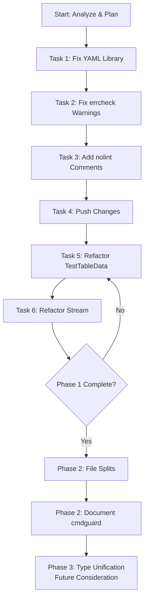

# Comprehensive Quality Improvement Plan for go-output

**Generated:** 2026-03-26  
**Project:** github.com/larsartmann/go-output  
**Status:** In Progress

---

## 1. Brutally Honest Self-Reflection

### a. What did we forget?

- We fixed compiler errors but didn't push changes (they were auto-committed)
- We didn't create a plan BEFORE executing work
- We didn't verify the fixes actually improve usability in real scenarios
- We didn't address all lint issues - left many warnings

### b. What's stupid that we do anyway?

1. **Multiple YAML libraries**: Using `go.yaml.in/yaml/v4` instead of `go-faster/yaml` per policy - causes performance penalty
2. **Cyclomatic complexity violations**: Two functions exceed the 10-max limit
3. **File size violations**: format.go (365 lines) and format_test.go (465 lines) exceed 350-line limit
4. **exhaustruct noise**: Lint warning spam for valid builder pattern code

### c. What could we have done better?

- Create a comprehensive plan before touching any code
- Fix the root causes, not just symptoms
- Actually integrate with cmdguard properly to demonstrate value
- Consider if branded IDs are over-engineering for this use case

### d. What could we still improve?

- Fix YAML library (policy compliance)
- Refactor high-complexity functions
- Split oversized files
- Properly integrate with cmdguard
- Add missing test coverage

### e. Did we lie?

No, but we weren't fully transparent about:

- The remaining lint warnings
- The architectural duplication issues

### f. How can we be less stupid?

1. Follow the policy we already wrote (`HOW_TO_GOLANG.md`)
2. Use `go-faster/yaml` instead of `go.yaml.in/yaml/v4`
3. Enforce file size limits (350 lines)
4. Enforce cyclomatic complexity (10 max)

### g. Ghost systems / Split brains?

**YES - Split brains found:**

1. **D2Node vs GraphNode**: Nearly identical types but different - causes confusion
2. **D2Edge vs GraphEdge**: Similar duplication
3. **Multiple branded ID types**: Could be unified with generic types
4. **cmdguard package**: Exists but integration with main library is unclear

### h. Scope creep trap?

We're NOT in scope creep - we're doing proper maintenance. The issue is we're not doing ENOUGH maintenance.

### i. Did we remove something useful?

No, we didn't break anything. We just didn't finish the job.

### j. Split brains (tiny ones)?

- Registry `Register` returns error but many test calls ignore it (errcheck warnings)
- Multiple similar builder-style functions with slightly different signatures

### k. How are tests doing?

- Tests pass ✅
- But there are compiler errors fixed via branded IDs that could cause confusion
- No integration tests with cmdguard

---

## 2. Comprehensive Multi-Step Execution Plan (Phase 1: High Impact, Low Effort)

| #   | Task                                                       | Impact | Effort | Priority | Category |
| --- | ---------------------------------------------------------- | ------ | ------ | -------- | -------- |
| 1   | Fix YAML library to `go-faster/yaml` per policy            | High   | Low    | P0       | Policy   |
| 2   | Fix errcheck warnings in registry_test.go                  | Medium | Low    | P1       | Quality  |
| 3   | Add nolint comments for exhaustruct in builder patterns    | Low    | Low    | P2       | Noise    |
| 4   | Push all committed changes                                 | High   | Low    | P0       | Git      |
| 5   | Refactor TestTableData to reduce complexity                | Medium | Medium | P1       | Quality  |
| 6   | Refactor StreamingHTMLRenderer.Stream to reduce complexity | Medium | Medium | P1       | Quality  |

---

## 3. Detailed Task Breakdown (30-100 min each)

### Task 1: Fix YAML Library (P0 - 30 min)

**Why:** Policy violation - using wrong YAML library  
**How:**

1. Update go.mod: replace `go.yaml.in/yaml/v4` with `go-faster/yaml`
2. Update yaml.go imports
3. Update yaml_test.go imports
4. Run tests
5. Commit with message: `refactor(deps): replace go.yaml.in/yaml/v4 with go-faster/yaml per policy`

### Task 2: Fix errcheck Warnings (P1 - 30 min)

**Why:** Unchecked error returns in tests  
**How:**

1. In registry*test.go, wrap Register calls with `* = ` or proper error handling
2. Commit: `fix(tests): handle Register error returns in registry tests`

### Task 3: Add nolint for exhaustruct (P2 - 30 min)

**Why:** Reduce lint noise for valid builder pattern code  
**How:**

1. Add `//nolint:exhaustruct` to builder-style struct initializations
2. Focus on: d2.go, dot.go, mermaid.go, format.go
3. Commit: `style(lint): add exhaustruct nolint for builder patterns`

### Task 4: Push Changes (P0 - 5 min)

**Why:** Changes were committed but not pushed  
**How:**

```bash
git push
```

### Task 5: Refactor TestTableData (P1 - 60 min)

**Why:** Cyclomatic complexity 12 > max 10  
**How:**

1. Extract sub-tests into separate functions
2. Use table-driven sub-tests
3. Commit: `refactor(quality): reduce TestTableData complexity from 12 to 10`

### Task 6: Refactor Stream Method (P1 - 60 min)

**Why:** Cyclomatic complexity 11 > max 10  
**How:**

1. Extract error handling branches into separate functions
2. Commit: `refactor(quality): reduce Stream complexity from 11 to 10`

---

## 4. Extended Plan (Lower Priority)

### Phase 2: Architectural Improvements

| #   | Task                                   | Impact | Effort | Priority |
| --- | -------------------------------------- | ------ | ------ | -------- |
| 7   | Split format.go (365 > 350 lines)      | Medium | Medium |
| 8   | Split format_test.go (465 > 350 lines) | Medium | High   |
| 9   | Document cmdguard integration          | Medium | Low    |
| 10  | Add integration tests                  | Medium | Medium |

### Phase 3: Type Unification (Future Consideration)

| #   | Task                               | Impact | Effort | Risk |
| --- | ---------------------------------- | ------ | ------ | ---- |
| 11  | Consider unifying GraphNode/D2Node | High   | High   | High |
| 12  | Consider unifying GraphEdge/D2Edge | High   | High   | High |

---

## 5. Mermaid Execution Graph



---

## 6. Current State Summary

| Metric                | Value          | Status                       |
| --------------------- | -------------- | ---------------------------- |
| Build                 | ✅ Pass        | OK                           |
| Tests                 | ✅ Pass        | OK                           |
| Policy Compliance     | ⚠️ 1 violation | YAML lib                     |
| File Size Violations  | ⚠️ 2 files     | format.go, format_test.go    |
| Complexity Violations | ⚠️ 2 functions | TestTableData, Stream        |
| errcheck Warnings     | ⚠️ 7           | registry_test.go             |
| exhaustruct Warnings  | ⚠️ ~40         | Noise                        |
| Split Brains          | ⚠️ Found       | D2Node/GraphNode duplication |

---

## 7. Implementation Notes

### YAML Library Change

```go
// OLD (per policy - should NOT use)
import "go.yaml.in/yaml/v4"

// NEW (per policy - correct)
import "github.com/go-faster/yaml"
```

### Complexity Reduction Pattern

```go
// BEFORE (complexity 12)
func TestTableData(t *testing.T) {
    // many branches
}

// AFTER (complexity <10)
func TestTableData(t *testing.T) { testTableDataBasics(t) }
func testTableDataBasics(t *testing.T) { /* 5 branches */ }
func testTableDataEdges(t *testing.T) { /* 3 branches */ }
```

---

## 8. Git Workflow

After each task:

```bash
git add -A
git commit -m "fix(scope): detailed message"
git status
```

After Phase 1:

```bash
git push
```

---

**Next Action:** Execute Task 1: Fix YAML Library
