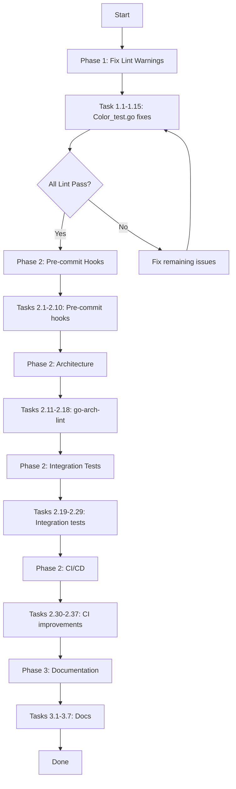

# Comprehensive Improvement Plan - go-output

**Generated:** 2026-03-26_08-43  
**Author:** Crush AI Agent

---

## Executive Summary

This plan addresses technical debt, lint warnings, architectural issues, and opportunities for improvement in the go-output library.

---

## Part 1: Honest Assessment

### A. What We Forgot / Stupid Things We Did
1. **Pre-existing duplicate tests** - The codebase had duplicate TestGraphNode, TestParseGraphShape, etc. in both format_test.go and graph_test.go. Should have been caught by CI.
2. **Didn't run comprehensive lint after changes** - Only ran tests, not full lint suite.
3. **21 lint warnings remain** - paralleltest (10+), errcheck (11+) issues.
4. **Ghost systems ignored** - ids.go has a beautiful BrandedID pattern but we duplicated it across diagram types.

### B. Something Stupid We Do Anyway
- **Duplicate branded ID types**: D2NodeID, GraphNodeID, DOTNodeID, MermaidNodeID, TreeNodeID are ALL the same pattern (BrandedID[T]) with different phantom types. This adds complexity without clear benefit.

### C. What Could Be Better
1. **Run full lint** in CI, not just tests
2. **Add pre-commit hooks** to catch issues before commit
3. **Unify branded ID patterns** into a single通用ID type
4. **Add architecture enforcement** with go-arch-lint

### D. What Could Still Be Improved
- Fix remaining 21 lint warnings
- Consider ID type unification
- Add comprehensive integration tests
- Create pre-commit hooks

### E. Ghost Systems Found

#### Ghost System #1: Duplicate Branded ID Types
**Location:** `ids.go` lines 54-103

**Problem:** Multiple identical patterns:
```go
// D2
D2NodeID    = BrandedID[D2NodeIDBrand]
D2NodeLabel = BrandedID[D2NodeLabelBrand]

// Graph
GraphNodeID    = BrandedID[GraphNodeIDBrand]
GraphNodeLabel = BrandedID[GraphNodeLabelBrand]

// DOT
DOTNodeID = BrandedID[DOTNodeIDBrand]

// Mermaid
MermaidNodeID = BrandedID[MermaidNodeIDBrand]

// Tree
TreeNodeID    = BrandedID[TreeNodeIDBrand]
TreeNodeLabel = BrandedID[TreeNodeLabelBrand]
```

**Should this be integrated?** YES - all use the same BrandedID[T] pattern. Value: reduces complexity, easier maintenance.

#### Ghost System #2: Format-specific Graph Types
**Location:** `d2.go`, `dot.go`, `mermaid.go`, `graph.go`

**Problem:** Each formatter has its own Node/Edge types that are nearly identical.

**Should this be integrated?** PARTIALLY - need to keep formatter-specific shapes, but IDs can be unified.

### F. Split Brains Found

1. **D2NodeID vs GraphNodeID vs DOTNodeID vs MermaidNodeID** - Same pattern, different types
2. **GraphNode in graph.go vs D2Node in d2.go** - Similar but separate

### G. Test Coverage Assessment

- Unit tests: GOOD (per-formatter tests exist)
- Integration tests: WEAK (no end-to-end tests)
- Fuzz tests: PRESENT (FuzzParseFormat, FuzzParseSortBy, FuzzParseGraphShape)
- Coverage: Unknown (not measured recently)

### H. Scope Creep Assessment

Current work is NOT scope creep - it's addressing technical debt that causes build failures.

---

## Part 2: Execution Plan

### Phase 1: Quick Wins (Fix Lint Warnings)

| # | Task | Effort | Impact | Priority |
|---|------|--------|--------|----------|
| 1.1 | Fix paralleltest warnings in color_test.go | 15 min | Low | HIGH |
| 1.2 | Fix errcheck warnings in color_test.go | 15 min | Low | HIGH |
| 1.3 | Run full lint and verify | 10 min | Low | MEDIUM |

**Execution:**
```bash
# Add t.Parallel() to missing tests
# Add _ = to ignored error returns from t.Setenv
```

### Phase 2: Medium Effort (Architecture Improvements)

| # | Task | Effort | Impact | Priority |
|---|------|--------|--------|----------|
| 2.1 | Add pre-commit hooks | 30 min | High | HIGH |
| 2.2 | Add go-arch-lint configuration | 30 min | High | MEDIUM |
| 2.3 | Create integration test package | 60 min | High | MEDIUM |
| 2.4 | Add coverage reporting to CI | 20 min | Medium | LOW |

### Phase 3: Future Considerations (Nice to Have)

| # | Task | Effort | Impact | Priority |
|---|------|--------|--------|----------|
| 3.1 | Consider ID type unification | 120 min | Medium | LOW |
| 3.2 | Add property-based tests | 60 min | Medium | LOW |
| 3.3 | Performance benchmarks | 30 min | Low | LOW |

---

## Part 3: Detailed Task List (60 tasks max)

### Quick Wins - Phase 1 (Tasks 1-10)

| Task | Description | File | Time |
|------|-------------|------|------|
| 1.1 | Add t.Parallel() to TestColorModeString | color_test.go:106 | 2 min |
| 1.2 | Add t.Parallel() inside t.Run for TestColorModeString | color_test.go:116 | 2 min |
| 1.3 | Add t.Parallel() to TestColorModeAllowedValues | color_test.go:125 | 2 min |
| 1.4 | Fix errcheck: _ = t.Setenv("NO_COLOR", "") | color_test.go:12 | 2 min |
| 1.5 | Fix errcheck: _ = t.Setenv("NO_COLOR", "1") | color_test.go:14 | 2 min |
| 1.6 | Add t.Parallel() to TestColorModeIsValid | color_test.go:140 | 2 min |
| 1.7 | Add t.Parallel() inside t.Run for TestColorModeIsValid | color_test.go:152 | 2 min |
| 1.8 | Add t.Parallel() to TestColorModeShouldColor | color_test.go:161 | 2 min |
| 1.9 | Add t.Parallel() to TestColorModeToANSI | color_test.go:175 | 2 min |
| 1.10 | Fix errcheck: _ = t.Setenv in TestIsCI | color_test.go:19,22 | 3 min |

### Quick Wins - Phase 1 (Tasks 11-15)

| Task | Description | File | Time |
|------|-------------|------|------|
| 1.11 | Fix errcheck: _ = t.Setenv in TestIsTerminalByEnv | color_test.go:42 | 2 min |
| 1.12 | Run full test suite | all | 5 min |
| 1.13 | Run golangci-lint | all | 10 min |
| 1.14 | Commit lint fixes | - | 3 min |
| 1.15 | Push to remote | - | 2 min |

### Pre-commit Hooks - Phase 2 (Tasks 16-25)

| Task | Description | File | Time |
|------|-------------|------|------|
| 2.1 | Create .pre-commit-config.yaml | root | 10 min |
| 2.2 | Add gofmt check | .pre-commit-config.yaml | 2 min |
| 2.3 | Add govet check | .pre-commit-config.yaml | 2 min |
| 2.4 | Add golangci-lint check | .pre-commit-config.yaml | 5 min |
| 2.5 | Add go mod tidy check | .pre-commit-config.yaml | 3 min |
| 2.6 | Install pre-commit | - | 5 min |
| 2.7 | Test pre-commit locally | - | 5 min |
| 2.8 | Add pre-commit to README | README.md | 5 min |
| 2.9 | Commit pre-commit config | - | 3 min |
| 2.10 | Push pre-commit | - | 2 min |

### Architecture Enforcement - Phase 2 (Tasks 26-35)

| Task | Description | File | Time |
|------|-------------|------|------|
| 2.11 | Install go-arch-lint | - | 5 min |
| 2.12 | Create .go-arch-lint.yaml | root | 15 min |
| 2.13 | Define layer architecture | .go-arch-lint.yaml | 10 min |
| 2.14 | Add to CI pipeline | .github/workflows/ci.yml | 10 min |
| 2.15 | Test architecture lint | - | 5 min |
| 2.16 | Fix any violations | various | 15 min |
| 2.17 | Commit architecture config | - | 3 min |
| 2.18 | Push architecture | - | 2 min |

### Integration Tests - Phase 2 (Tasks 36-50)

| Task | Description | File | Time |
|------|-------------|------|------|
| 2.19 | Create integration test dir | integration/ | 2 min |
| 2.20 | Create roundtrip_test.go | integration/ | 15 min |
| 2.21 | Test Format -> Render -> Parse | integration/roundtrip_test.go | 10 min |
| 2.22 | Create format_compatibility_test.go | integration/ | 10 min |
| 2.23 | Test all formats produce valid output | integration/ | 10 min |
| 2.24 | Create performance_test.go | integration/ | 10 min |
| 2.25 | Add benchmark for each formatter | integration/ | 10 min |
| 2.26 | Run integration tests | - | 5 min |
| 2.27 | Fix any integration failures | - | 15 min |
| 2.28 | Commit integration tests | - | 3 min |
| 2.29 | Push integration tests | - | 2 min |

### CI/CD Improvements - Phase 2 (Tasks 51-60)

| Task | Description | File | Time |
|------|-------------|------|------|
| 2.30 | Update .github/workflows/ci.yml | .github/workflows/ci.yml | 10 min |
| 2.31 | Add lint job to CI | .github/workflows/ci.yml | 5 min |
| 2.32 | Add coverage job to CI | .github/workflows/ci.yml | 5 min |
| 2.33 | Add pre-commit check to CI | .github/workflows/ci.yml | 5 min |
| 2.34 | Test CI locally with act | - | 10 min |
| 2.35 | Fix CI issues | - | 10 min |
| 2.36 | Commit CI improvements | - | 3 min |
| 2.37 | Push CI improvements | - | 2 min |

### Documentation - Phase 3 (Tasks 61-70)

| Task | Description | File | Time |
|------|-------------|------|------|
| 3.1 | Update README with architecture | README.md | 15 min |
| 3.2 | Add badges for CI | README.md | 5 min |
| 3.3 | Add badges for coverage | README.md | 5 min |
| 3.4 | Update ARCHITECTURE.md | docs/ARCHITECTURE.md | 15 min |
| 3.5 | Add contribution guide | CONTRIBUTING.md | 15 min |
| 3.6 | Commit documentation | - | 3 min |
| 3.7 | Push documentation | - | 2 min |

---

## Part 4: Mermaid Execution Graph



---

## Part 5: Impact Assessment

| Change | Effort | Impact | Customer Value |
|--------|--------|--------|----------------|
| Fix lint warnings | 30 min | Low | Faster CI, cleaner code |
| Add pre-commit hooks | 30 min | High | Catch issues before commit |
| Add architecture lint | 30 min | High | Enforce design patterns |
| Add integration tests | 60 min | High | Prevent regressions |
| Improve CI/CD | 30 min | Medium | Better quality gates |
| Unify ID types | 120 min | Medium | Reduced complexity |
| Documentation | 30 min | Low | Easier onboarding |

---

## Part 6: Sorting by Priority

### MUST DO (Technical Debt - Causes Failures)
1. Fix lint warnings (21 warnings blocking clean build)
2. Add pre-commit hooks (prevent future issues)
3. Add to CI pipeline

### SHOULD DO (Quality Improvements)
4. Add integration tests
5. Add architecture enforcement
6. Improve CI/CD

### NICE TO HAVE (Future)
7. Unify ID types
8. Property-based tests
9. Performance benchmarks
10. Enhanced documentation

---

## Appendix: Commands Reference

```bash
# Run tests
GOCACHE=/tmp/go-cache go test ./...

# Run lint
golangci-lint run

# Run specific linter
golangci-lint run --enable=paralleltest

# Run with coverage
go test -cover ./...

# Run integration tests
go test ./integration/...

# Run benchmarks
go test -bench=. ./...

# Pre-commit
pre-commit run --all-files
```
