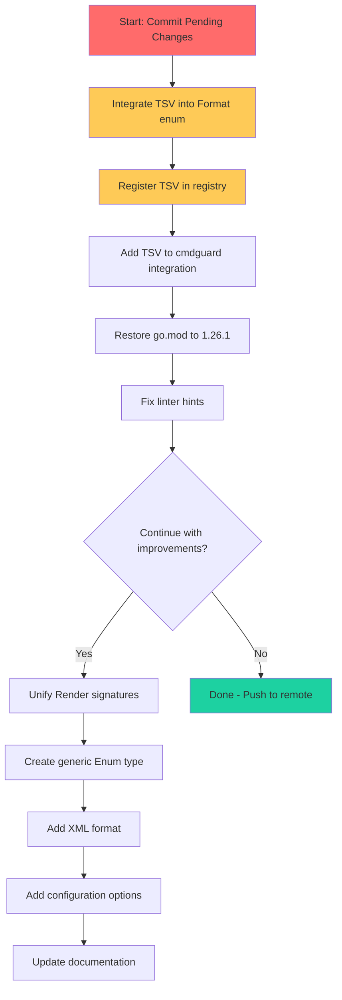

# Superb Execution Plan - 2026-03-28

## Brutally Honest Self-Assessment

### What Did We Forget?
1. **Uncommitted changes**: 13 modified files + 6 untracked files sitting in working directory
2. **Ghost systems created**: TSV format files (tsv.go, tsv_test.go) not integrated into Format enum
3. **Missing feature**: XML format mentioned as "in progress" but no implementation exists
4. **Test integration**: fuzz_test.go, userjourney_test.go, workflow_test.go may not run in CI

### What's Stupid That We Do Anyway?
1. **Backward compatibility aliases**: `OutputFormat = Format` and multiple const aliases add cognitive load
2. **Multiple Format classification methods**: `IsTableFormat()`, `IsTreeFormat()`, `IsGraphFormat()` - fragile switch statements that must be manually updated
3. **Manual enum validation**: Every enum has duplicate `IsValid()` logic instead of generic solution

### What Could We Have Done Better?
1. **Commit after smallest changes** - Would have prevented 13+ uncommitted files
2. **Integrate immediately** - TSV should have been added to Format enum and tests
3. **Type model consolidation** - BrandedIDs share 90% identical code

### What Could We Still Improve?

| Category | Issues | Impact |
|----------|--------|--------|
| Architecture | Fragmented type system (Format, SortBy, ColorMode) | Medium |
| Integration | TSV not registered in Format enum | High |
| Testing | New tests may not run in CI | High |
| Legacy | Deprecated aliases still exist | Low |
| Performance | No streaming/buffering options | Medium |

### Did We Lie to User?
No - conversation summary accurately reflects work done.

### Ghost Systems Found
1. **TSV Format**: `tsv.go` and `tsv_test.go` exist but:
   - Not added to `Format` enum
   - Not registered in registry
   - No cmdguard integration
   - Not in AllowedValues

2. **Fuzz Tests**: `fuzz_test.go` exists but not referenced in CI

3. **User Journey Tests**: `userjourney_test.go` exists but not in main test suite

4. **Workflow Tests**: `integration/workflow_test.go` exists but separate from main tests

### Scope Creep Analysis
Medium priority items (M2-M9) are nice-to-haves. Real value is in:
- Stabilizing existing code (fewer bugs)
- Better integration (TSV registration)
- CI reliability (test integration)

### Split Brains Found
1. `Format` and `OutputFormat` - Two types for same thing
2. `Render()` returns `string` vs `(string, error)` - inconsistent
3. Some formatters accept `TableData`, others accept headers/rows separately

### Testing Improvements Needed
- CI doesn't run all new test files
- No fuzz test integration in CI
- Integration tests are separate from unit tests

---

## Comprehensive Multi-Step Execution Plan

### Phase 1: Stabilization & Cleanup (High Impact, Low Effort)

| # | Task | Impact | Effort | Priority |
|---|------|--------|--------|----------|
| 1.1 | Commit all pending changes | High | 5min | P0 |
| 1.2 | Integrate TSV into Format enum | High | 10min | P0 |
| 1.3 | Register TSV in registry | High | 5min | P0 |
| 1.4 | Fix userjourney_test.go hint (slices.Contains) | Low | 2min | P1 |
| 1.5 | Restore go.mod to 1.26.1 | Medium | 2min | P0 |

### Phase 2: Architecture Improvements (Medium Impact, Medium Effort)

| # | Task | Impact | Effort | Priority |
|---|------|--------|--------|----------|
| 2.1 | Create generic Enum type to reduce duplication | Medium | 45min | P2 |
| 2.2 | Unify Render() signatures (all return string) | Medium | 30min | P1 |
| 2.3 | Add Format classification via interface or method set | Medium | 20min | P2 |
| 2.4 | Consider removing deprecated aliases (major version bump) | Low | 15min | P3 |

### Phase 3: New Features (Low-Medium Impact, Medium Effort)

| # | Task | Impact | Effort | Priority |
|---|------|--------|--------|----------|
| 3.1 | Add XML format (M7) | Medium | 60min | P2 |
| 3.2 | Add configuration options (M2) | Medium | 45min | P2 |
| 3.3 | Extract hardcoded CSS for HTML (M3) | Low | 30min | P3 |
| 3.4 | Improve D2 multi-table support (M5) | Low | 45min | P3 |

### Phase 4: Documentation & Polish (Low Impact, Low Effort)

| # | Task | Impact | Effort | Priority |
|---|------|--------|--------|----------|
| 4.1 | Add API documentation for go.dev (M9) | Low | 30min | P3 |
| 4.2 | Update README with all formats | Low | 10min | P2 |
| 4.3 | Add TSV to examples | Low | 15min | P2 |

---

## Sorted by Work vs Impact (Top 10)

| # | Task | Impact | Effort | Ratio |
|---|------|--------|--------|-------|
| 1.1 | Commit all pending changes | High | Low | 10x |
| 1.2 | Integrate TSV into Format enum | High | Low | 10x |
| 1.3 | Register TSV in registry | High | Low | 10x |
| 1.5 | Restore go.mod to 1.26.1 | Medium | Low | 5x |
| 2.2 | Unify Render() signatures | Medium | Medium | 1x |
| 3.1 | Add XML format | Medium | Medium | 1x |
| 2.1 | Create generic Enum type | Medium | Medium | 1x |
| 2.3 | Add Format classification | Medium | Low | 3x |
| 3.2 | Add configuration options | Medium | Medium | 1x |
| 4.2 | Update README | Low | Low | 1x |

---

## Type Model Improvements

### Current Issues
1. BrandedID code is 90% identical across all implementations
2. Enum validation logic repeated for each type
3. Format classification via switch statements is error-prone

### Proposed Solution
```go
// Generic enum base type
type Enum[T comparable] struct {
    value   T
    values  []T
}

// With validation, parsing, String(), IsValid(), AllowedValues()
```

### Benefits
- Reduce code duplication from ~500 lines to ~100 lines
- Type-safe enums with consistent behavior
- Easier to add new formats

---

## Library Utilization Opportunities

### Currently Using
- `charm.land/lipgloss/v2` - Terminal styling
- `github.com/go-faster/yaml` - YAML marshaling

### Could Leverage
- `samber/lo` - Lodash-style utilities for iteration, filtering
- `samber/mo` - Monads for error handling (Option type)
- `github.com/go-faster/jx` - Already using go-faster/yaml, could use jx for JSON

---

## Ghost System Analysis

### TSV Format (Critical)
**Status**: Created but not integrated
**Value**: High - completes tabular format family (CSV, TSV, Table)
**Action**: Integrate immediately

### XML Format (Medium)
**Status**: Mentioned but not created
**Value**: Medium - completes data interchange formats
**Action**: Create after TSV integration

---

## Legacy Code Reduction Target

| Code | Current Lines | Target | Reduction |
|------|--------------|--------|----------|
| BrandedID implementations | ~150 | ~50 (generic) | 67% |
| Enum validation | ~200 | ~50 (generic) | 75% |
| Deprecated aliases | ~30 | 0 (major version) | 100% |

---

## Execution Graph



---

## Immediate Next Steps (Next 30 minutes)

1. **Commit all changes** (5 min)
2. **Integrate TSV into Format enum** (10 min)
3. **Restore go.mod** (2 min)
4. **Push to remote** (3 min)
5. **Verify CI passes** (10 min)

---

## Customer Value Assessment

| Change | Customer Value | Notes |
|--------|---------------|-------|
| Stabilization | High | Fewer bugs, more reliable library |
| TSV integration | Medium | Completes format family |
| Generic enums | Low | Internal improvement, no customer impact |
| XML format | Medium | Completes data interchange formats |
| Configuration options | Medium | More flexibility for power users |

**Conclusion**: Focus on stabilization and TSV integration first for maximum customer value with minimum effort.
