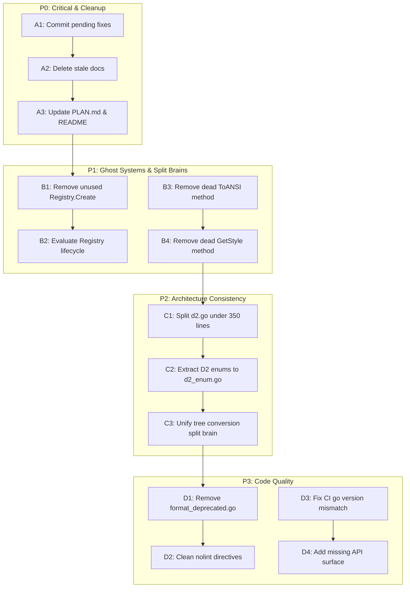

# go-output: Comprehensive Improvement Plan

**Created:** 2026-04-29  
**Status:** Execution Ready

## Mermaid Execution Graph

---

## Honest Self-Assessment

### What we forgot

- We committed fixes (go.mod, enum, sort, d2) but never committed them.
- `go.mod` had `golang.org/x/term` as indirect for an unknown period.

### What's stupid

- **Registry is a ghost system.** `Register()`, `Create()`, `IsRegistered()`, `RegisteredFormats()` are public API with full test coverage but **zero production callers**. It's tested infrastructure nobody uses.
- **PLAN.md is stale.** It specifies `cmdguard/format.go`, `cmdguard/sort.go`, `cmdguard/color.go` which were consolidated into `cmdguard/flag.go`. It lists only 10 formats (missing TSV, XML). It shows struct-tag integration that doesn't exist.
- **1,838 lines of stale root-level docs** (PLAN.md, BDD_TESTS_REVIEW.md, IMPROVEMENTS_SUMMARY.md, MIGRATION_TO_NIX_FLAKES_PROPOSAL.md = 678 lines for a never-approved proposal).
- **2,855 lines of stale docs in docs/** (planning and status reports from completed sessions).
- **`ToANSI()`** on ColorMode is tested but never called in production code. Dead API surface.
- **`GetStyle()`** on GraphNode was added "though unused" (per IMPROVEMENTS_SUMMARY.md) and is now only used in tests. Still dead production API.

### What could be better

- **d2.go is 333 lines** — close to 350 limit. It mixes enums (D2Direction, D2NodeShape, D2ArrowType, D2Constraint) with domain types (D2Node, D2Edge, D2Table). Should split.
- **Tree conversion is a split brain.** `AddTreeNodes()` in graph.go is generic, but D2 has `d2_convert.go::addTreeNodes()`, DOT has `dot.go::addTreeNodes()`, Mermaid has `mermaid.go::addTreeNodes()`. Three parallel implementations with slightly different ID resolution logic.
- **`FilledStrings()`** is exported production API only used in test files. Should be unexported or moved to testutil.
- **47 `//nolint:` directives** — mostly `exhaustruct` (25) and `gochecknoglobals` (13). The exhaustruct ones indicate structs with too many optional fields.

### Did we lie?

- IMPROVEMENTS_SUMMARY.md says `GetStyle()` is "though unused" — it IS used in tests. Misleading but not a lie about production use.
- PLAN.md says cmdguard has 3 files — actually 1 file. PLAN.md was never updated.
- MIGRATION_TO_NIX_FLAKES_PROPOSAL.md identifies a CI bug (go 1.23 vs 1.26) — need to verify if still present.

### How to be less stupid

- Delete stale docs aggressively. They're in git history if needed.
- Remove dead API surface (ToANSI, GetStyle) or give them real use cases.
- Make Registry actually integrate with the format system, or remove it.
- Unify tree conversion to eliminate the 3-way split brain.

### Ghost Systems

1. **Registry** — Full implementation with mutex, error types, sorted format listing. Only used in its own tests and one integration test. Zero production integration. **Value: Potential plugin system for custom formats. Recommend: Keep but document as opt-in.**

### Split Brains

1. **Tree conversion** — `graph.go::AddTreeNodes()` (generic) vs `d2_convert.go::addTreeNodes()` vs `dot.go::addTreeNodes()` vs `mermaid.go::addTreeNodes()` (3 renderer-specific versions).
2. **D2 node types vs GraphNode** — D2 has richer types (shapes, styles, arrows) but must convert from generic GraphNode. This is intentional by design (D2 has domain-specific features), so the conversion layer is justified.

### Scope Creep Traps

- Don't add `samber/lo` just for 2-3 slice operations. The stdlib is sufficient.
- Don't refactor Renderer to return `(string, error)` — it would break the entire API for marginal benefit.
- Don't add Ginkgo — BDD_TESTS_REVIEW.md already recommends against it.
- Don't implement Nix migration — it was never approved.

### Tests

- Main package: 91.0% ✅
- Enum: 100% ✅ (was 94.7%, improved by fixing joinStrings)
- Sort: 95.5% ✅ (was 86.7%, improved by adding tests)
- Escape: 100% ✅
- Table: 100% ✅
- Cmdguard: 100% ✅
- **Improvement:** Add property-based/fuzz tests for escape functions. Add integration tests for round-trip marshal/unmarshal.

---

## Phase 1 Tasks (30-100 min each)

| #   | Task                                                     | Impact | Effort | Customer Value    |
| --- | -------------------------------------------------------- | ------ | ------ | ----------------- |
| A1  | Commit pending fixes (go.mod, enum, sort, d2)            | High   | Low    | Stability         |
| A2  | Delete stale docs (6 root files + 10 docs/ files)        | Medium | Low    | Maintainability   |
| A3  | Update PLAN.md to match reality                          | Medium | Low    | Onboarding        |
| B1  | Evaluate Registry: document as opt-in or integrate       | High   | Medium | API clarity       |
| B2  | Remove dead ToANSI and GetStyle methods                  | Medium | Low    | API surface       |
| C1  | Split d2.go: extract D2 enums to d2_enum.go              | Medium | Medium | File size         |
| C2  | Unify tree conversion (eliminate split brain)            | Medium | High   | Architecture      |
| D1  | Remove format_deprecated.go (breaking change assessment) | Low    | Low    | Code cleanliness  |
| D2  | Fix CI go version mismatch (if still present)            | High   | Low    | Build reliability |
| D3  | Add MarshalYAMLIndent API gap                            | Medium | Low    | Feature parity    |
| D4  | Run benchmarks and verify no regressions                 | Medium | Low    | Performance       |

---

## Phase 2 Tasks (12 min each)

| #   | Task                                                   | Impact | Effort | Depends |
| --- | ------------------------------------------------------ | ------ | ------ | ------- |
| 1   | `git add` + commit pending go.mod fix                  | High   | 2min   | -       |
| 2   | `git add` + commit enum/joinStrings fix                | High   | 2min   | -       |
| 3   | `git add` + commit sort stability fix + new tests      | High   | 5min   | -       |
| 4   | `git add` + commit d2 enum refactor                    | Medium | 5min   | -       |
| 5   | Delete MIGRATION_TO_NIX_FLAKES_PROPOSAL.md             | Medium | 1min   | -       |
| 6   | Delete IMPROVEMENTS_SUMMARY.md                         | Low    | 1min   | -       |
| 7   | Delete BDD_TESTS_REVIEW.md                             | Low    | 1min   | -       |
| 8   | Delete all docs/planning/\*.md (5 files)               | Low    | 2min   | -       |
| 9   | Delete all docs/status/\*.md (7 files)                 | Low    | 2min   | -       |
| 10  | Update PLAN.md: fix cmdguard section                   | Medium | 5min   | -       |
| 11  | Update PLAN.md: add TSV/XML formats                    | Low    | 3min   | -       |
| 12  | Update PLAN.md: mark as living doc note                | Low    | 1min   | -       |
| 13  | Add Registry doc comment: explain opt-in usage         | Medium | 5min   | -       |
| 14  | Remove ToANSI from ColorMode                           | Medium | 5min   | -       |
| 15  | Remove GetStyle from GraphNode                         | Low    | 5min   | -       |
| 16  | Create d2_enum.go: move D2Direction + Parse + methods  | Medium | 8min   | -       |
| 17  | Create d2_enum.go: move D2NodeShape + Parse + methods  | Medium | 8min   | 16      |
| 18  | Create d2_enum.go: move D2ArrowType + Parse + methods  | Medium | 8min   | 17      |
| 19  | Create d2_enum.go: move D2Constraint + Parse + methods | Medium | 5min   | 18      |
| 20  | Verify d2.go < 200 lines after split                   | Medium | 2min   | 19      |
| 21  | Add godoc to all exported types in d2_enum.go          | Low    | 5min   | 19      |
| 22  | Unexport FilledStrings → filledStrings                 | Low    | 5min   | -       |
| 23  | Check CI go version in .github/workflows/ci.yml        | High   | 2min   | -       |
| 24  | Fix CI go version if mismatched                        | High   | 5min   | 23      |
| 25  | Add MarshalYAMLIndent to yaml.go                       | Medium | 8min   | -       |
| 26  | Add test for MarshalYAMLIndent                         | Medium | 5min   | 25      |
| 27  | Run `go test -bench=. -benchmem ./...`                 | Medium | 5min   | -       |
| 28  | git push all changes                                   | High   | 2min   | all     |
| 29  | Update AGENTS.md with current project state            | Medium | 8min   | -       |
| 30  | Update README.md with current API surface              | Medium | 10min  | -       |
