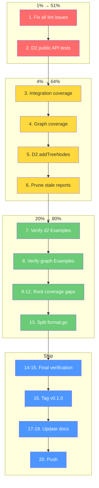

# Execution Plan — Post-Modularization Polish & Hardening

**Created:** 2026-05-23_13-36
**Branch:** `modularize/extract-d2-graph`
**Philosophy:** Start with 1% that delivers 51%, then 4%→64%, then 20%→80%

---

## Pareto Analysis

### 1% → 51% of Result (DO FIRST — Critical Correctness)

These are the things that, if left undone, mean the codebase is broken or misleading:

1. **Fix ALL remaining lint issues** — 7 pre-existing issues across sort/table/integration. A codebase with known lint failures teaches developers that lint doesn't matter.
2. **Fix color.go goimports** — Root module's only remaining formatting issue.
3. **D2 coverage: test AllD2Constraints/String/AllowedValues (0%)** — 3 public functions with zero tests. Public API without tests = no contract.

### 4% → 64% of Result (DO SECOND — Quality Foundation)

4. **Integration coverage 75.9% → 90%** — Cross-module tests are the safety net for modularization. 75% is below the 90% target.
5. **Graph coverage 94.4% → 97%+** — dotTreeNodeID/mermaidTreeNodeID at 66.7% (edge case paths).
6. **D2 addTreeNodes 87.5% → 100%** — Tree conversion is a critical cross-cutting feature.
7. **Prune 17 stale status reports** — `docs/status/` has 20 files. Keep latest 3. Noise reduces trust in docs.

### 20% → 80% of Result (DO THIRD — Polish & Ship-Readiness)

8. **Verify Example test outputs** — 6 Example functions with `//nolint:testableexamples`. Adding verified output catches output format regressions.
9. **Root coverage 88.7% → 92%** — Focus on streaming.go (73%), xml.go (66%), tsv.go (50%).
10. **Split format.go (291 lines)** — Into format_enum.go, shape.go, renderer_interfaces.go. Under 350 limit but over 200 = harder to navigate.
11. **Tag v0.1.0** — With CHANGELOG. The modularization work deserves a version marker.
12. **Deprecation plan** — Document in CHANGELOG which deprecated APIs will be removed in v0.2.0.

---

## Detailed Task Plan — Batch Level (15-30 min each, 20 tasks)

| # | Batch | Tasks | Impact | Effort | Module |
|---|-------|-------|--------|--------|--------|
| 1 | Fix all lint issues (sort, table, integration, color.go) | 1.1–1.4 | HIGH | 15min | all |
| 2 | D2 uncovered public API tests | 2.1–2.3 | HIGH | 10min | d2 |
| 3 | Integration coverage → 90% | 3.1–3.3 | HIGH | 15min | integration |
| 4 | Graph coverage → 97%+ | 4.1–4.3 | MEDIUM | 15min | graph |
| 5 | D2 addTreeNodes coverage → 100% | 5.1 | MEDIUM | 10min | d2 |
| 6 | Prune stale status reports | 6.1 | LOW | 5min | docs |
| 7 | Verify d2 Example outputs | 7.1–7.3 | MEDIUM | 15min | d2 |
| 8 | Verify graph Example outputs | 8.1–8.3 | MEDIUM | 15min | graph |
| 9 | Root streaming.go coverage | 9.1–9.3 | MEDIUM | 20min | root |
| 10 | Root xml.go coverage | 10.1–10.2 | MEDIUM | 15min | root |
| 11 | Root tsv.go coverage | 11.1 | MEDIUM | 10min | root |
| 12 | Root markup.go coverage | 12.1 | MEDIUM | 10min | root |
| 13 | Split format.go into focused files | 13.1–13.3 | MEDIUM | 20min | root |
| 14 | Final lint verification all 10 modules | 14.1 | HIGH | 10min | all |
| 15 | Final coverage verification | 15.1 | HIGH | 5min | all |
| 16 | Tag v0.1.0 with CHANGELOG | 16.1 | HIGH | 10min | — |
| 17 | Update AGENTS.md with final state | 17.1 | MEDIUM | 10min | root |
| 18 | Update TODO_LIST.md status | 18.1 | LOW | 10min | docs |
| 19 | Update execution plan with completion | 19.1 | LOW | 5min | docs |
| 20 | Final push | 20.1 | HIGH | 2min | — |

**Total estimated time: ~4.5 hours**

---

## Micro-Task Plan (5-15 min each, ~60 tasks)

### Batch 1: Fix All Lint Issues

| ID | Task | Effort | File |
|----|------|--------|------|
| 1.1 | Fix sort/compare_test.go wsl_v5: add blank line before return | 2min | sort/compare_test.go |
| 1.2 | Fix table/table.go goimports: separate stdlib/third-party imports | 2min | table/table.go |
| 1.3 | Fix table/table_test.go goimports: separate stdlib/third-party imports | 2min | table/table_test.go |
| 1.4 | Fix integration/test_helpers.go goconst: extract "Health" and "90%" constants | 5min | integration/test_helpers.go |
| 1.5 | Fix color.go goimports: reorder imports (stdlib, then x/term, then enum) | 2min | color.go |
| 1.6 | Verify all modules lint clean | 5min | all |

### Batch 2: D2 Uncovered Public API Tests

| ID | Task | Effort | File |
|----|------|--------|------|
| 2.1 | Test AllD2Constraints() returns all 3 constraints | 3min | d2/d2_enum_test.go |
| 2.2 | Test D2Constraint.String() returns correct strings | 3min | d2/d2_enum_test.go |
| 2.3 | Test D2Constraint.AllowedValues() returns correct slice | 3min | d2/d2_enum_test.go |

### Batch 3: Integration Coverage → 90%

| ID | Task | Effort | File |
|----|------|--------|------|
| 3.1 | Test assertTableData with nil data (covers fatal path) | 3min | integration/test_helpers_test.go |
| 3.2 | Test renderMarkdownTable error path | 3min | integration/ |
| 3.3 | Test renderSampleMarkdownTable output | 3min | integration/ |

### Batch 4: Graph Coverage → 97%+

| ID | Task | Effort | File |
|----|------|--------|------|
| 4.1 | Test dotTreeNodeID with non-zero ID node | 3min | graph/dot_test.go |
| 4.2 | Test mermaidTreeNodeID with non-empty ID | 3min | graph/mermaid_test.go |
| 4.3 | Test DOTFromTableData with styled edges | 5min | graph/dot_test.go |

### Batch 5: D2 addTreeNodes Coverage → 100%

| ID | Task | Effort | File |
|----|------|--------|------|
| 5.1 | Test d2 addTreeNodes with nested children and parent edge | 5min | d2/d2_convert_test.go |

### Batch 6: Prune Stale Status Reports

| ID | Task | Effort | File |
|----|------|--------|------|
| 6.1 | Delete 17 oldest status reports, keep latest 3 | 3min | docs/status/ |

### Batch 7: Verify d2 Example Outputs

| ID | Task | Effort | File |
|----|------|--------|------|
| 7.1 | Add verified output to ExampleNewD2Diagram | 5min | d2/example_test.go |
| 7.2 | Add verified output to ExampleNewD2Diagram_tables | 5min | d2/example_test.go |
| 7.3 | Add verified output to ExampleNewD2Diagram_styledNodes | 5min | d2/example_test.go |

### Batch 8: Verify graph Example Outputs

| ID | Task | Effort | File |
|----|------|--------|------|
| 8.1 | Add verified output to ExampleDOTFromTableData | 5min | graph/example_test.go |
| 8.2 | Add verified output to ExampleMermaidFlowchartRenderer | 5min | graph/example_test.go |
| 8.3 | Add verified output to ExampleDOTFromTree | 5min | graph/example_test.go |

### Batch 9: Root streaming.go Coverage

| ID | Task | Effort | File |
|----|------|--------|------|
| 9.1 | Test Stream with custom chunk size | 5min | streaming_test.go additions |
| 9.2 | Test writeRow error path | 5min | streaming_test.go additions |
| 9.3 | Test Stream (non-HTML) render path | 5min | streaming_test.go additions |

### Batch 10: Root xml.go Coverage

| ID | Task | Effort | File |
|----|------|--------|------|
| 10.1 | Test WriteHeader/WriteRow/WriteFooter with error writer | 5min | xml_test.go additions |
| 10.2 | Test MarshalXMLIndent error path | 5min | xml_test.go additions |

### Batch 11: Root tsv.go Coverage

| ID | Task | Effort | File |
|----|------|--------|------|
| 11.1 | Test writeTSVData error path (writer fails) | 5min | tsv_test.go additions |

### Batch 12: Root markup.go Coverage

| ID | Task | Effort | File |
|----|------|--------|------|
| 12.1 | Test writeMarkupRow/writeMarkupColumns error paths | 5min | markup_test.go additions |

### Batch 13: Split format.go

| ID | Task | Effort | File |
|----|------|--------|------|
| 13.1 | Extract Shape enum + capability matrix to shape.go | 10min | shape.go (new) |
| 13.2 | Verify all tests pass after split | 5min | root |
| 13.3 | Verify lint clean after split | 5min | root |

### Batch 14-20: Verification & Ship

| ID | Task | Effort | File |
|----|------|--------|------|
| 14.1 | Run full build/test/vet/lint across all 10 modules | 10min | all |
| 15.1 | Record final coverage for all modules | 5min | all |
| 16.1 | Tag v0.1.0, update CHANGELOG | 10min | — |
| 17.1 | Update AGENTS.md coverage table and notes | 10min | AGENTS.md |
| 18.1 | Update TODO_LIST.md marking completed items | 10min | TODO_LIST.md |
| 19.1 | Mark execution plan complete | 5min | this file |
| 20.1 | Push to remote | 2min | — |

---

## Execution Graph

---

## Rules

1. **DO NOT break the build** — run tests after every change
2. **Commit after each batch** — small, self-contained commits
3. **Fix root-cause, not symptoms** — if a test fails, understand why
4. **Pre-existing issues only in files I touch** — don't refactor unrelated code
5. **No VERSCHLIMMBESSER** — don't make things worse by "improving" them
