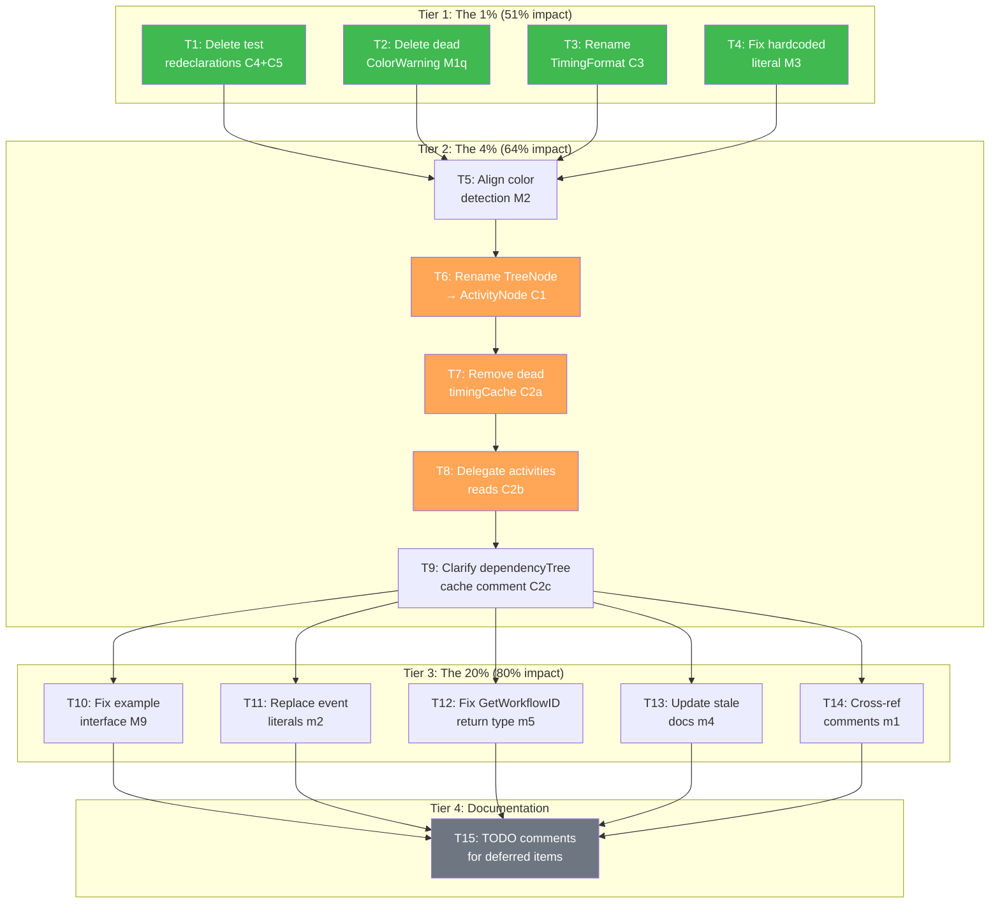

# Split-Brain Elimination Sprint — Pareto Execution Plan

**Created:** 2026-06-17 23:02
**Source:** `SPLIT-BRAIN.html` audit report (20 findings)
**Goal:** Eliminate all split-brain issues from the data model without breaking the build

---

## Step 1: Pareto Breakdown

### The 1% that delivers 51% of the result

These 5 micro-fixes eliminate the most confusing name collisions with near-zero risk.
All are compiler-verifiable, touch <10 lines each, and have zero or near-zero callers.

| ID  | Fix                                                                  | Risk | Lines Changed |
| --- | -------------------------------------------------------------------- | ---- | ------------- |
| C4  | Delete `graphRenderer` redeclaration in serialization tests          | None | ~5            |
| C5  | Delete `renderer` redeclaration in integration tests                 | None | ~3            |
| M1q | Delete dead `nom.ColorWarning` (zero callers)                        | None | ~2            |
| C3  | Rename `tui.TimingFormat` → `tui.timingFormatWithIcon` (unexport)    | None | ~6            |
| M3  | Replace hardcoded `"No activities to display"` literal with constant | None | ~1            |

### The 4% that delivers 64% of the result

The above 5, PLUS these 3 mechanical fixes:

| ID | Fix                                                                | Risk    | Lines Changed |
| -- | ------------------------------------------------------------------ | ------- | ------------- |
| C1 | Rename `nom.TreeNode` → `nom.ActivityNode` (compiler-guided)       | Low     | ~73 refs      |
| M2 | Align color detection: add `TERM=dumb` to root, add CI vars to nom | Low     | ~10           |
| C2 | Remove dead `timingCache` field, delegate `activities` reads       | Low-Med | ~8            |

### The 20% that delivers 80% of the result

The above 8, PLUS these 5 cleanup tasks:

| ID | Fix                                                                | Risk | Lines Changed |
| -- | ------------------------------------------------------------------ | ---- | ------------- |
| m2 | Replace 30+ bare event-string literals with `nom.Event*` constants | Low  | ~30           |
| M9 | Fix drifted example `delimitedWriter` interface                    | Low  | ~3            |
| m4 | Update stale `GraphEdge` docs (missing `Style` field)              | None | ~2            |
| m5 | Fix `GetWorkflowID()` return type consistency                      | Low  | ~2            |
| m1 | Add cross-reference comments for duplicated `"unknown"` sentinel   | None | ~2            |

### Remaining 80% (deferred to next minor version — API-breaking)

These require coordinated version bumps. Listed for completeness, documented as TODOs.

| ID | Fix                                                                                 | Why Deferred          |
| -- | ----------------------------------------------------------------------------------- | --------------------- |
| M4 | Rename `InlineRenderer.Render()` → `Draw()`, `DependencyTree.Render()` → `Format()` | Exported API break    |
| M5 | Rename `ShapeBox` → `NodeShapeBox` etc.                                             | Exported API break    |
| M6 | Add canonical `output.Direction` enum + bridge                                      | New API design needed |
| M7 | Bridge `D2Direction` ↔ `RankDir`                                                    | Depends on M6         |
| M8 | Align style struct field names (`FillColor` → `Fill` etc.)                          | Exported API break    |
| m6 | Restructure branded ID re-export canonical paths                                    | Exported API change   |

---

## Step 2: Comprehensive Plan (Medium Tasks — 30-100 min each)

15 tasks. Sorted by impact/effort.

| #   | Task                                                  | Finding(s) | Impact   | Effort | Deps   |
| --- | ----------------------------------------------------- | ---------- | -------- | ------ | ------ |
| T1  | Delete test interface redeclarations (C4+C5)          | C4, C5     | High     | 15min  | —      |
| T2  | Delete dead `nom.ColorWarning` constant               | M1q        | Med      | 5min   | —      |
| T3  | Rename `tui.TimingFormat` → unexported, fix callers   | C3         | High     | 15min  | —      |
| T4  | Replace hardcoded message literal with constant       | M3         | Med      | 5min   | —      |
| T5  | Align color detection logic (root + nom)              | M2         | High     | 30min  | —      |
| T6  | Rename `nom.TreeNode` → `nom.ActivityNode` (all refs) | C1         | Critical | 60min  | —      |
| T7  | Remove dead `timingCache` field from ProgressModel    | C2a        | High     | 15min  | —      |
| T8  | Delegate `m.activities` reads to subscriber           | C2b        | High     | 20min  | T7     |
| T9  | Clarify `dependencyTree` cached-snapshot comment      | C2c        | Med      | 10min  | T8     |
| T10 | Fix drifted example `delimitedWriter` interface       | M9         | Low      | 15min  | —      |
| T11 | Replace bare event literals with constants            | m2         | Med      | 45min  | —      |
| T12 | Fix `GetWorkflowID()` return type consistency         | m5         | Low      | 15min  | —      |
| T13 | Update stale `FORMAT_ARCHITECTURE.md` docs            | m4         | Low      | 15min  | —      |
| T14 | Add cross-reference comments for `"unknown"` sentinel | m1         | Low      | 10min  | —      |
| T15 | Add TODO comments for deferred API-breaking changes   | M4-M8,m6   | Low      | 30min  | T1-T14 |

---

## Step 3: Micro-Tasks (max 15 min each)

52 tasks. Sorted by execution order within each Pareto tier.

### Tier 1: The 1% (T1-T4) — 12 micro-tasks

| #   | Micro-Task                                                                 | File(s)                           | Est  |
| --- | -------------------------------------------------------------------------- | --------------------------------- | ---- |
| 1.1 | Read `serialization/testhelpers_test.go:50-65` to confirm exact text       | serialization/                    | 2min |
| 1.2 | Delete `graphRenderer` interface, change generic to `output.GraphRenderer` | serialization/testhelpers_test.go | 5min |
| 1.3 | Build + test serialization module                                          | serialization/                    | 3min |
| 1.4 | Read `integration/renderer_test.go:165-175` to confirm exact text          | integration/                      | 2min |
| 1.5 | Delete `renderer` interface, change generic to `output.Renderer`           | integration/renderer_test.go      | 5min |
| 1.6 | Build + test integration module                                            | integration/                      | 3min |
| 2.1 | Delete `ColorWarning` var + comment from `nom/symbols.go:46-47`            | nom/symbols.go                    | 2min |
| 2.2 | Build + test nom module                                                    | nom/                              | 3min |
| 3.1 | Rename `TimingFormat` → `timingFormatWithIcon` in `tui/constants.go:6`     | tui/constants.go                  | 2min |
| 3.2 | Update callers at `tui/view.go:184,187`                                    | tui/view.go                       | 3min |
| 3.3 | Update `tui/constants_test.go:10-11`                                       | tui/constants_test.go             | 2min |
| 3.4 | Build + test tui module                                                    | tui/                              | 3min |

### Tier 2: The 4% (T5-T9) — 18 micro-tasks

| #    | Micro-Task                                                                       | File(s)                          | Est   |
| ---- | -------------------------------------------------------------------------------- | -------------------------------- | ----- |
| 4.1  | Replace hardcoded literal at `tui/view.go:290` with `MsgNoActivitiesToDisplay`   | tui/view.go                      | 2min  |
| 4.2  | Build + test tui module                                                          | tui/                             | 3min  |
| 5.1  | Add `TERM=dumb` check to root `isNoColor()` in `color.go:107`                    | color.go                         | 3min  |
| 5.2  | Add 4 CI env vars to nom `detectNoColor()` in `nom/inline_renderer.go:81`        | nom/inline_renderer.go           | 5min  |
| 5.3  | Add "keep in sync" cross-reference comments to both                              | color.go, nom/inline_renderer.go | 3min  |
| 5.4  | Build + test root + nom modules                                                  | ./, nom/                         | 3min  |
| 6.1  | Rename `TreeNode` → `ActivityNode` in `nom/tree.go` (struct + all internal refs) | nom/tree.go                      | 10min |
| 6.2  | Update `nom/tree_accessors.go` (return types)                                    | nom/tree_accessors.go            | 5min  |
| 6.3  | Update `nom/tree_building.go`                                                    | nom/tree_building.go             | 3min  |
| 6.4  | Update `nom/tree_clear.go`                                                       | nom/tree_clear.go                | 2min  |
| 6.5  | Update `nom/tree_priority.go`                                                    | nom/tree_priority.go             | 5min  |
| 6.6  | Update `nom/tree_render.go` (heaviest file)                                      | nom/tree_render.go               | 10min |
| 6.7  | Update `nom/tree_modification.go`                                                | nom/tree_modification.go         | 3min  |
| 6.8  | Update all `nom/*_test.go` files with TreeNode refs                              | nom/\*\_test.go                  | 10min |
| 6.9  | Update `tui/state.go:116` (`visibleNodes []*nom.ActivityNode`)                   | tui/state.go                     | 2min  |
| 6.10 | Update any tui test refs to `nom.TreeNode`                                       | tui/\*\_test.go                  | 5min  |
| 6.11 | Build + test nom + tui + integration modules                                     | nom/, tui/, integration/         | 5min  |

### Tier 3: The 20% (T7-T14) — 15 micro-tasks

| #    | Micro-Task                                                                              | File(s)                     | Est   |
| ---- | --------------------------------------------------------------------------------------- | --------------------------- | ----- |
| 7.1  | Remove `timingCache` field from `tui/state.go:111`                                      | tui/state.go                | 2min  |
| 7.2  | Remove `timingCache` assignment from `tui/model.go` sync func                           | tui/model.go                | 2min  |
| 7.3  | Build + test tui module                                                                 | tui/                        | 3min  |
| 8.1  | Remove `activities` field from `tui/state.go:109`                                       | tui/state.go                | 2min  |
| 8.2  | Replace `m.activities` read at `tui/view.go:331` with `m.nomSubscriber.GetActivities()` | tui/view.go                 | 3min  |
| 8.3  | Remove `m.activities = ...` assignment from `tui/model.go:185`                          | tui/model.go                | 2min  |
| 8.4  | Build + test tui module                                                                 | tui/                        | 3min  |
| 9.1  | Add cached-snapshot comment on `dependencyTree` field in `tui/state.go`                 | tui/state.go                | 2min  |
| 10.1 | Read `examples/basic/renderers.go:75-81` to confirm drifted interface                   | examples/                   | 2min  |
| 10.2 | Remove `WriteFooter` from example interface or align with real one                      | examples/basic/renderers.go | 5min  |
| 10.3 | Build + test examples module                                                            | examples/                   | 3min  |
| 11.1 | Replace bare event literals in `tui/` tests with `nom.Event*` constants                 | tui/\*\_test.go             | 10min |
| 11.2 | Replace bare event literals in `integration/` tests                                     | integration/\*\_test.go     | 10min |
| 11.3 | Replace bare event literals in `examples/` code                                         | examples/                   | 5min  |

### Tier 4: Cleanup (T12-T15) — 7 micro-tasks

| #    | Micro-Task                                                         | File(s)                                              | Est   |
| ---- | ------------------------------------------------------------------ | ---------------------------------------------------- | ----- |
| 12.1 | Fix `GetWorkflowID()` return type in `nom/state_accessors.go:43`   | nom/state_accessors.go                               | 5min  |
| 12.2 | Build + test nom module                                            | nom/                                                 | 3min  |
| 13.1 | Update `FORMAT_ARCHITECTURE.md` GraphEdge to include `Style` field | docs/FORMAT_ARCHITECTURE.md                          | 5min  |
| 14.1 | Add cross-reference comment at `nom/activity_status.go:37`         | nom/activity_status.go                               | 2min  |
| 14.2 | Add cross-reference comment at `tui/state.go:30`                   | tui/state.go                                         | 2min  |
| 15.1 | Add TODO comments for M4 (Render method naming)                    | nom/inline_renderer.go, nom/tree_render.go           | 5min  |
| 15.2 | Add TODO comments for M5-M8,m6 (deferred API breaks)               | shape.go, graph.go, d2/d2_enum.go, graph/dot_enum.go | 10min |

---

## Execution Graph

---

## Safety Rules

1. **Build after every module change** — `go build ./...` in the module
2. **Test after every module change** — `go test ./...` in the module
3. **Commit after each Tier** — detailed commit message per tier
4. **Never guess** — read before editing, use exact text matching
5. **The compiler is your friend** — after the TreeNode rename, let `go build` find every reference
6. **If tests fail** — fix immediately, do not continue with broken state
