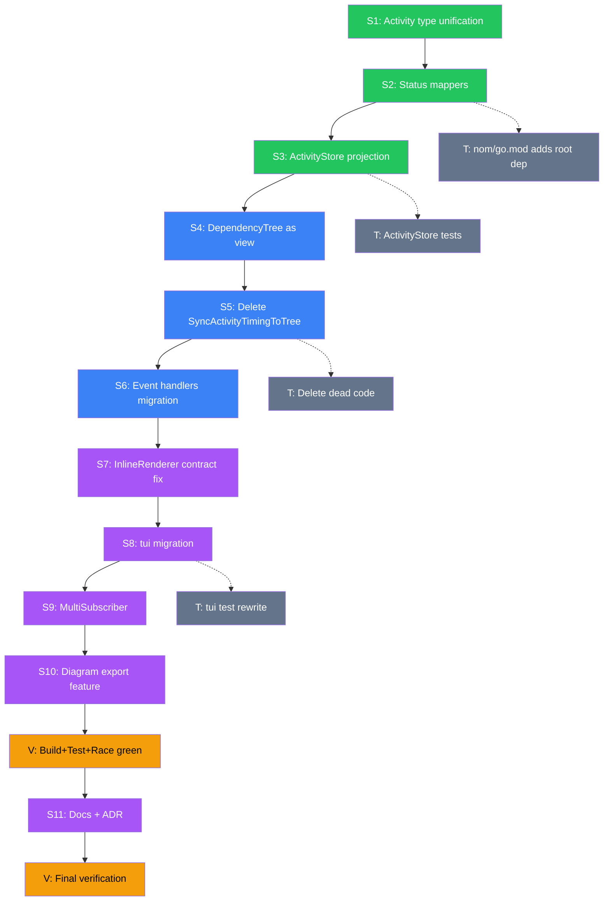

# Nom/ Composition Refactor — Reusing Root Types

**Created:** 2026-06-18 13:40
**Status:** PLANNED → IN EXECUTION
**Theme:** Eliminate nom/'s reinvention of root's graph types; make progress state diagram-exportable and composable.

---

## Context — Why This Sprint

### The Problem (verified in code)

`nom/` is a parallel universe that duplicates root's graph concepts with inferior types:

| nom/ today (reinvents) | root/ (already exists) | Consequence |
|---|---|---|
| `ActivityNode` + `ActivityDisplayState` (two types, duplicated fields) | `output.GraphNode` (one type) | **Split-brain**: `SyncActivityTimingToTree()` must run before every render or displays are stale |
| `DependencyTree` (nodes map + roots + edges) | `output.GraphRendererState` | Parallel implementation, no reuse |
| `ActivityID string` (plain, no phantom type) | `output.GraphNodeID` (branded) | No type safety; can mix with any string |
| `InlineRenderer.Render()` (void return) | `output.Renderer.Render() (string, error)` | **split-brain M4** — documented TODO, violates contract |
| `detectNoColor()` (5-line duplication) | `output.ColorMode` | Accepted per dedup policy, but could go |
| `ActivityStatus.GetColor() color.Color` | `output.GraphStyle` (hex strings) | Different concerns (terminal vs diagram) — KEEP BOTH |

### The Killer Feature Unlocked

Once activities ARE `output.GraphNode`s, nom/ can export live build progress as **DOT, Mermaid, D2, or PlantUML diagrams** with zero new rendering code:

```go
dot := graph.NewDOTRenderer()
dot.SetNodes(subscriber.Store().Nodes())   // projection
dot.SetEdges(subscriber.Store().Edges())
diagram, _ := dot.Render()                   // your build, as a diagram
```

### Constraints (do NOT violate — verschlimmbessern guardrails)

1. **Root public API is FROZEN** (ADR 006) — no changes to `output.*` types
2. **Event contract unchanged** — `nom.Event` / `nom.EventSubscriber` keep their signatures
3. **No feature loss** — timing cache, priority sort, inline rendering all stay
4. **nom/ stays minimal** — adding root dep is acceptable (branded-id + enum + delimited are tiny, stable, stdlib-like); root gains zero nom imports (no circular risk)
5. **Build + tests + race must pass after EVERY task** — no big-bang
6. **Color model stays split intentionally** — `GraphStyle` (hex strings) for diagram export; lipgloss `color.Color` for terminal. Different concerns, both valid.

---

## Pareto Breakdown

### 1% that delivers 51%

**Unify the Activity type + status→visual mappers.** Define ONE `nom.Activity` struct that embeds `output.GraphNode` (structural identity + diagram-exportable style) plus temporal domain fields (Status, StartedAt, EndedAt, Estimate, Err). Add `ActivityStatus.Shape()` and `ActivityStatus.GraphStyle()` mappers so the same status drives both terminal lipgloss styling AND diagram export.

**~100 LOC. Eliminates:** the entire `ActivityDisplayState` vs `ActivityNode` duplication at the type level, `GetSymbol()/GetColor()` parallel concept, makes diagram export possible. Foundation for everything else.

### 4% that delivers 64%

**Kill `SyncActivityTimingToTree()` by making the tree a view.** Introduce `ActivityStore` (map-backed, O(1) updates, projects to `Nodes()/Edges()`). Rewrite `DependencyTree` to derive its render from the store rather than holding parallel state. The manual sync call — and its entire class of "forgot to sync → stale display" bugs — becomes impossible.

### 20% that delivers 80%

**Migrate the full pipeline to the unified types.** Event handlers write to `ActivityStore`. `InlineRenderer.Render()` conforms to `output.Renderer` (fixes split-brain M4). `tui/` consumes the new types. Add `MultiSubscriber` (fanout like `io.MultiWriter`). Rewrite tests. Update docs.

### Remaining 20% (long tail — NOT in this sprint)

- Theme injection (custom symbols/colors)
- Invert tui→nom dependency via `ProgressView` interface
- FileFrameRenderer / LogFrameRenderer
- `detectNoColor()` consolidation with `output.ColorMode`

---

## Mermaid Execution Graph



---

## Medium Granularity Plan (30–100 min tasks)

**22 tasks. Sorted by impact (desc), then effort (asc).**

| # | Task | Stage | Impact | Effort | Depends on |
|---|---|---|---|---|---|
| M01 | Add `output` dep to `nom/go.mod` + verify build | 1 | 🔥🔥🔥 | 15m | — |
| M02 | Define `Activity` struct embedding `output.GraphNode` + temporal fields | 1 | 🔥🔥🔥 | 45m | M01 |
| M03 | Add `ActivityStatus.Shape()` + `.GraphStyle()` mappers + tests | 1 | 🔥🔥🔥 | 45m | M02 |
| M04 | Define `ActivityStore` (map-backed, `Nodes()`/`Edges()` projection) + tests | 1 | 🔥🔥🔥 | 90m | M02 |
| M05 | Rewrite `DependencyTree` to derive from `ActivityStore` (no parallel state) | 2 | 🔥🔥🔥 | 90m | M04 |
| M06 | Delete `SyncActivityTimingToTree()` + `ActivityDisplayState` split | 2 | 🔥🔥🔥 | 45m | M05 |
| M07 | Migrate `OnEvent` handlers to write `ActivityStore` | 2 | 🔥🔥 | 90m | M05,M06 |
| M08 | Rewrite `NOMStyleSubscriber` to compose `ActivityStore`+`DependencyTree`+`TimingCache` | 2 | 🔥🔥🔥 | 90m | M07 |
| M09 | Migrate `InlineRenderer` to conform to `output.Renderer` (fixes M4) | 3 | 🔥🔥 | 60m | M08 |
| M10 | Add `MultiSubscriber` (fanout for `EventSubscriber`) + tests | 3 | 🔥🔥 | 45m | M08 |
| M11 | Add diagram export example (`ExportProgressAsDOT`) + test | 3 | 🔥🔥 | 45m | M08 |
| M12 | Migrate `tui/` to consume new nom types | 3 | 🔥🔥🔥 | 90m | M08,M09 |
| M13 | Rewrite nom unit tests for unified types | 3 | 🔥🔥 | 90m | M08 |
| M14 | Rewrite tui unit tests | 3 | 🔥🔥 | 60m | M12 |
| M15 | Update integration tests (`integration/nom_tui_test.go`) | 3 | 🔥🔥 | 45m | M12 |
| M16 | Update `examples/nom_progress` + `examples/tui_progress` | 3 | 🔥 | 30m | M12 |
| M17 | Update `docs/FORMAT_ARCHITECTURE.md` nom/tui section | 3 | 🔥 | 30m | M08 |
| M18 | Write ADR 007: nom composition via root types | 3 | 🔥 | 45m | M08 |
| M19 | Update `AGENTS.md` nom patterns section | 3 | 🔥 | 30m | M08 |
| M20 | Update `CHANGELOG.md` + `FEATURES.md` | 3 | 🔥 | 30m | M11 |
| M21 | Full race-detector sweep (`-race` on nom+tui+integration) | 3 | 🔥🔥 | 30m | all |
| M22 | Final verification: all 16 modules build+test+lint green | 3 | 🔥🔥🔥 | 30m | all |

**Total estimated: ~19h of work**

---

## Fine Granularity Breakdown (≤15 min each)

**78 tasks. Sorted by impact (desc), then effort (asc), then dependency order.**

### Stage 1: Type Unification (1%/51%) — 18 tasks

| # | Task | Impact | Effort | Parent |
|---|---|---|---|---|
| F01 | Read current `nom/go.mod` + verify replace directive for root | — | 5m | M01 |
| F02 | Add `require github.com/larsartmann/go-output` to `nom/go.mod` | 🔥🔥 | 5m | M01 |
| F03 | Run `go mod tidy` in nom/ + verify no lipgloss/bubbletea pulled | 🔥🔥 | 10m | M01 |
| F04 | Write `nom/activity.go`: `Activity` struct embedding `output.GraphNode` + Status/StartedAt/EndedAt/Estimate/Err | 🔥🔥🔥 | 15m | M02 |
| F05 | Write `NewActivity(id, name string) *Activity` constructor | 🔥🔥 | 5m | M02 |
| F06 | Write `Activity.ApplyStatus(s ActivityStatus)` — sets Shape+Style via mappers | 🔥🔥 | 10m | M02 |
| F07 | Write `nom/status_mappers.go`: `ActivityStatus.Shape() output.GraphShape` | 🔥🔥🔥 | 10m | M03 |
| F08 | Write `ActivityStatus.GraphStyle() output.GraphStyle` (hex colors) | 🔥🔥🔥 | 10m | M03 |
| F09 | Write tests for `Shape()` — all 5 statuses return valid GraphShape | 🔥 | 10m | M03 |
| F10 | Write tests for `GraphStyle()` — all 5 statuses return non-empty FillColor | 🔥 | 10m | M03 |
| F11 | Write `nom/activity_store.go`: `ActivityStore` struct (map + edges + RWMutex) | 🔥🔥🔥 | 15m | M04 |
| F12 | Write `ActivityStore.Upsert(a *Activity)` + `Get(id) (*Activity, bool)` | 🔥🔥🔥 | 10m | M04 |
| F13 | Write `ActivityStore.Nodes() []output.GraphNode` (projection) | 🔥🔥🔥 | 10m | M04 |
| F14 | Write `ActivityStore.Edges() []output.GraphEdge` | 🔥🔥 | 10m | M04 |
| F15 | Write `ActivityStore.AddEdge(from, to output.GraphNodeID)` | 🔥🔥 | 5m | M04 |
| F16 | Write `ActivityStore.Roots() []output.GraphNodeID` (nodes with no in-edges) | 🔥🔥 | 10m | M04 |
| F17 | Write `ActivityStore.Counts() (running, completed, failed, pending int)` | 🔥🔥 | 10m | M04 |
| F18 | Write ActivityStore tests — Upsert/Get/Nodes/Edges/Roots/Counts | 🔥🔥 | 15m | M04 |

### Stage 2: Kill Split-Brain (4%/64%) — 16 tasks

| # | Task | Impact | Effort | Parent |
|---|---|---|---|---|
| F19 | Rewrite `DependencyTree` to hold `*ActivityStore` (not parallel nodes) | 🔥🔥🔥 | 15m | M05 |
| F20 | Rewrite `DependencyTree.AddActivity` to write to ActivityStore | 🔥🔥🔥 | 15m | M05 |
| F21 | Rewrite `DependencyTree.UpdateActivityStatus` to update ActivityStore | 🔥🔥 | 10m | M05 |
| F22 | Rewrite `DependencyTree.Render` to derive from ActivityStore + priority sort | 🔥🔥🔥 | 15m | M05 |
| F23 | Rewrite `DependencyTree.GetNode` to read from ActivityStore | 🔥🔥 | 10m | M05 |
| F24 | Rewrite `childPriority` sort to read from ActivityStore nodes | 🔥🔥 | 10m | M05 |
| F25 | Delete `ActivityNode` type entirely | 🔥🔥🔥 | 5m | M06 |
| F26 | Delete `ActivityDisplayState` type (merged into Activity) | 🔥🔥🔥 | 5m | M06 |
| F27 | Delete `SyncActivityTimingToTree()` method | 🔥🔥🔥 | 5m | M06 |
| F28 | Delete `DisplayState` struct | 🔥🔥 | 5m | M06 |
| F29 | Rewrite `handleActivityStarted` → `ActivityStore.Upsert` + `ApplyStatus(Running)` | 🔥🔥🔥 | 15m | M07 |
| F30 | Rewrite `handleActivityCompleted` → timing cache record + status update | 🔥🔥 | 10m | M07 |
| F31 | Rewrite `handleActivityFailed` → status + error storage | 🔥🔥 | 10m | M07 |
| F32 | Rewrite `handleActivityRegistered` → Upsert with Pending status | 🔥🔥 | 10m | M07 |
| F33 | Rewrite `handleWorkflowStarted/Finished` → minimal workflow metadata | 🔥 | 10m | M07 |
| F34 | Rewrite `NOMStyleSubscriber` struct to embed ActivityStore | 🔥🔥🔥 | 15m | M08 |

### Stage 3: Composability (20%/80%) — 28 tasks

| # | Task | Impact | Effort | Parent |
|---|---|---|---|---|
| F35 | Rename `InlineRenderer.Render()` → `Draw()` (void, side-effecting) | 🔥🔥 | 10m | M09 |
| F36 | Add `InlineRenderer.Render() (string, error)` building frame string | 🔥🔥🔥 | 15m | M09 |
| F37 | Refactor Draw to call Render then write to writer | 🔥🔥 | 10m | M09 |
| F38 | Delete split-brain M4 NOTE from inline_renderer.go | 🔥 | 5m | M09 |
| F39 | Write `MultiSubscriber` struct + `OnEvent` fanout | 🔥🔥🔥 | 15m | M10 |
| F40 | Write `NewMultiSubscriber(subs ...EventSubscriber)` constructor | 🔥🔥 | 5m | M10 |
| F41 | Write MultiSubscriber tests — 3 subs, all receive event | 🔥🔥 | 10m | M10 |
| F42 | Write MultiSubscriber tests — one sub errors, others still called | 🔥 | 10m | M10 |
| F43 | Write `examples/nom_progress/diagram_export.go` — DOT export demo | 🔥🔥 | 15m | M11 |
| F44 | Write integration test: ActivityStore → DOT renderer → valid DOT | 🔥🔥 | 15m | M11 |
| F45 | Write integration test: ActivityStore → Mermaid renderer → valid Mermaid | 🔥 | 10m | M11 |
| F46 | Update `tui/state.go` ProgressModel fields (new nom types) | 🔥🔥🔥 | 15m | M12 |
| F47 | Update `tui/reporter.go` Subscriber() return type | 🔥🔥 | 10m | M12 |
| F48 | Update `tui/render_nom.go` to render from ActivityStore | 🔥🔥🔥 | 15m | M12 |
| F49 | Update `tui/view.go` node interaction (selectedNode type) | 🔥🔥 | 10m | M12 |
| F50 | Update `tui/summary.go` counts from ActivityStore.Counts() | 🔥🔥 | 10m | M12 |
| F51 | Update `tui/event_sequence_test.go` testEvent accessors | 🔥🔥 | 15m | M14 |
| F52 | Update `tui/model_test.go` activity setup helpers | 🔥🔥 | 15m | M14 |
| F53 | Update `tui/view_test.go` tree construction helpers | 🔥🔥 | 15m | M14 |
| F54 | Update `tui/reporter_test.go` assertions | 🔥 | 10m | M14 |
| F55 | Update `tui/testhelpers_test.go` newTestTree | 🔥 | 10m | M14 |
| F56 | Update `integration/nom_tui_test.go` full flow | 🔥🔥 | 15m | M15 |
| F57 | Update `examples/nom_progress/main.go` | 🔥 | 10m | M16 |
| F58 | Update `examples/tui_progress/main.go` | 🔥 | 10m | M16 |
| F59 | Rewrite `nom/activity_display_test.go` for unified Activity | 🔥🔥 | 15m | M13 |
| F60 | Rewrite `nom/tree_test.go` for ActivityStore-backed tree | 🔥🔥 | 15m | M13 |
| F61 | Rewrite `nom/subscriber_test.go` for new handlers | 🔥🔥 | 15m | M13 |
| F62 | Run nom tests green | 🔥🔥🔥 | 10m | M13 |

### Documentation & Verification — 16 tasks

| # | Task | Impact | Effort | Parent |
|---|---|---|---|---|
| F63 | Update `docs/FORMAT_ARCHITECTURE.md` — Activity embeds GraphNode | 🔥 | 10m | M17 |
| F64 | Update `docs/FORMAT_ARCHITECTURE.md` — diagram export section | 🔥 | 10m | M17 |
| F65 | Update `docs/DOMAIN_LANGUAGE.md` — Activity, ActivityStore terms | 🔥 | 10m | M17 |
| F66 | Write `docs/adr/007-nom-composition-via-root-types.md` | 🔥🔥 | 15m | M18 |
| F67 | Update `AGENTS.md` nom design patterns section | 🔥 | 10m | M19 |
| F68 | Update `AGENTS.md` nom file structure | 🔥 | 10m | M19 |
| F69 | Update `CHANGELOG.md` — nom composition refactor entry | 🔥 | 10m | M20 |
| F70 | Update `FEATURES.md` — diagram export feature | 🔥 | 10m | M20 |
| F71 | Update `FEATURES.md` — MultiSubscriber feature | 🔥 | 5m | M20 |
| F72 | Delete remaining `NOTE(split-brain` markers in nom/ (M4 fixed) | 🔥 | 10m | M09 |
| F73 | Run `go mod tidy` across all 16 modules | 🔥 | 10m | all |
| F74 | Run `nix run .#build` — all modules compile | 🔥🔥🔥 | 10m | all |
| F75 | Run `nix run .#test` — all modules pass | 🔥🔥🔥 | 10m | all |
| F76 | Run `nix run .#test-race` — nom+tui race-free | 🔥🔥🔥 | 10m | all |
| F77 | Run `nix run .#lint` — zero issues | 🔥🔥🔥 | 10m | all |
| F78 | Final `git status` + commit + push | 🔥 | 5m | all |

---

## Execution Rules

1. **Build+test after every M-task** — never accumulate breakage
2. **Parallelize independent F-tasks** within a stage using sub-agents
3. **Commit after each M-task** with detailed message
4. **If something breaks root or tui** — STOP and fix before continuing
5. **Do NOT touch root package code** — nom/ and tui/ only
6. **Preserve every feature** — timing cache, priority sort, inline render, all display modes
7. **If a task takes >2x estimate** — reassess before pushing through

---

## Risk Register

| Risk | Likelihood | Mitigation |
|---|---|---|
| Root import pulls unexpected transitive deps | Low | Verify with `go mod graph` after F03 |
| DependencyTree rewrite breaks priority sort | Medium | Keep `sortKey` logic identical; test golden files |
| tui/ migration cascades into many files | High | tui has ~10 files touching nom types; budget 90m |
| Color type mismatch (color.Color vs hex string) | Low | Keep both: lipgloss for terminal, GraphStyle for export |
| Race conditions in new ActivityStore | Medium | Map+RWMutex like today; run `-race` after M04 |
| Breaking existing nom/ consumers | Low | nom/ is v0.x; breaking change is acceptable, document in CHANGELOG |
