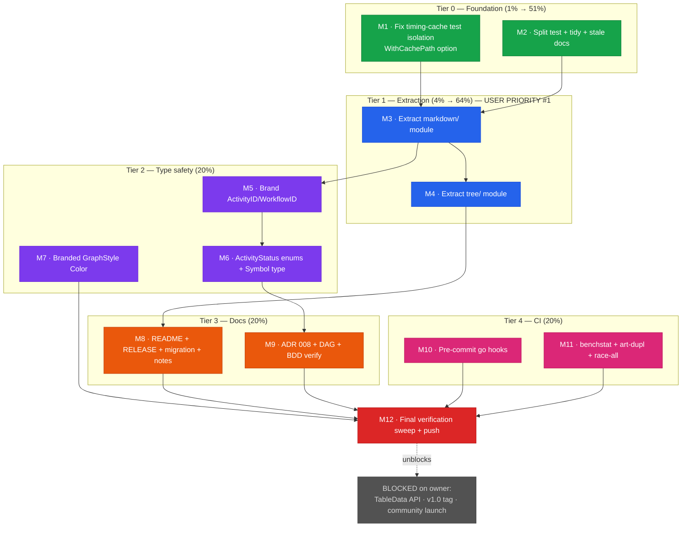

# V1.0 Composability + Hardening — Pareto Execution Plan

**Created:** 2026-06-19 02:10
**Author:** Crush (pareto-planning skill)
**Baseline:** HEAD `a78979d` on `master` · working tree clean · 18 modules · build/test/lint/race green
**Goal:** Ship a composable, hardened, well-documented v1.0-rc — shrinking the root god-package, eliminating an entire class of ID-mixing bugs at compile time, and adding CI guardrails — while respecting the Core Invariant (root imports zero sub-modules).

---

## 0. Context — Why this plan exists

The project is a multi-module Go library (18 modules) for CLI output formatting. It is in its
strongest state ever (0 lint issues, 0 govulncheck vulns, 763 tests passing, 149 features). But
three things remain:

1. **The user's #1 complaint:** *"we have TOO MANY files in root already and this SDK is not
   composable enough."* Root is a god-package: **16 production files, 1908 lines**, mixing core
   types with two self-contained renderers (`markdown.go` 289L, `tree.go` 229L).
2. **2 real bugs** (false claims in TODO_LIST.md): timing-cache test isolation reads real
   `~/.cache`; `render_tabledata_test.go` is 355 lines (5 over the 350 limit).
3. **v1.0.0 readiness gaps:** nom IDs are `type X string` (not phantom-branded), missing
   RELEASE.md/migration guide, no pre-commit Go checks, benchmarks discarded.

**The decisive constraint:** root extraction is a *breaking* change. If we freeze v1.0.0
**before** extracting markdown/tree, the god-package is locked in forever (extraction would force
a v2). Therefore **extraction precedes the v1.0 freeze.** This single ordering decision is what
makes the plan correct.

### What was verified against actual code (not stale docs)

| Claim in docs | Code reality | Verdict |
|---|---|---|
| `ActivityDisplayState` / `SyncActivityTimingToTree` pending (comprehensive plan §2, 23 tasks) | `rg` finds **zero references** — already eliminated | **DONE — not re-planned** |
| Phase 1 quick wins (depguard, FEATURES claim, ErrWrite, Color aliases, ANSI→lipgloss) | Committed `a78979d` | **DONE** |
| Timing-cache isolation "fixed" (TODO_LIST #62) | `NewTimingCache()` still hardcodes `~/.cache/nom-timing.csv`; subscriber tests have no injection point | **STILL BROKEN — bug** |
| render_tabledata_test "≤350" | **355 lines** | **OVER LIMIT — bug** |
| escape go.mod versions consistent | d2/graph/markup/plantuml `require escape v0.12.0` but escape was **never tagged**; masked only by go.work | **RESIDUE — tidy needed** |
| `markdown.go` / `tree.go` extractable | import only `fmt`/`strings`/`strconv`; follow existing `table/` registry pattern (`render_tabledata.go:38-41` registers them via root `init()`) | **FEASIBLE** |

### Excluded — blocked on owner (cannot execute autonomously)

1. `TableData` fields-vs-getters API decision (sole v1.0.0 freeze blocker) — Option A (fields) / B (getters+setters) / C (keep both).
2. Cut `v1.0.0` tag.
3. r/golang + Awesome Go community submission (needs owner account).

### Strategic recommendation (flagged, not blocking)

**Conservative extraction only:** move `markdown/` and `tree/` out (self-contained renderers,
mirror `table/`). **Defer** the aggressive `core/` + `graphcore/` split — it would leave root
nearly empty (just `registry.go` = 75 lines, over-modularized) and is the riskier move that
caused last session's pain. Shared types (TableData, GraphNode, ColorMode) stay in root.

---

## 1. Pareto Breakdown

| Tier | Cumulative scope | Effort | Value | Rationale |
|------|------------------|--------|-------|-----------|
| **1% → 51%** | Fix 2 bugs + `nix run .#tidy` + delete stale/misleading docs | ~35 min | Honesty: "green" means green; false claims eliminated. A release built on false claims is worthless. | Tiny effort; the foundation everything else stands on |
| **4% → 64%** | + Extract `markdown/` + `tree/` OUT of root (−518 lines) via `table/` registry pattern | ~2.5 hrs | Fixes the user's #1 complaint; root 1908→1390 lines; composability; must precede v1.0 | The architectural linchpin; small relative to total work |
| **20% → 80%** | + Type-safety (brand nom IDs, ActivityStatus enums, Symbol type, GraphStyle colors) + docs (README/RELEASE/migration/release-notes/ADR 008) + CI (pre-commit go hooks, benchstat, art-dupl, race-all) | ~6 hrs | Hardened, documented, release-candidate v1.0 with compile-time safety + guardrails | Additive must-haves; non-breaking once extraction done |
| **remaining 80%** | graphcore/ extraction (riskier), CBOR, Theme struct, cmd/ module, community launch | ongoing | Polish + future | Diminishing returns |

---

## 2. Medium Plan — 12 tasks (30–100 min each)

Sorted by impact/effort/customer-value; dependencies respected.

| # | Task | Tier | Impact | Effort | CV | Depends | Status |
|---|------|------|--------|--------|-----|---------|--------|
| **M1** | Fix timing-cache test isolation — `WithCachePath` option on `TimingCache` + subscriber; inject `t.TempDir()` | 1% | 🔥🔥 | 40m | ★★ | — | Ready |
| **M2** | Split `render_tabledata_test.go` (355→2) + `nix run .#tidy` + delete stale `docs/modularization/` proposal + AGENTS.md `internal/` refs | 1% | 🔥🔥 | 35m | ★★ | — | Ready |
| **M3** | **Extract `markdown/`** — move `markdown.go`, relocate `renderMarkdownTableData`+init, update consumers, flake/golangci/go.work | 4% | 🔥🔥🔥 | 75m | ★★★ | M2 | Ready |
| **M4** | **Extract `tree/`** — move `tree.go`, relocate `renderTreeTableData`+init, update consumers, AGENTS.md map (18→20) | 4% | 🔥🔥🔥 | 75m | ★★★ | M3 | Ready |
| **M5** | Brand `ActivityID`/`WorkflowID` via `go-branded-id` (phantom types) | 20% | 🔥🔥 | 35m | ★★ | — | Ready |
| **M6** | `ActivityStatus.Parse/IsValid/AllowedValues` + `Symbol` type for nom symbols | 20% | 🔥 | 40m | ★★ | M5 | Ready |
| **M7** | Branded `Color` type for `GraphStyle` `Fill`/`Stroke`/`FontColor` | 20% | 🟡 | 25m | ★☆ | — | Ready |
| **M8** | Docs: README all 20 modules + `RELEASE.md` + migration v0.12→v1.0 + v1.0.0 release notes | 20% | 🔥 | 60m | ★★ | M4 | Ready |
| **M9** | Docs: ADR 008 (dedup-workflow) + module DAG in FORMAT_ARCHITECTURE.md + BDD name verify | 20% | 🟡 | 45m | ★☆ | M5 | Ready |
| **M10** | CI: pre-commit Go hooks (gofumpt + vet + golangci-lint) in flake git-hooks | 20% | 🔥 | 25m | ★☆ | — | Ready |
| **M11** | CI: benchstat + baseline + `art-dupl -t 30` gate + `go test -race` all modules | 20% | 🔥 | 40m | ★☆ | — | Ready |
| **M12** | Final sweep — build/test/lint/race/govulncheck + zero-TODO grep + ≤350 check; commit + push | 20% | 🔥🔥🔥 | 35m | ★★★ | all | Ready |

**Totals:** ~530 min (~9 hrs autonomous). 3 owner-blocked items excluded.

---

## 3. Fine Plan — 65 tasks (≤15 min each)

Execution order respects dependencies. Impact legend: 🔥🔥🔥 critical / 🔥🔥 high / 🔥 medium / 🟡 low.

### Tier 0 — Foundation (1%) → M1, M2

| ID | Task | Impact | Effort |
|----|------|--------|--------|
| F1 | Read `nom/timing_cache.go` + subscriber; design cache-path injection | 🔥 | 5m |
| F2 | Add `WithCachePath(path)` functional option to `TimingCache` | 🔥🔥 | 10m |
| F3 | Wire `WithCachePath` through `NOMStyleSubscriber` constructor | 🔥🔥 | 10m |
| F4 | Update `subscriber_test.go` to inject `t.TempDir()` | 🔥🔥 | 10m |
| F5 | Verify isolation: `GOWORK=off` nom build+test (no `~/.cache` writes) | 🔥🔥 | 5m |
| F6 | Split `render_tabledata_test.go` (355 → 2 files ≤350) | 🔥 | 10m |
| F7 | `nix run .#tidy` — normalize escape go.mod residue | 🔥 | 2m |
| F8 | Verify escape residue resolved (isolated builds per module) | 🔥 | 5m |
| F9 | Delete stale `docs/modularization/2026-06-18_PROPOSAL.md` (describes reverted merge) | 🟡 | 1m |
| F10 | Remove stale `internal/gentest`/`internal/testutils` refs from AGENTS.md | 🟡 | 2m |
| F11 | Commit Tier 0 (carefully — pre-commit hook runs tidy) | — | 5m |

### Tier 1 — Extraction (4%) → M3, M4

| ID | Task | Impact | Effort |
|----|------|--------|--------|
| F12 | Map markdown move scope: read `markdown.go` + all consumers | 🔥🔥🔥 | 10m |
| F13 | Create `markdown/` dir + `go.mod` (replace siblings, require root) | 🔥🔥🔥 | 10m |
| F14 | Move `markdown.go` → `markdown/markdown.go` (fix package + imports) | 🔥🔥🔥 | 10m |
| F15 | Move `renderMarkdownTableData` + `init()` registration → `markdown/` | 🔥🔥🔥 | 10m |
| F16 | Remove markdown `init()` from root `render_tabledata.go` | 🔥🔥🔥 | 5m |
| F17 | Add `markdown` to `flake.nix` modules + `go.work.example` | 🔥🔥 | 5m |
| F18 | Add `markdown` to `.golangci.yml` allow-lists (default + main) | 🔥🔥 | 5m |
| F19 | Update consumers (examples/, integration/) to import markdown | 🔥🔥🔥 | 10m |
| F20 | Verify markdown extraction: isolated + workspace build/test | 🔥🔥🔥 | 10m |
| F21 | Map tree move scope: read `tree.go` + consumers | 🔥🔥🔥 | 10m |
| F22 | Create `tree/` dir + `go.mod` | 🔥🔥🔥 | 10m |
| F23 | Move `tree.go` → `tree/tree.go` | 🔥🔥🔥 | 10m |
| F24 | Move `renderTreeTableData` + `init()` registration → `tree/` | 🔥🔥🔥 | 10m |
| F25 | Remove tree `init()` from root `render_tabledata.go` | 🔥🔥🔥 | 5m |
| F26 | Add `tree` to flake/golangci/go.work | 🔥🔥 | 5m |
| F27 | Update consumers to import tree | 🔥🔥🔥 | 10m |
| F28 | Verify tree extraction: isolated + workspace build/test | 🔥🔥🔥 | 10m |
| F29 | Update AGENTS.md module map (18→20 modules) + Core Invariant note | 🔥 | 5m |
| F30 | Commit Tier 1 | — | 5m |

### Tier 2 — Type safety (20%) → M5, M6, M7

| ID | Task | Impact | Effort |
|----|------|--------|--------|
| F31 | Brand `ActivityID` via `go-branded-id` in `nom/types.go` | 🔥🔥 | 10m |
| F32 | Brand `WorkflowID` via `go-branded-id` | 🔥🔥 | 10m |
| F33 | Update nom callers (constructors, handlers, tests) for branded IDs | 🔥🔥 | 10m |
| F34 | Verify nom build+test+race after branding | 🔥🔥 | 5m |
| F35 | Add `ActivityStatus.Parse/IsValid/AllowedValues` (match Format/Shape pattern) | 🔥 | 10m |
| F36 | Add ActivityStatus enum-method tests | 🔥 | 10m |
| F37 | Define `Symbol` type in `nom/symbols.go`; type the constants | 🔥 | 10m |
| F38 | Update Symbol callers + tests | 🔥 | 10m |
| F39 | Define branded `Color` type | 🟡 | 10m |
| F40 | Apply `Color` to `GraphStyle` Fill/Stroke/FontColor | 🟡 | 10m |
| F41 | Verify graph build+test | 🟡 | 5m |
| F42 | Commit Tier 2 | — | 5m |

### Tier 3 — Docs (20%) → M8, M9

| ID | Task | Impact | Effort |
|----|------|--------|--------|
| F43 | README: list all 20 modules with one-line purpose each | 🔥 | 15m |
| F44 | Write `RELEASE.md` — 18-module mono-version bump workflow | 🔥 | 15m |
| F45 | Write migration guide `docs/MIGRATION_v0.12_to_v1.0.md` | 🔥 | 15m |
| F46 | Draft GitHub release notes for v1.0.0 (`docs/RELEASE_NOTES_v1.0.0.md`) | 🟡 | 15m |
| F47 | Add `docs/adr/0008-dedup-workflow.md` | 🟡 | 15m |
| F48 | Document module dependency DAG in FORMAT_ARCHITECTURE.md | 🟡 | 15m |
| F49 | Verify BDD specs reference new type names (post-rename) | 🟡 | 15m |
| F50 | Commit Tier 3 | — | 5m |

### Tier 4 — CI/Process (20%) → M10, M11

| ID | Task | Impact | Effort |
|----|------|--------|--------|
| F51 | Add `gofumpt` to flake `git-hooks.nix` pre-commit | 🔥 | 10m |
| F52 | Add `go vet` to pre-commit | 🔥 | 5m |
| F53 | Add `golangci-lint` (per-module) to pre-commit | 🔥 | 10m |
| F54 | Add benchstat CI step + store baseline artifact | 🔥 | 15m |
| F55 | Add `art-dupl -t 30` CI gate to ci.yml | 🔥 | 15m |
| F56 | Add `go test -race` for all modules in CI (not just nom/tui) | 🔥 | 10m |
| F57 | Commit Tier 4 | — | 5m |

### Tier 5 — Final verification → M12

| ID | Task | Impact | Effort |
|----|------|--------|--------|
| F58 | `nix run .#build` (all 20 modules) | 🔥🔥🔥 | 5m |
| F59 | `nix run .#test` (all modules) | 🔥🔥🔥 | 5m |
| F60 | `nix run .#lint` | 🔥🔥🔥 | 5m |
| F61 | `nix run .#test-race` | 🔥🔥🔥 | 5m |
| F62 | `nix run .#govulncheck` | 🔥🔥 | 5m |
| F63 | grep: zero TODO/FIXME/HACK in prod `*.go` | 🔥 | 2m |
| F64 | grep: all test files ≤350 lines | 🔥 | 2m |
| F65 | Final commit + push | 🔥🔥🔥 | 5m |

---

## 4. Execution Graph (mermaid.js)

**Critical path:** M2 → M3 → M4 → M8 → M12 (extraction is the long pole; everything branches off it).

**Parallelism:** M1‖M2 (independent bugs); M5‖M7‖M10‖M11 (independent of extraction); M6 after M5; M9 after M5.

---

## 5. Guardrails (anti-Verschlimmbesserung)

1. **Core Invariant stays sacred:** root never imports a sub-module. Extraction *moves* markdown/tree OUT; it does not make root import them back. After extraction, root's `render_tabledata.go` init() for markdown/tree is **removed** — the new modules self-register like `table/`.
2. **Verify after EVERY step:** isolated build (`GOWORK=off go build ./...`) + workspace build + relevant tests. Never batch unverified changes.
3. **Pre-commit hook trap:** the BuildFlow hook runs `go mod tidy` on commit and can sweep unrelated go.mod changes. Stage precisely; if the hook mutates go.mod, inspect the diff before accepting.
4. **Mono-version discipline:** new `markdown/` + `tree/` modules get `replace` directives in every sibling + entries in `flake.nix` modules list + `go.work.example` use block + `.golangci.yml` allow-lists. No half-wired module ships.
5. **Conservative scope:** only markdown + tree extract. The `core/`/`graphcore/` question is deferred — flagged as remaining work, not attempted here.

---

## 6. Remaining work after this plan (the 80%)

- `graphcore/` extraction (move `GraphRendererState` + graph state) — riskier; needs the `core/` decision first.
- `core/` module decision — does root become just the registry, or keep shared types?
- `direction.go` (40L) / `ids.go` (58L) relocation review.
- CBOR format (ROADMAP) — only on real user demand.
- `cmd/`/`cli/` examples module.
- Owner decisions: TableData API (A/B/C), cut v1.0.0 tag, r/golang + Awesome Go.

---

_Generated 2026-06-19 02:10 · pareto-planning skill · baseline `a78979d`_
