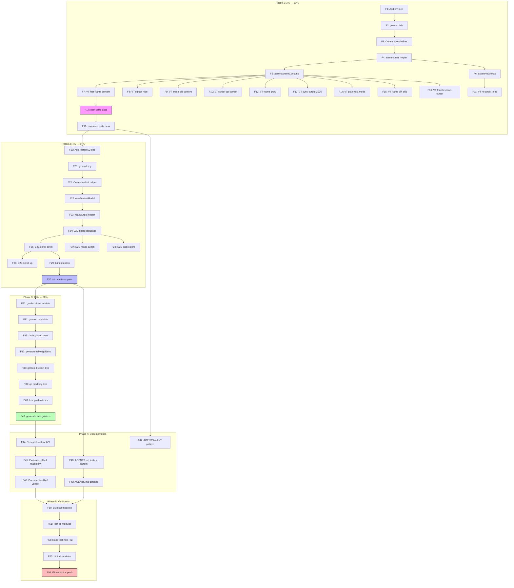

# Charmbracelet/x Integration — VT Testing, teatest E2E, Golden Expansion

> Created: 2026-07-01 23:43 | Status: ACTIVE

## Context

The project already uses `x/ansi` (StringWidth, Truncate, cursor constants) and `x/exp/golden` (snapshot tests) in `nom/`. A deep review of `charmbracelet/x` identified **three high-value testing infrastructure gaps** plus one future production-code opportunity. This plan executes the testing infrastructure improvements (zero production code risk) and documents the production-code evaluation.

### Key Research Findings

- **`x/vt`** — Full VT emulator: `vt.NewEmulator(w,h)` → `term.Write(bytes)` → `term.String()` reads screen. Already-compatible transitive dep (`ultraviolet`). Perfect for testing InlineRenderer escape sequences.
- **`x/exp/teatest/v2`** — Compatible with `charm.land/bubbletea/v2` (NOT v1 teatest!). API: `NewTestModel`, `Send`, `WaitFor`, `FinalOutput`, `RequireEqualOutput`.
- **`x/exp/golden`** — Already a transitive dep in `table/`. Promoting to direct costs nothing.
- **`x/cellbuf`** — Could replace `buildRedrawOutput()` entirely, but high-risk rewrite. Evaluate, don't implement yet.

---

## Pareto Breakdown

### The 1% that delivers 51% of the result

**VT-based test harness for the InlineRenderer** (`nom/`)

The InlineRenderer's `buildRedrawOutput()` + `Draw()` is the most complex terminal-interaction code in the project. It emits cursor-up, erase-line, sync-output (mode 2026), and ghost-line cleanup sequences. Today it's tested only via fragile `strings.Contains(buf, "\x1b[A")` assertions that prove a sequence was *emitted* but never what a terminal would *render*. The AGENTS.md itself admits this is "genuinely untestable without a pseudo-terminal." `x/vt` fixes this — we feed the renderer's output to a real VT emulator and assert on the actual screen buffer.

### The 4% that delivers 64% of the result

**+ `teatest/v2` E2E tests for the TUI** (`tui/`)

The TUI has zero end-to-end test coverage. All tests construct the model directly, bypassing the Bubble Tea program loop. Message dispatch, scroll, mouse-click mapping, quit/cursor-restore — all untested through the real program. `teatest/v2` (the v2-compatible fork) gives us programmatic TUI driving with `tea.KeyPressMsg`, `WaitFor`, and golden-file output comparison.

### The 20% that delivers 80% of the result

**+ Golden-file snapshot testing expansion** (`table/`, `tree/`)

Currently only `nom/` has golden tests. `table/` and `tree/` use ad-hoc string comparison — when rendered output changes, tests fail with unhelpful diffs instead of clean golden updates. `x/exp/golden` is already a transitive dep; promoting it to direct costs nothing.

### Remaining 80% → last 20%

| Opportunity | Verdict | Why |
|---|---|---|
| `x/cellbuf` rewrite of redraw engine | **Evaluate, defer** | High-risk production rewrite. Needs VT tests first (Phase 1). Document feasibility only. |
| `x/ansi` SGR constants in tree/markdown | **Skip** | Contradicts dep-light module design. Hand-rolled sequences are correct. |
| `x/term` consolidation | **Skip** | Zero functional gain. `golang.org/x/term` works fine. |
| `x/colors` palette | **Skip** | Wrong abstraction level for domain-specific SemanticColors. |

---

## Medium Task Breakdown (30–100 min each)

| # | Task | Module | Impact | Effort | Phase |
|---|---|---|---|---|---|
| M1 | Add x/vt dep + create vttest helper | nom/ | Critical | 60min | 1 |
| M2 | VT tests: first-frame Draw + cursor hide | nom/ | Critical | 45min | 1 |
| M3 | VT tests: redraw cycle (cursor-up, erase-line) | nom/ | Critical | 45min | 1 |
| M4 | VT tests: ghost-line cleanup on frame shrink | nom/ | High | 45min | 1 |
| M5 | VT tests: sync-output 2026 + plain-text degradation | nom/ | High | 45min | 1 |
| M6 | VT tests: frame diffing skip + cursor show on Finish | nom/ | Medium | 30min | 1 |
| M7 | Add teatest/v2 dep + create test harness | tui/ | Critical | 60min | 2 |
| M8 | E2E test: basic event sequence (start→activity→complete) | tui/ | Critical | 60min | 2 |
| M9 | E2E test: scroll + display mode switch | tui/ | High | 45min | 2 |
| M10 | E2E test: quit/cursor restoration | tui/ | High | 30min | 2 |
| M11 | Promote golden to direct dep in table/ + golden tests | table/ | High | 45min | 3 |
| M12 | Promote golden to direct dep in tree/ + golden tests | tree/ | High | 45min | 3 |
| M13 | Evaluate x/cellbuf feasibility (spike + document) | nom/ | Medium | 60min | 4 |
| M14 | Update AGENTS.md patterns + gotchas | root | Medium | 30min | 4 |
| M15 | Full verification: build, test, lint, race across all modules | all | Critical | 30min | 5 |

---

## Fine Task Breakdown (max 15 min each)

### Phase 1: x/vt VT Test Harness (1% → 51%)

| # | Task | Est | Deps |
|---|---|---|---|
| F1 | Add `github.com/charmbracelet/x/vt` to nom/go.mod require | 5min | — |
| F2 | Run `go mod tidy` for nom/ | 5min | F1 |
| F3 | Create nom/vttest_test.go: vtWriter (io.Writer → vt.Emulator) | 10min | F2 |
| F4 | Implement screenLines(term) []string helper | 10min | F3 |
| F5 | Implement assertScreenContains(t, term, substr) helper | 5min | F4 |
| F6 | Implement assertNoGhosts(t, term, startY, endY) helper | 10min | F4 |
| F7 | TestVT_FirstFrame_ShowsTreeContent | 10min | F5 |
| F8 | TestVT_FirstFrame_HidesCursor (check cursor.Hidden) | 10min | F5 |
| F9 | TestVT_SecondFrame_ErasesOldContent | 10min | F5 |
| F10 | TestVT_SecondFrame_CursorUpCorrect | 10min | F5 |
| F11 | TestVT_FrameShrink_NoGhostLines | 10min | F6 |
| F12 | TestVT_FrameGrow_AddsNewLines | 10min | F5 |
| F13 | TestVT_SyncOutput_TTY_WrapsMode2026 | 10min | F5 |
| F14 | TestVT_PlainText_NoEscapeSequences | 10min | F5 |
| F15 | TestVT_FrameDiff_IdenticalSkipsRedraw | 10min | F5 |
| F16 | TestVT_Finish_ShowsCursor | 10min | F5 |
| F17 | Run `nix run .#test` for nom/ — verify all pass | 10min | F7-F16 |
| F18 | Run `nix run .#test-race` for nom/ — verify race-free | 10min | F17 |

### Phase 2: teatest/v2 TUI E2E (4% → 64%)

| # | Task | Est | Deps |
|---|---|---|---|
| F19 | Add `github.com/charmbracelet/x/exp/teatest/v2` to tui/go.mod | 5min | F17 |
| F20 | Run `go mod tidy` for tui/ | 5min | F19 |
| F21 | Create tui/teatest_helpers_test.go | 10min | F20 |
| F22 | Implement newTeatestModel(t, w, h) helper | 10min | F21 |
| F23 | Implement readTeatestOutput(t, tm) []byte helper | 5min | F22 |
| F24 | TestTeatest_BasicEventSequence (start→progress→complete) | 15min | F23 |
| F25 | TestTeatest_ScrollDown_ShowsEntries | 15min | F24 |
| F26 | TestTeatest_ScrollUp | 10min | F25 |
| F27 | TestTeatest_DisplayModeSwitch_NOM_To_Universal | 15min | F24 |
| F28 | TestTeatest_Quit_RestoresCursor | 10min | F24 |
| F29 | Run `nix run .#test` for tui/ | 10min | F24-F28 |
| F30 | Run `nix run .#test-race` for tui/ | 10min | F29 |

### Phase 3: Golden Expansion (20% → 80%)

| # | Task | Est | Deps |
|---|---|---|---|
| F31 | Promote golden to direct dep in table/go.mod | 5min | F29 |
| F32 | Run `go mod tidy` for table/ | 5min | F31 |
| F33 | Create table/golden_test.go | 10min | F32 |
| F34 | TestGolden_Table_BasicHeadersRows | 10min | F33 |
| F35 | TestGolden_Table_WithFooterRow | 10min | F34 |
| F36 | TestGolden_Table_NoColorMode | 10min | F35 |
| F37 | Generate golden files (run tests with -update) | 5min | F34-F36 |
| F38 | Promote golden to direct dep in tree/go.mod | 5min | F37 |
| F39 | Run `go mod tidy` for tree/ | 5min | F38 |
| F40 | Create tree/golden_test.go | 10min | F39 |
| F41 | TestGolden_Tree_SimpleHierarchy | 10min | F40 |
| F42 | TestGolden_Tree_WithColors | 10min | F41 |
| F43 | Generate golden files (run tests with -update) | 5min | F41-F42 |

### Phase 4: cellbuf Evaluation + Documentation

| # | Task | Est | Deps |
|---|---|---|---|
| F44 | Research cellbuf.Buffer API (Write, String, diff) | 10min | F43 |
| F45 | Evaluate: can cellbuf replace buildRedrawOutput? | 10min | F44 |
| F46 | Document cellbuf evaluation verdict in this file | 5min | F45 |
| F47 | Add VT testing pattern to AGENTS.md | 10min | F18 |
| F48 | Add teatest/v2 pattern to AGENTS.md | 10min | F30 |
| F49 | Add x/vt + teatest/v2 dep notes to AGENTS.md gotchas | 5min | F48 |

### Phase 5: Full Verification

| # | Task | Est | Deps |
|---|---|---|---|
| F50 | Run `nix run .#build` — all 18 modules | 10min | F49 |
| F51 | Run `nix run .#test` — all 18 modules | 10min | F50 |
| F52 | Run `nix run .#test-race` — nom + tui | 10min | F51 |
| F53 | Run `nix run .#lint` — golangci-lint across all | 10min | F52 |
| F54 | Git commit + push with detailed message | 10min | F53 |

**Total: 54 fine tasks**

---

## Execution Graph

---

## cellbuf Evaluation (Phase 4 Output)

**Verdict: DEFER — technically feasible but poor risk/reward at this time.**

### What cellbuf provides

`cellbuf.Screen` maintains a 2D cell grid and computes minimal diff output via `Render()` + `Flush()`. `ScreenWriter` implements `io.Writer` with ANSI SGR recognition and width-aware wrapping. This maps directly to the InlineRenderer's needs.

### Can it replace `buildRedrawOutput()`?

**Yes, architecturally.** The current manual approach (track `prevLines`, compute `PhysicalLineCount`, cursor-up/erase-line sequencing, ghost-line cleanup) could be replaced by:
1. Write each frame to `cellbuf.Screen` via `ScreenWriter.Print()`
2. `Screen.Render()` computes the diff automatically
3. `Screen.Flush()` writes only changed cells to the output

### Why defer

| Factor | Assessment |
|---|---|
| **Risk** | HIGH — full rewrite of the InlineRenderer's core rendering loop. The two-mutex design (tickMu/renderMu) would need rethinking. |
| **Current state** | WORKING — the code is battle-tested: race-tested, golden-tested, and now VT-tested (Phase 1). |
| **cellbuf maturity** | EXPERIMENTAL — no SemVer guarantees. Package may change API before stabilizing. |
| **Main benefit** | Automatic diff rendering — already handled by the current manual approach. |
| **Secondary benefit** | Width-aware wrapping — the integer-division approximation bug in `PhysicalLineCount` is minor and could be fixed independently. |

### Recommendation

Revisit after `cellbuf` graduates from experimental status (moves to a stable charmbracelet package). At that point, the VT test harness from Phase 1 provides the safety net needed for a confident rewrite. Until then, the current code is correct and well-tested.

---

## Constraints

- **DO NOT BREAK BUILD** — every phase must leave the build green
- **No production code changes** — all work is new test files + dependency additions
- **Core Invariant** — root must not import any sub-module (unchanged)
- **Depguard** — add new deps to `.golangci.yml` allow-lists if lint fails
- **Pattern B** — use committed `replace` directives for sibling deps only; x/vt and teatest/v2 are external deps
