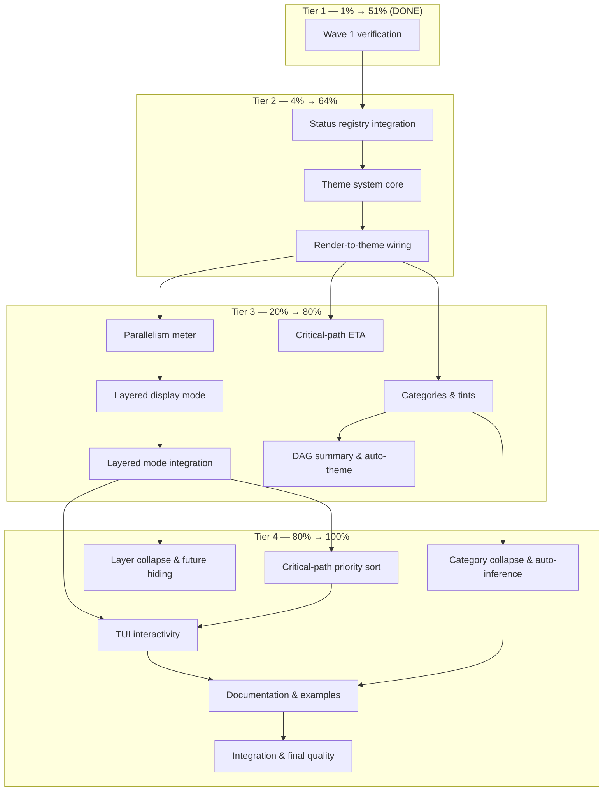

# Execution Plan — Innovating Beyond nom (Resumed)

**Date:** 2026-07-02 04:41
**Branch:** `master`
**Project:** `go-output` / `nom/` module
**Goal:** Finish the entire Innovating Beyond nom feature stack, building on the true DAG topology introduced in `9e6719f`.

> ~~What remains is the integration of the registry into the existing code, the theme system, and all downstream features (parallelism meter, layered display, categories, auto-theme, TUI enhancements, and documentation).~~ **Done — all Tiers 1–4 shipped in v0.23.0** (commit `e23a2f3`). Layered mode, themes, categories, critical-path, parallelism meter, DAG summary, status registry — all implemented.

## Executive Summary

The DAG-overhaul work has been committed in two waves. Wave 1 (critical-path, blockage, convergence markers) and the registry _structure_ of Wave 2 are already on `master`. What remains is the integration of the registry into the existing code, the theme system, and all downstream features (parallelism meter, layered display, categories, auto-theme, TUI enhancements, and documentation).

This plan re-breaks the remaining work into Pareto tiers, then into 30–100 min comprehensive tasks, then into ≤15 min micro-tasks. We execute in tier order: finish the high-value 1% verification, then the 4% status/theme completion, then the 20% feature layer, then the remaining 80% polish.

## Pareto Breakdown

| Tier       | Share of Work | Share of Value | Theme                                                                                          | Status                                                            |
| ---------- | ------------- | -------------- | ---------------------------------------------------------------------------------------------- | ----------------------------------------------------------------- |
| **Tier 1** | ~1%           | 51%            | Critical-path, blockage, convergence markers                                                   | **Done** (commit `48b01c0`)                                       |
| **Tier 2** | ~4%           | 64%            | Open status registry integration + theme system                                                | **Partially done** — registry exists, integration + theme missing |
| **Tier 3** | ~20%          | 80%            | Parallelism meter, layered display, critical-path ETA, category tints, DAG summary, auto-theme | Not started                                                       |
| **Tier 4** | ~80%          | 100%           | Priority sort, layer collapse, interactive TUI, category collapse, docs, examples              | Not started                                                       |

**Total remaining effort (post-Wave 1):** ~13.5 hours, ~84 micro-tasks.

## What Is Already Done

- [x] DAG topology: `ActivityNode.Deps`, deepest-parent placement, Option A/B rendering.
- [x] Wave 1 markers: `◆` critical path, `◇` convergence, `⊘` blockage, opt-in subscriber options.
- [x] Wave 1 tests: `tree_critical_test.go`, `tree_render_test.go`.
- [x] Wave 2 status registry _structure_: `StatusDef`, `statusRegistry`, `RegisterStatus`, `LookupStatus`, `AllRegisteredStatuses`, pre-registration of core IDs 0–3 (commit `f8b261c`).

## What Remains

### Tier 2: Status Registry Integration + Theme (4% → 64%)

1. Wire the registry into `ActivityStatus.String()`, `GetSymbol()`, `GetColor()`, `Interest()`, `IsValid()`, `ParseActivityStatus()`, `AllowedValues()`, `AllActivityStatuses()`.
2. Wire the registry into `status_mappers.go`: `NodeShape()` and `GraphStyle()`.
3. Wire the registry into `activity.go` `applyDisplayStyle()`.
4. Add `status_registry_test.go` with backward-compat and custom-status tests.
5. Define `Theme` struct with `SemanticColors` and `Symbols` map.
6. Define preset themes: `ThemeDefault`, `ThemeDracula`, `ThemeNord`, `ThemeMonochrome`, `ThemeHighContrast`.
7. Add `WithTheme()` subscriber option, store theme in `NOMStyleSubscriber`, add `Theme()` accessor.
8. Refactor `formatActivityLabel`/`formatCollapsedPhaseLabel` to resolve status color through the theme.
9. Refactor `tui/colors.go` to delegate to the subscriber theme.
10. Add `theme_test.go` with preset and custom tests.

### Tier 3: Core Features (20% → 80%)

11. Add `ParallelismStats()` on `NOMStyleSubscriber` and render it in the summary bar.
12. Implement `RenderMode` (`RenderModeTree`, `RenderModeLayered`) and `WithRenderMode()` option.
13. Implement `collectLayeredEntries` + layer separators + wrapping/height-pressure collapse.
14. Wire `RenderWithSnapshots` to dispatch by render mode.
15. Integrate layered mode with `InlineRenderer` and TUI scroll.
16. Implement `EstimatedCriticalPathRemaining()` and render it in the summary bar.
17. Add `ActivityCategory` type and `Category` field on `Activity`/`ActivitySnapshot`.
18. Add `CategoryColors` to `Theme` and render `[tag]` prefix in `formatActivityLabel`.
19. Add `SetCategory()` accessor on subscriber.
20. Add `DAGSummary()` on `DependencyTree` and render summary line.
21. Implement OSC 11 background query and `WithAutoTheme()`.

### Tier 4: Polish, TUI, Docs (80% → 100%)

22. Add critical-path priority boost in `tree_priority.go`.
23. Implement layer-level collapse and future-layer hiding in layered mode.
24. Add TUI key bindings: `T` tree, `L` layered, `C` critical-path-only, `D` DOT export.
25. Implement category-based collapse in tree rendering.
26. Implement category auto-inference for phase children.
27. Update CHANGELOG with DAG and innovation entries.
28. Write ADR 010 (DAG topology) and ADR 011 (status registry).
29. Update `FEATURES.md`, `AGENTS.md`, `TODO_LIST.md`.
30. Add godoc examples and `examples/nom_dag/` demo program.
31. Add VT emulator tests for layered mode and integration test for full event flow → DOT export.
32. Final full-module test, lint, and push.

## Comprehensive Plan (30–100 min tasks)

| #   | Task                                                                                                                       | Tier   | Files                                                                                                       | Est.   | Value                       |
| --- | -------------------------------------------------------------------------------------------------------------------------- | ------ | ----------------------------------------------------------------------------------------------------------- | ------ | --------------------------- |
| T1  | **Wave 1 verification & regression lock** — run tests, lint, and golden update decision                                    | Tier 1 | `nom/`                                                                                                      | 30 min | locks 51% of value          |
| T2  | **Status registry integration** — refactor all `ActivityStatus` methods and `status_mappers.go` to use `LookupStatus`      | Tier 2 | `activity_status.go`, `status_mappers.go`, `activity.go`, `status_registry_test.go`                         | 90 min | enables custom statuses     |
| T3  | **Theme system core** — `Theme` struct, presets, `WithTheme`, subscriber storage                                           | Tier 2 | `theme.go`, `nom_subscriber.go`, `colors.go`                                                                | 75 min | color customization         |
| T4  | **Render-to-theme wiring** — `formatActivityLabel`/`formatCollapsedPhaseLabel` + TUI delegation                            | Tier 2 | `tree_render.go`, `tui/colors.go`, `theme_test.go`                                                          | 75 min | consistent visuals          |
| T5  | **Parallelism meter** — `ParallelismStats()` + summary bar rendering + tests                                               | Tier 3 | `state_accessors.go`, `inline_renderer_summary.go`, `state_accessors_test.go`                               | 45 min | at-a-glance concurrency     |
| T6  | **Layered display mode** — `RenderMode`, `collectLayeredEntries`, layer separators, wrapping, height pressure              | Tier 3 | `types.go`, `tree_render.go`, `tree_render_layered.go`, `nom_subscriber.go`                                 | 90 min | DAG-appropriate layout      |
| T7  | **Layered mode integration** — inline renderer + TUI scroll + golden/VT tests                                              | Tier 3 | `inline_renderer.go`, `tui/render_nom.go`, `tree_render_layered_test.go`, `golden_test.go`                  | 75 min | end-to-end mode             |
| T8  | **Critical-path ETA** — `EstimatedCriticalPathRemaining()` + summary bar + tests                                           | Tier 3 | `tree_critical.go`, `inline_renderer_summary.go`, `tree_critical_test.go`                                   | 45 min | time awareness              |
| T9  | **Categories & tints** — `ActivityCategory`, `CategoryColors`, `SetCategory`, `[tag]` prefix + tests                       | Tier 3 | `types.go`, `activity.go`, `subscriber_handlers.go`, `tree_render.go`, `theme.go`, `tree_render_test.go`    | 75 min | semantic grouping           |
| T10 | **DAG summary & auto-theme** — `DAGSummary()`, summary line, OSC 11 probe, `WithAutoTheme()` + tests                       | Tier 3 | `tree_accessors.go`, `inline_renderer_summary.go`, `theme.go`, `nom_subscriber.go`, `theme_test.go`         | 75 min | context + adaptivity        |
| T11 | **Critical-path priority sort** — boost `onCriticalPath` in `sortKey.less()` + tests                                       | Tier 4 | `tree_priority.go`, `tree_priority_test.go`                                                                 | 30 min | keep important rows visible |
| T12 | **Layer collapse & future hiding** — collapsed layer summaries + future layer hiding under pressure                        | Tier 4 | `tree_render_layered.go`, `tree_render_layered_test.go`                                                     | 45 min | height pressure management  |
| T13 | **TUI interactivity** — `T`/`L`/`C`/`D` keys, layered scroll, DOT export + teatest tests                                   | Tier 4 | `model.go`, `update.go`, `tui/render_nom.go`, `teatest_test.go`                                             | 90 min | interactive exploration     |
| T14 | **Category collapse & auto-inference** — group by category, phase children inherit category + tests                        | Tier 4 | `tree_render.go`, `subscriber_handlers.go`, `tree_render_test.go`, `subscriber_handlers_test.go`            | 75 min | compact views               |
| T15 | **Documentation & examples** — CHANGELOG, ADRs 010/011, FEATURES.md, AGENTS.md, TODO_LIST.md, godoc examples, demo program | Tier 4 | `docs/`, `CHANGELOG.md`, `FEATURES.md`, `AGENTS.md`, `TODO_LIST.md`, `example_test.go`, `examples/nom_dag/` | 90 min | user discoverability        |
| T16 | **Integration & final quality** — VT layered test, integration test, full `nix run .#test`, lint, commit, push             | Tier 4 | `vt_layered_test.go`, `integration/`, all modules                                                           | 60 min | ship-ready                  |

**Total comprehensive tasks:** 16
**Total remaining time:** ~13.5 hours

## Detailed Micro-Plan (≤15 min each)

### Tier 2 — Status Registry Integration + Theme

#### T2: Status Registry Integration (90 min → 9 micro-tasks)

| ID   | Micro-task                                                                                 | Est. | File(s)                   |
| ---- | ------------------------------------------------------------------------------------------ | ---- | ------------------------- |
| T2.1 | Add `LookupStatus` fallback safety: ensure core IDs 0–3 always return a valid def          | 10   | `status_registry.go`      |
| T2.2 | Refactor `ActivityStatus.String()` to `LookupStatus().Name`                                | 10   | `activity_status.go`      |
| T2.3 | Refactor `GetSymbol()` to `LookupStatus().Symbol`                                          | 10   | `activity_status.go`      |
| T2.4 | Refactor `GetColor()` to `LookupStatus().Color`                                            | 10   | `activity_status.go`      |
| T2.5 | Refactor `Interest()` to `LookupStatus().Interest`                                         | 10   | `activity_status.go`      |
| T2.6 | Refactor `NodeShape()` and `GraphStyle()` to registry lookup                               | 12   | `status_mappers.go`       |
| T2.7 | Refactor `ParseActivityStatus`/`IsValid`/`AllowedValues`/`AllActivityStatuses` to registry | 15   | `activity_status.go`      |
| T2.8 | Update `applyDisplayStyle()` to use `LookupStatus().Symbol/Color`                          | 10   | `activity.go`             |
| T2.9 | Add `status_registry_test.go`: backward compat, custom status, parse/valid                 | 15   | `status_registry_test.go` |

#### T3: Theme System Core (75 min → 7 micro-tasks)

| ID   | Micro-task                                                                         | Est. | File(s)                         |
| ---- | ---------------------------------------------------------------------------------- | ---- | ------------------------------- |
| T3.1 | Define `Theme` struct: `SemanticColors` + `Symbols map[ActivityStatus]Symbol`      | 10   | `theme.go`                      |
| T3.2 | Define `SemanticColors` struct matching current `Colors`                           | 10   | `theme.go`                      |
| T3.3 | Create `ThemeDefault` preset (current colors)                                      | 10   | `theme.go`                      |
| T3.4 | Create `ThemeDracula`, `ThemeNord`, `ThemeMonochrome`, `ThemeHighContrast` presets | 15   | `theme.go`                      |
| T3.5 | Add `WithTheme(Theme) SubscriberOption` and `theme` field on `NOMStyleSubscriber`  | 10   | `nom_subscriber.go`, `theme.go` |
| T3.6 | Add `Theme()` accessor and ensure default theme is used when none set              | 10   | `nom_subscriber.go`, `theme.go` |
| T3.7 | Add `theme_test.go`: preset color assertions, default fallback, custom symbol map  | 15   | `theme_test.go`                 |

#### T4: Render-to-Theme Wiring (75 min → 7 micro-tasks)

| ID   | Micro-task                                                                 | Est. | File(s)                                |
| ---- | -------------------------------------------------------------------------- | ---- | -------------------------------------- |
| T4.1 | Add `ActivitySnapshot` color/symbol resolution helpers that accept a theme | 10   | `activity_snapshot.go`                 |
| T4.2 | Refactor `formatActivityLabel` to use themed status color/symbol           | 12   | `tree_render.go`                       |
| T4.3 | Refactor `formatCollapsedPhaseLabel` to use themed phase color/symbol      | 10   | `tree_render.go`                       |
| T4.4 | Thread theme through `RenderWithSnapshots` to `collectVisibleNodes`        | 10   | `tree_render.go`, `tree.go`            |
| T4.5 | Refactor `tui/colors.go` to read semantic colors from the subscriber theme | 12   | `tui/colors.go`, `tui/model.go`        |
| T4.6 | Ensure TUI model captures the theme from its subscriber or defaults        | 10   | `tui/model.go`                         |
| T4.7 | Add theme regression tests: compare ANSI output for default vs Dracula     | 15   | `theme_test.go`, `tree_render_test.go` |

### Tier 3 — Core Features

#### T5: Parallelism Meter (45 min → 5 micro-tasks)

| ID   | Micro-task                                                                     | Est. | File(s)                      |
| ---- | ------------------------------------------------------------------------------ | ---- | ---------------------------- |
| T5.1 | Define `ParallelismStats` struct and `ParallelismStats()` method on subscriber | 10   | `state_accessors.go`         |
| T5.2 | Count `running` and `possible` (pending with all deps complete)                | 12   | `state_accessors.go`         |
| T5.3 | Add `renderParallelism()` helper in summary bar                                | 10   | `inline_renderer_summary.go` |
| T5.4 | Wire summary bar to show `"parallel: 3/4 possible"`                            | 8    | `inline_renderer_summary.go` |
| T5.5 | Add tests for diamond, serial, and all-complete DAGs                           | 10   | `state_accessors_test.go`    |

#### T6: Layered Display Mode (90 min → 9 micro-tasks)

| ID   | Micro-task                                                                          | Est. | File(s)                        |
| ---- | ----------------------------------------------------------------------------------- | ---- | ------------------------------ |
| T6.1 | Define `RenderMode` type and constants (`RenderModeTree`, `RenderModeLayered`)      | 10   | `types.go`                     |
| T6.2 | Add `renderMode` field to `DependencyTree` and `WithRenderMode()` subscriber option | 10   | `tree.go`, `nom_subscriber.go` |
| T6.3 | Implement `collectLayeredEntries` grouping nodes by `node.Depth`                    | 15   | `tree_render_layered.go`       |
| T6.4 | Implement layer header and separator rendering                                      | 12   | `tree_render_layered.go`       |
| T6.5 | Handle wide-layer wrapping when terminal width is exceeded                          | 12   | `tree_render_layered.go`       |
| T6.6 | Handle height-pressure collapse for completed layers                                | 12   | `tree_render_layered.go`       |
| T6.7 | Refactor `RenderWithSnapshots` to dispatch tree/layered by `dt.renderMode`          | 10   | `tree_render.go`               |
| T6.8 | Add `tree_render_layered_test.go`: grouping, separators, no trailing separator      | 12   | `tree_render_layered_test.go`  |
| T6.9 | Add golden test for layered mode                                                    | 10   | `golden_test.go`               |

#### T7: Layered Mode Integration (75 min → 6 micro-tasks)

| ID   | Micro-task                                                              | Est. | File(s)              |
| ---- | ----------------------------------------------------------------------- | ---- | -------------------- |
| T7.1 | Wire `RenderSnapshot` in `state_accessors.go` to use layered mode       | 10   | `state_accessors.go` |
| T7.2 | Ensure `InlineRenderer` respects layered frames without diff corruption | 12   | `inline_renderer.go` |
| T7.3 | Update TUI `renderDependencyTree` to dispatch by mode                   | 15   | `tui/render_nom.go`  |
| T7.4 | Implement layered-mode scroll windowing in TUI                          | 15   | `tui/render_nom.go`  |
| T7.5 | Add layered mode golden test                                            | 10   | `golden_test.go`     |
| T7.6 | Add VT layered mode test                                                | 15   | `vt_layered_test.go` |

#### T8: Critical-Path ETA (45 min → 4 micro-tasks)

| ID   | Micro-task                                                              | Est. | File(s)                      |
| ---- | ----------------------------------------------------------------------- | ---- | ---------------------------- |
| T8.1 | Implement `EstimatedCriticalPathRemaining(snapshots) time.Duration`     | 15   | `tree_critical.go`           |
| T8.2 | Use max path sum (not sum) with `max(0, est-elapsed)` for running nodes | 12   | `tree_critical.go`           |
| T8.3 | Render `"~Xm left (critical path)"` in summary bar                      | 10   | `inline_renderer_summary.go` |
| T8.4 | Add tests for diamond and running-node ETA                              | 10   | `tree_critical_test.go`      |

#### T9: Categories & Tints (75 min → 7 micro-tasks)

| ID   | Micro-task                                                                         | Est. | File(s)                                           |
| ---- | ---------------------------------------------------------------------------------- | ---- | ------------------------------------------------- |
| T9.1 | Define `ActivityCategory` type and add `Category` to `Activity`/`ActivitySnapshot` | 10   | `types.go`, `activity.go`, `activity_snapshot.go` |
| T9.2 | Add `SetCategory(id, cat)` accessor on subscriber                                  | 10   | `configuration.go` or `subscriber_handlers.go`    |
| T9.3 | Add `CategoryColors map[ActivityCategory]color.Color` to `Theme`                   | 10   | `theme.go`                                        |
| T9.4 | Render `[category]` prefix in `formatActivityLabel` when non-empty                 | 12   | `tree_render.go`                                  |
| T9.5 | Apply category tint color to prefix                                                | 10   | `tree_render.go`, `theme.go`                      |
| T9.6 | Add default category colors to `ThemeDefault`                                      | 8    | `theme.go`                                        |
| T9.7 | Add tests for category rendering and empty-category no-op                          | 10   | `tree_render_test.go`                             |

#### T10: DAG Summary & Auto-Theme (75 min → 7 micro-tasks)

| ID    | Micro-task                                                                       | Est. | File(s)                         |
| ----- | -------------------------------------------------------------------------------- | ---- | ------------------------------- |
| T10.1 | Implement `DAGSummary()` on `DependencyTree` (nodes, edges, layers, widestLayer) | 15   | `tree_accessors.go`             |
| T10.2 | Add `renderDAGSummary()` to summary bar                                          | 10   | `inline_renderer_summary.go`    |
| T10.3 | Add tests for DAG summary counts                                                 | 10   | `tree_accessors_test.go`        |
| T10.4 | Implement OSC 11 terminal background color query helper                          | 12   | `theme.go`                      |
| T10.5 | Add `WithAutoTheme()` option that probes OSC 11 and picks light/dark preset      | 12   | `theme.go`, `nom_subscriber.go` |
| T10.6 | Ensure graceful fallback when OSC 11 unsupported (non-TTY)                       | 10   | `theme.go`                      |
| T10.7 | Add auto-theme fallback tests                                                    | 10   | `theme_test.go`                 |

### Tier 4 — Polish, TUI, Docs

#### T11: Critical-Path Priority Sort (30 min → 3 micro-tasks)

| ID    | Micro-task                                                                  | Est. | File(s)                 |
| ----- | --------------------------------------------------------------------------- | ---- | ----------------------- |
| T11.1 | Add `onCriticalPath` to `sortKey` struct                                    | 10   | `tree_priority.go`      |
| T11.2 | Update `sortKey.less()` to boost critical-path nodes at same interest level | 10   | `tree_priority.go`      |
| T11.3 | Add height-pressure test where critical nodes stay visible                  | 10   | `tree_priority_test.go` |

#### T12: Layer Collapse & Future Hiding (45 min → 4 micro-tasks)

| ID    | Micro-task                                                             | Est. | File(s)                       |
| ----- | ---------------------------------------------------------------------- | ---- | ----------------------------- |
| T12.1 | Implement completed-layer summary line: `"✔ Layer 0: Build (done)"`    | 12   | `tree_render_layered.go`      |
| T12.2 | Implement future-layer hiding: show active + next layer, collapse rest | 12   | `tree_render_layered.go`      |
| T12.3 | Render `"⋯ N more layers"` marker                                      | 8    | `tree_render_layered.go`      |
| T12.4 | Add tests for completed-layer collapse and future-layer hiding         | 10   | `tree_render_layered_test.go` |

#### T13: TUI Interactivity (90 min → 8 micro-tasks)

| ID    | Micro-task                                                  | Est. | File(s)                              |
| ----- | ----------------------------------------------------------- | ---- | ------------------------------------ |
| T13.1 | Add `renderMode` field to TUI model                         | 10   | `tui/model.go`                       |
| T13.2 | Add `T` key binding toggling tree/layered mode              | 10   | `tui/update.go`                      |
| T13.3 | Add `C` key binding for critical-path-only filter           | 10   | `tui/update.go`, `tui/render_nom.go` |
| T13.4 | Implement critical-path filtering in `renderDependencyTree` | 12   | `tui/render_nom.go`                  |
| T13.5 | Add `D` key binding for DOT export to file                  | 12   | `tui/update.go`                      |
| T13.6 | Implement layered-mode scroll logic                         | 12   | `tui/render_nom.go`                  |
| T13.7 | Add teatest for tree/layered key toggle                     | 12   | `tui/teatest_test.go`                |
| T13.8 | Add teatest for critical-path filter and DOT export         | 12   | `tui/teatest_test.go`                |

#### T14: Category Collapse & Auto-Inference (75 min → 7 micro-tasks)

| ID    | Micro-task                                                                   | Est. | File(s)                        |
| ----- | ---------------------------------------------------------------------------- | ---- | ------------------------------ |
| T14.1 | Implement category-based collapse in `collectVisibleNodes`                   | 15   | `tree_render.go`               |
| T14.2 | Render summary line: `"all 6 build tasks passed"`                            | 12   | `tree_render.go`               |
| T14.3 | Add subscriber option to enable category collapse                            | 8    | `nom_subscriber.go`, `tree.go` |
| T14.4 | Add tests for category collapse grouping                                     | 10   | `tree_render_test.go`          |
| T14.5 | Implement phase children inherit parent category in `subscriber_handlers.go` | 12   | `subscriber_handlers.go`       |
| T14.6 | Add tests for category auto-inference                                        | 10   | `subscriber_handlers_test.go`  |
| T14.7 | Document category collapse option and auto-inference                         | 8    | `AGENTS.md` (later)            |

#### T15: Documentation & Examples (90 min → 8 micro-tasks)

| ID    | Micro-task                                                             | Est. | File(s)                           |
| ----- | ---------------------------------------------------------------------- | ---- | --------------------------------- |
| T15.1 | CHANGELOG entry for DAG topology overhaul                              | 10   | `CHANGELOG.md`                    |
| T15.2 | CHANGELOG entry for innovation features                                | 10   | `CHANGELOG.md`                    |
| T15.3 | ADR 010: DAG topology model                                            | 12   | `docs/adr/010-dag-topology.md`    |
| T15.4 | ADR 011: Open status registry                                          | 12   | `docs/adr/011-status-registry.md` |
| T15.5 | Update `FEATURES.md` with new features                                 | 10   | `FEATURES.md`                     |
| T15.6 | Update `AGENTS.md` with new patterns                                   | 10   | `AGENTS.md`                       |
| T15.7 | Update `TODO_LIST.md` with done status                                 | 8    | `TODO_LIST.md`                    |
| T15.8 | Add godoc examples: `WithShowExtraDeps`, `RegisterStatus`, `WithTheme` | 12   | `nom/example_test.go`             |
| T15.9 | Add `examples/nom_dag/` demo program                                   | 15   | `examples/nom_dag/`               |

#### T16: Integration & Final Quality (60 min → 5 micro-tasks)

| ID    | Micro-task                                                                  | Est. | File(s)                  |
| ----- | --------------------------------------------------------------------------- | ---- | ------------------------ |
| T16.1 | VT layered mode test                                                        | 15   | `nom/vt_layered_test.go` |
| T16.2 | Integration test: full event flow → subscriber → DOT export with multi-deps | 15   | `integration/`           |
| T16.3 | Run `nix run .#test` across all modules                                     | 15   | all                      |
| T16.4 | Run `golangci-lint` on `nom/` and fix issues                                | 15   | `nom/`                   |
| T16.5 | Commit and push all changes                                                 | 10   | git                      |

## Mermaid.js Execution Graph

## Risks & Dependencies

1. **Theme lock model.** `tui/colors.go` has a global `colors` struct. We must thread the subscriber theme through the model instead of relying on globals; otherwise tests run with stale colors and TUI cannot adapt to `WithTheme`.
2. **Layered mode scroll.** The TUI scroll window slices `visibleEntries`. Layered mode will introduce entries that are layer separators rather than activity nodes; mouse click mapping and scroll clamping must be verified.
3. **Status registry backward compat.** Core statuses must remain IDs 0–3. Any test that asserts on `ActivityStatus(0)` etc. must continue to pass. The registry `LookupStatus` must return a safe default for unknown IDs instead of panicking.
4. **OSC 11 auto-theme.** The terminal background query may not work in all terminals; we must default to `ThemeDefault` when the probe fails or the writer is not a TTY.
5. **Golden tests.** New features default to off where possible to keep existing golden files stable. When we add new golden tests (layered mode, themes), we use `ColorModeNever`.

## Definition of Done

- `nom` module tests pass: `go test ./... -count=1`.
- `nom` module lint is clean: `golangci-lint run ./...`.
- All new public APIs have tests and godoc examples.
- `CHANGELOG.md`, `FEATURES.md`, `AGENTS.md`, `TODO_LIST.md`, and ADRs 010/011 are updated.
- A runnable example exists at `examples/nom_dag/`.
- The branch is committed and pushed.
