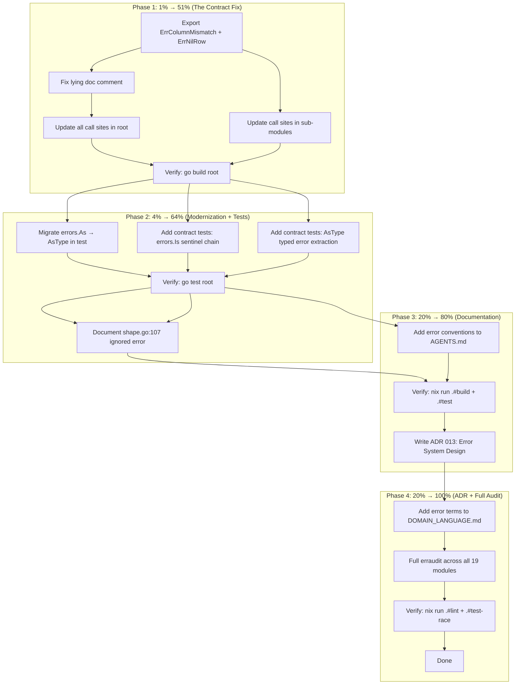

# Superb Error System for go-output

**Date:** 2026-07-30
**Status:** Planned — awaiting execution
**Scope:** Root package (`output`) error contract + cross-module consistency

---

## Context: What Triggered This

An `erraudit ./...` run on the root package reported 27 violations (16 ERROR, 11 WARNING).
After deep analysis, **~90% are false positives** — the tool suggests anti-patterns for a Go library.
The remaining findings surface **one real contract bug** and **one modernization gap**.

### Current Error Inventory

| Category                            | Count | Location                                       | Status                                     |
| ----------------------------------- | ----- | ---------------------------------------------- | ------------------------------------------ |
| Typed error structs (`*XxxError`)   | 11    | root + nom + graph + d2                        | Good — structured fields, proper `Error()` |
| Exported sentinels (`var ErrFoo`)   | 8     | d2 (5), nom (1), testhelpers (2)               | Good                                       |
| Unexported sentinels (`var errFoo`) | 2     | root: `errColumnMismatch`, `errNilRow`         | **BUG: should be exported**                |
| `errors.Is` calls in production     | 0     | —                                              | N/A (nothing matches on sentinels yet)     |
| `errors.As` calls (legacy)          | 1     | `render_registry_test.go:89`                   | **Should be `errors.AsType`**              |
| Ignored errors (`_`)                | 1     | `shape.go:107`                                 | **Needs documentation**                    |
| Lying doc comments                  | 1     | `tabledata.go:47` promises `ErrColumnMismatch` | **CRITICAL: documented but not exported**  |

---

## The Real Issues (sorted by impact)

### Issue 1 — CRITICAL: Lying Doc Comment (1% → 51%)

`tabledata.go:47`:

```go
// Returns ErrColumnMismatch if the row length differs from len(Headers).
func (d *Table) AddRowChecked(row []string) error {
    ...
    return fmt.Errorf("%w: row has %d columns, expected %d",
        errColumnMismatch, len(row), len(d.Headers))
```

The doc comment **promises** `ErrColumnMismatch` (exported), but the variable is `errColumnMismatch` (unexported).
A consumer reading the docs would write `errors.Is(err, output.ErrColumnMismatch)` and get a compile error.
This is the most insidious error-system bug: **the public contract lies**.

**Fix:** Export both sentinels (`ErrColumnMismatch`, `ErrNilRow`) and update all call sites.

### Issue 2 — Go 1.26 Modernization (part of the 4% → 64%)

`render_registry_test.go:89` (confirmed by gopls diagnostic `[gopls errorsastype]`):

```go
var unsupportedErr *UnsupportedFormatError
if !errors.As(err, &unsupportedErr) {  // ← should be AsType
```

**Fix:** Migrate to `errors.AsType[*UnsupportedFormatError](err)`.

### Issue 3 — Undocumented Ignored Error (part of the 20% → 80%)

`shape.go:107`:

```go
func (f Format) Shapes() []Shape {
    shapes, _ := getFormatShapes(f)  // ← silently ignores error
    return shapes
}
```

This is **intentional** — unregistered formats return empty (consistent with `Supports()` returning false on line 97-99).
But it's undocumented, so `erraudit` flags it and future maintainers will wonder.

**Fix:** Add a comment explaining the intentional error suppression.

### Issue 4 — No Error Contract Tests (part of the 20% → 80%)

There are zero tests proving that `errors.Is` works through the `%w` wrapping chain.
If someone accidentally changes `%w` to `%v` or `%s`, no test would catch it.

**Fix:** Add contract tests: `errors.Is(AddRowChecked error, ErrColumnMismatch) == true`,
`errors.Is(Validate error, ErrNilRow) == true`, etc.

### Issue 5 — No Error System Documentation (the other 20% → 100%)

The error system design is implicit. AGENTS.md doesn't mention it.
DOMAIN_LANGUAGE.md has no error vocabulary. No ADR captures the design decisions.

**Fix:** Add error conventions to AGENTS.md, error terms to DOMAIN_LANGUAGE.md, and an ADR.

---

## What NOT To Do (VERSCHLIMMBESSER Prevention)

| Anti-Pattern                               | Why It's Wrong                                                                                                    | erraudit Finding                                   |
| ------------------------------------------ | ----------------------------------------------------------------------------------------------------------------- | -------------------------------------------------- |
| Add `out=%v` to error messages             | `out` is the **failed render result** — empty/garbage on the error path. Leaks noise, makes errors non-greppable. | 16 `context_loss` ERRORs (all false positives)     |
| Return concrete types instead of `error`   | Couples consumers to implementation. Go convention: return `error`, let callers match via `errors.Is`/`AsType`.   | 11 `generic_return` WARNINGs (all false positives) |
| Create `RenderError` interface hierarchy   | Over-engineering. Flat typed structs + sentinels + wrapping IS the Go convention.                                 | (not from erraudit)                                |
| Merge d2 sentinels with graph typed errors | Different domains — D2 shapes (d2 module) vs graph shapes (root). Not a split brain.                              | (not from erraudit)                                |
| Add `errors.Is` where none is needed       | YAGNI — zero production callers match on sentinels today                                                          | (not from erraudit)                                |

---

## Execution Graph



---

## Phase 1: Export Validation Sentinels (1% → 51%)

**Why first:** This is the only real bug. The public API promises `ErrColumnMismatch` but delivers an unexported variable. Every consumer who reads the docs and writes `errors.Is(err, output.ErrColumnMismatch)` gets a compile error.

### Tasks

| ID  | Task                                             | File(s)                   | Impact   | Effort | Size |
| --- | ------------------------------------------------ | ------------------------- | -------- | ------ | ---- |
| 1.1 | Rename `errColumnMismatch` → `ErrColumnMismatch` | `tabledata.go:9`          | Critical | 2min   | XS   |
| 1.2 | Rename `errNilRow` → `ErrNilRow`                 | `tabledata.go:10`         | Critical | 2min   | XS   |
| 1.3 | Update all references in `tabledata.go`          | `tabledata.go:51,134,144` | Critical | 3min   | XS   |
| 1.4 | Update doc comments to match exported names      | `tabledata.go:43-47`      | Critical | 3min   | XS   |
| 1.5 | Verify build: `go build .`                       | —                         | High     | 1min   | XS   |

---

## Phase 2: Go 1.26 Modernization + Contract Tests (4% → 64%)

**Why:** The sentinels exist but nothing proves they work through `%w` wrapping. Also, one `errors.As` call should be the modern `AsType`.

### Tasks

| ID  | Task                                               | File(s)                               | Impact | Effort | Size |
| --- | -------------------------------------------------- | ------------------------------------- | ------ | ------ | ---- |
| 2.1 | Migrate `errors.As` → `errors.AsType`              | `render_registry_test.go:88-91`       | High   | 3min   | XS   |
| 2.2 | Add `TestErrColumnMismatch_MatchesThroughWrapping` | `tabledata_test.go` (new or existing) | High   | 8min   | S    |
| 2.3 | Add `TestErrNilRow_MatchesThroughWrapping`         | `tabledata_test.go`                   | High   | 5min   | XS   |
| 2.4 | Add `TestUnsupportedFormatError_AsTypeExtraction`  | `render_registry_test.go`             | Medium | 5min   | XS   |
| 2.5 | Verify: `go test -race -count=1 ./...`             | —                                     | High   | 2min   | XS   |

---

## Phase 3: Documentation (20% → 80%)

**Why:** The error system is implicit knowledge. Future maintainers and AI sessions need it written down.

### Tasks

| ID  | Task                                                   | File(s)            | Impact | Effort | Size |
| --- | ------------------------------------------------------ | ------------------ | ------ | ------ | ---- |
| 3.1 | Document `shape.go:107` intentional error suppression  | `shape.go:106-109` | Medium | 3min   | XS   |
| 3.2 | Add error system pattern to AGENTS.md Patterns section | `AGENTS.md`        | High   | 10min  | S    |
| 3.3 | Verify: `nix run .#build && nix run .#test`            | —                  | High   | 5min   | XS   |

---

## Phase 4: ADR + Full Audit (20% → 100%)

**Why:** Lock in the design decisions so future changes respect the contract.

### Tasks

| ID  | Task                                                  | File(s)                                | Impact | Effort | Size |
| --- | ----------------------------------------------------- | -------------------------------------- | ------ | ------ | ---- |
| 4.1 | Write ADR 013: Error System Design                    | `docs/adr/0013-error-system-design.md` | Medium | 12min  | S    |
| 4.2 | Add error terms to DOMAIN_LANGUAGE.md                 | `docs/DOMAIN_LANGUAGE.md`              | Low    | 5min   | XS   |
| 4.3 | Run erraudit across all 19 modules, document findings | This plan file (appendix)              | Medium | 8min   | S    |
| 4.4 | Verify: `nix run .#lint`                              | —                                      | High   | 5min   | XS   |
| 4.5 | Verify: `nix run .#test-race`                         | —                                      | High   | 5min   | XS   |

---

## Consolidated Task Table (All Phases, Sorted by Impact × Urgency)

| Priority | ID  | Task                                        | Impact   | Effort | Phase |
| -------- | --- | ------------------------------------------- | -------- | ------ | ----- |
| P0       | 1.1 | Export `ErrColumnMismatch`                  | Critical | 2min   | 1     |
| P0       | 1.2 | Export `ErrNilRow`                          | Critical | 2min   | 1     |
| P0       | 1.3 | Update call sites in `tabledata.go`         | Critical | 3min   | 1     |
| P0       | 1.4 | Fix lying doc comment                       | Critical | 3min   | 1     |
| P0       | 1.5 | Verify root build                           | High     | 1min   | 1     |
| P1       | 2.1 | Migrate `errors.As` → `AsType`              | High     | 3min   | 2     |
| P1       | 2.2 | Contract test: `ErrColumnMismatch` wrapping | High     | 8min   | 2     |
| P1       | 2.3 | Contract test: `ErrNilRow` wrapping         | High     | 5min   | 2     |
| P1       | 2.4 | Contract test: `AsType` extraction          | Medium   | 5min   | 2     |
| P1       | 2.5 | Verify root tests                           | High     | 2min   | 2     |
| P2       | 3.1 | Document `shape.go:107`                     | Medium   | 3min   | 3     |
| P2       | 3.2 | Error conventions in AGENTS.md              | High     | 10min  | 3     |
| P2       | 3.3 | Verify full build + test                    | High     | 5min   | 3     |
| P3       | 4.1 | ADR 013: Error System Design                | Medium   | 12min  | 4     |
| P3       | 4.2 | Error terms in DOMAIN_LANGUAGE.md           | Low      | 5min   | 4     |
| P3       | 4.3 | Cross-module erraudit documentation         | Medium   | 8min   | 4     |
| P3       | 4.4 | Verify lint                                 | High     | 5min   | 4     |
| P3       | 4.5 | Verify test-race                            | High     | 5min   | 4     |

**Total estimated effort:** ~90 minutes
**Net code changes:** 3 production files (tabledata.go, shape.go, render_registry_test.go), 1 new test file, 3 doc files

---

## Micro-Breakdown (≤12 min per task)

Every task above is already ≤12 minutes. No further decomposition needed.

---

## Success Criteria

- [ ] `ErrColumnMismatch` and `ErrNilRow` are exported and matchable via `errors.Is`
- [ ] Doc comments accurately reference exported names
- [ ] `errors.AsType` used instead of `errors.As` (Go 1.26 modernization)
- [ ] Contract tests prove sentinel matching through `%w` wrapping
- [ ] `shape.go:107` intentional suppression is documented
- [ ] AGENTS.md has an error system pattern entry
- [ ] ADR 013 captures the design decisions
- [ ] `nix run .#build` passes across all 19 modules
- [ ] `nix run .#test` passes across all 19 modules
- [ ] `nix run .#lint` passes
- [ ] No new erraudit violations introduced
