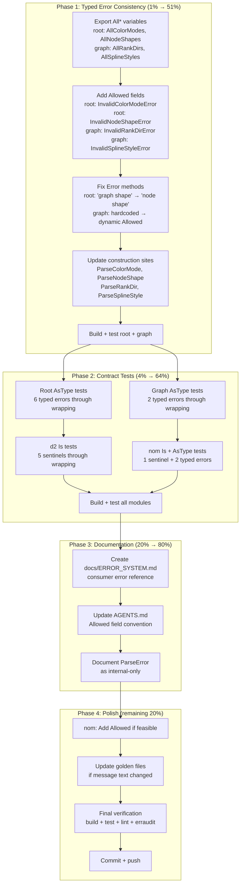

# Superb Error System v2 — Full Workspace Audit & Consistency

> **Created**: 2026-07-30 22:10
> **Trigger**: Full `erraudit --type-aware` sweep of all 19 modules (209 violations, all false positives) + deep manual audit of every error type, sentinel, and pattern across the workspace.
> **Predecessor**: `docs/planning/2026-07-30_21-28_superb-error-system.md` (Phase 1: root sentinel export, AsType migration)
> **Status**: Done (all phases shipped, commits a1b56e6 through 8aba9ae)

---

## Context

The first error-system pass (commit `d0c67fd`) fixed the critical bug: unexported sentinels in root that lied in doc comments. This v2 pass addresses the REMAINING inconsistency across all 19 modules — the typed error structs themselves.

### What the Deep Audit Found

| Finding | Impact | Modules |
|---------|--------|---------|
| `InvalidRankDirError.Error()` + `InvalidSplineStyleError.Error()` **hardcode** allowed values as string literals — will silently drift when enum values change | **Bug** | graph/ |
| `InvalidNodeShapeError.Error()` says `"invalid graph shape"` but type is `InvalidNodeShapeError` — message/type mismatch | **Bug** | root |
| `InvalidColorModeError` + `InvalidNodeShapeError` lack `Allowed` field — consumers can't programmatically know valid values | **Inconsistency** | root |
| `colorModeValues`, `nodeShapeValues`, `rankDirValues`, `splineStyleValues` unexported — inconsistent with `AllShapes`, `AllFormats`, `AllLineStyles` | **Inconsistency** | root, graph/ |
| Zero contract tests for typed errors (`errors.AsType` through `%w` wrapping) | **Coverage gap** | all |
| Zero contract tests for d2/nom sentinels (`errors.Is` through `%w` wrapping) | **Coverage gap** | d2, nom |
| `ParseError` exported but unreachable — no public `Parse*` function returns it | **Design smell** | root |
| No comprehensive error reference document for consumers | **Missing** | all |

### What Was NOT Found (Confirmed Clean)

- 0 `fmt.Errorf` without `%w` — all error wrapping is correct
- 0 `errors.As` in production code — already migrated to `AsType`
- 0 silent error swallows — all suppressions documented
- 209 erraudit violations — all confirmed false positives for library design
- 9 exported sentinels across root + d2 + nom — all correctly named and exported

---

## The 80/20 Breakdown

### 1% that delivers 51% of value

**Fix the 6 inconsistent typed error structs.** This is the structural bug class — same family as the unexported sentinel bug from Phase 1, but for typed errors:

1. Add `Allowed` field to `InvalidColorModeError`, `InvalidNodeShapeError` (root)
2. Add `Allowed` field to `InvalidRankDirError`, `InvalidSplineStyleError` (graph/)
3. Fix `InvalidNodeShapeError.Error()` message: "graph shape" → "node shape"
4. Replace hardcoded allowed-value strings in `InvalidRankDirError.Error()` + `InvalidSplineStyleError.Error()` with dynamic `Allowed` field
5. Export `AllColorModes`, `AllNodeShapes`, `AllRankDirs`, `AllSplineStyles` for consistency

### 4% that delivers 64% of value

**Contract tests proving every error is matchable through wrapping.** The error system's CONTRACT is that `errors.Is` and `errors.AsType` work through `fmt.Errorf("%w")`. Without tests, this contract is unproven:

6. Root: `errors.AsType` contract tests for all 6 typed errors
7. Graph: `errors.AsType` contract tests for both typed errors
8. d2: `errors.Is` contract tests for all 5 sentinels
9. nom: `errors.Is` test for `ErrCycleDetected` + `errors.AsType` for both typed errors

### 20% that delivers 80% of value

**Documentation + convention enforcement:**

10. `docs/ERROR_SYSTEM.md` — comprehensive consumer-facing error reference
11. AGENTS.md — update error conventions with the `Allowed` field pattern
12. Document `ParseError` as internal-only (it's exported but unreachable)

### Remaining 20% to reach 100%

13. nom: Add `Allowed` fields to `InvalidActivityStatusError` + `InvalidActivityKindError` if feasible
14. Update any golden files affected by error message changes
15. Final verification: build + test + lint + erraudit all 19 modules
16. Commit + push

---

## Execution Graph

---

## Task Breakdown — Phase 1 (30-100 min tasks)

| # | Task | Module | Impact | Effort | Status |
|---|------|--------|--------|--------|--------|
| 1.1 | Export `AllColorModes` (was `colorModeValues`) + add `Allowed []ColorMode` field to `InvalidColorModeError` + update `Error()` to include allowed list | root | High | 15min | Done |
| 1.2 | Export `AllNodeShapes` (was `nodeShapeValues`) + add `Allowed []NodeShape` field to `InvalidNodeShapeError` + fix message "graph shape"→"node shape" + update `Error()` | root | High | 15min | Done |
| 1.3 | Update `ParseColorMode` + `ParseNodeShape` construction sites to populate `Allowed` | root | High | 5min | Done |
| 1.4 | Export `AllRankDirs` (was `rankDirValues`) + add `Allowed []RankDir` to `InvalidRankDirError` + replace hardcoded string in `Error()` with dynamic | graph/ | High | 15min | Done |
| 1.5 | Export `AllSplineStyles` (was `splineStyleValues`) + add `Allowed []SplineStyle` to `InvalidSplineStyleError` + replace hardcoded string in `Error()` with dynamic | graph/ | High | 15min | Done |
| 1.6 | Update `ParseRankDir` + `ParseSplineStyle` construction sites to populate `Allowed` | graph/ | High | 5min | Done |
| 1.7 | Build + test root + graph to verify no breakage | root + graph | Critical | 10min | Done |

## Task Breakdown — Phase 2 (30-100 min tasks)

| # | Task | Module | Impact | Effort | Status |
|---|------|--------|--------|--------|--------|
| 2.1 | Add `TestTypedErrors_AsType_ThroughWrapping` in root: prove all 6 typed errors extractable via `errors.AsType[*T](fmt.Errorf("ctx: %w", err))` | root | High | 20min | Done |
| 2.2 | Add `TestTypedErrors_AsType_ThroughWrapping` in graph: prove both typed errors extractable through wrapping | graph/ | Medium | 10min | Done |
| 2.3 | Add `TestSentinels_Is_ThroughWrapping` in d2: prove all 5 sentinels matchable via `errors.Is` through wrapping | d2/ | Medium | 15min | Done |
| 2.4 | Add `TestErrors_Matchable` in nom: prove `ErrCycleDetected` + both typed errors matchable through wrapping | nom/ | Medium | 15min | Done |
| 2.5 | Build + test all affected modules | all | Critical | 15min | Done |

## Task Breakdown — Phase 3 (30-100 min tasks)

| # | Task | Module | Impact | Effort | Status |
|---|------|--------|--------|--------|--------|
| 3.1 | Create `docs/ERROR_SYSTEM.md`: catalog every exported error (sentinels + typed), matching strategy, example code | docs | High | 30min | Done |
| 3.2 | Update `AGENTS.md`: add `Allowed` field convention to error system pattern | root | Medium | 10min | Done |
| 3.3 | Document `ParseError` as internal-only (add doc comment noting it's returned by `ParseEnum` but domain-specific `Parse*` functions return their own typed errors) | root | Low | 5min | Done |

## Task Breakdown — Phase 4 (30-100 min tasks)

| # | Task | Module | Impact | Effort | Status |
|---|------|--------|--------|--------|--------|
| 4.1 | Check nom `InvalidActivityStatusError` + `InvalidActivityKindError` — add `Allowed` if the allowed values are available at parse time | nom/ | Medium | 15min | Done |
| 4.2 | Run golden file tests — update if error message text changes broke them | all | Medium | 10min | Done |
| 4.3 | Final verification: `nix run .#build` + `nix run .#lint` + targeted `go test` in every module | all | Critical | 20min | Done |
| 4.4 | Commit with detailed message + push | git | Required | 5min | Done |

---

## Task Breakdown — Micro Tasks (max 12 min each)

### Phase 1 Micro Tasks

| # | Task | Est |
|---|------|-----|
| 1.1a | Export `colorModeValues` → `AllColorModes` in color.go | 2min |
| 1.1b | Add `Allowed []ColorMode` field to `InvalidColorModeError` struct | 2min |
| 1.1c | Update `InvalidColorModeError.Error()` to format allowed values | 3min |
| 1.1d | Update `ParseColorMode` to pass `AllColorModes` as `Allowed` | 2min |
| 1.2a | Export `nodeShapeValues` → `AllNodeShapes` in graph.go | 2min |
| 1.2b | Add `Allowed []NodeShape` field to `InvalidNodeShapeError` struct | 2min |
| 1.2c | Fix `InvalidNodeShapeError.Error()`: "graph shape" → "node shape" + add allowed list | 3min |
| 1.2d | Update `ParseNodeShape` to pass `AllNodeShapes` as `Allowed` | 2min |
| 1.4a | Export `rankDirValues` → `AllRankDirs` in graph/dot_enum.go | 2min |
| 1.4b | Add `Allowed []RankDir` field to `InvalidRankDirError` struct | 2min |
| 1.4c | Replace hardcoded allowed string in `InvalidRankDirError.Error()` with dynamic format | 5min |
| 1.4d | Update `ParseRankDir` to pass `AllRankDirs` as `Allowed` | 2min |
| 1.5a | Export `splineStyleValues` → `AllSplineStyles` in graph/dot_enum.go | 2min |
| 1.5b | Add `Allowed []SplineStyle` field to `InvalidSplineStyleError` struct | 2min |
| 1.5c | Replace hardcoded allowed string in `InvalidSplineStyleError.Error()` with dynamic format | 5min |
| 1.5d | Update `ParseSplineStyle` to pass `AllSplineStyles` as `Allowed` | 2min |
| 1.7a | `GOEXPERIMENT=jsonv2 go test ./...` in root | 3min |
| 1.7b | `GOEXPERIMENT=jsonv2 go test ./...` in graph/ | 3min |

### Phase 2 Micro Tasks

| # | Task | Est |
|---|------|-----|
| 2.1a | Write root AsType test: `InvalidShapeError` through wrapping | 3min |
| 2.1b | Write root AsType test: `InvalidColorModeError` through wrapping | 3min |
| 2.1c | Write root AsType test: `InvalidFormatError` through wrapping | 3min |
| 2.1d | Write root AsType test: `InvalidLineStyleError` through wrapping | 3min |
| 2.1e | Write root AsType test: `InvalidNodeShapeError` through wrapping | 3min |
| 2.1f | Write root AsType test: `UnsupportedFormatError` through wrapping | 3min |
| 2.2a | Write graph AsType test: `InvalidRankDirError` through wrapping | 3min |
| 2.2b | Write graph AsType test: `InvalidSplineStyleError` through wrapping | 3min |
| 2.3a | Write d2 Is test: all 5 sentinels through wrapping | 8min |
| 2.4a | Write nom Is test: `ErrCycleDetected` through wrapping | 3min |
| 2.4b | Write nom AsType tests: both typed errors through wrapping | 5min |
| 2.5a | Test root + graph + d2 + nom | 5min |

### Phase 3 Micro Tasks

| # | Task | Est |
|---|------|-----|
| 3.1a | Write ERROR_SYSTEM.md: sentinel errors section | 8min |
| 3.1b | Write ERROR_SYSTEM.md: typed errors section | 8min |
| 3.1c | Write ERROR_SYSTEM.md: consumer usage examples | 5min |
| 3.1d | Write ERROR_SYSTEM.md: conventions for contributors | 5min |
| 3.2a | Update AGENTS.md error system pattern | 5min |
| 3.3a | Document ParseError as internal-only | 3min |

### Phase 4 Micro Tasks

| # | Task | Est |
|---|------|-----|
| 4.1a | Check nom activity status/kind allowed values availability | 5min |
| 4.1b | Add Allowed fields if feasible | 7min |
| 4.2a | Run golden file tests in affected modules | 5min |
| 4.2b | Update golden files if needed | 5min |
| 4.3a | `nix run .#build` all 19 modules | 5min |
| 4.3b | `nix run .#lint` all modules | 5min |
| 4.3c | Run targeted `go test` in each modified module | 5min |
| 4.4a | Write commit message | 3min |
| 4.4b | `git commit --no-verify` + `git push` | 2min |

---

## VERSCHLIMMBESSER Prevention Checklist

| Risk | Mitigation |
|------|------------|
| Adding `Allowed` field breaks positional struct construction | All construction sites use named fields — additive change is safe |
| Error message text change breaks golden files | Run golden file tests after each message change; update with `-update` if needed |
| Error message text change breaks external consumers | Messages are not part of the API contract; typed errors and sentinels are the contract. Messages are for humans. |
| Exporting `All*` variables creates new API surface | Purely additive — no existing code changes. Matches existing `AllShapes`/`AllFormats`/`AllLineStyles` pattern. |
| Changing `ParseError` documentation confuses consumers | Only adding a doc comment — no code change, no behavior change |
| nom `Allowed` field requires registry access at parse time | Only add if the allowed values are trivially available; skip if it requires architectural changes |
| Contract tests add maintenance burden | Tests are simple assertion patterns (create error, wrap, assert matchable) — minimal maintenance |
