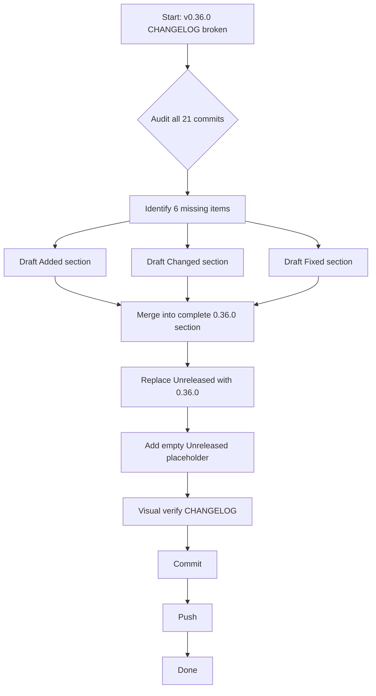

# Fix v0.36.0 Release Notes

**Date:** 2026-08-04
**Status:** Done — shipped in v0.36.0 (`ebb087f`)
**Severity:** High — public release has no CHANGELOG section and missing items

## Problem

The `v0.36.0` tag was cut on commit `1677f08` (2026-08-03) without updating `CHANGELOG.md`:

1. **No `[0.36.0]` section exists** — the entire release content is stranded under `[Unreleased]`
2. **The headline bug fix is undocumented** — `f61b60b` (plainText tree re-printing on every tick) is the most user-visible fix and appears nowhere
3. **Two features missing from CHANGELOG entirely:**
   - `2ba275d` — `feat(nom): activity kind and status definitions` (`Allowed` fields on `InvalidActivityKindError`/`InvalidActivityStatusError`)
   - `30427a7` — `feat(graph): extend DOT graph rendering with color and enum support` (exported `AllRankDirs`/`AllSplineStyles`, dynamic `Allowed` fields, hardcoded allowed-value strings eliminated)
4. **The sentinel error exports are missing** — `ErrColumnMismatch`/`ErrNilRow` were unexported and are now exported (`d0c67fd`) but not in CHANGELOG
5. **The `errors.As` → `errors.AsType` migration is missing** — Go 1.26 generic migration (`d0c67fd`)
6. **GitHub release used `generate_release_notes: true`** — dumped raw commit messages instead of curated notes

## What Shipped in v0.36.0 (v0.35.0..v0.36.0, 21 commits)

| Commit    | Type     | What it did                                                                                              | In CHANGELOG?                                                                 |
| --------- | -------- | -------------------------------------------------------------------------------------------------------- | ----------------------------------------------------------------------------- |
| `d0c67fd` | feat     | Three-tier error system: exported `ErrColumnMismatch`/`ErrNilRow`, `errors.As`→`AsType`, ADR 013         | **MISSING** (sentinels + migration)                                           |
| `30427a7` | feat     | Graph DOT color/enum: exported `AllNodeShapes`/`AllRankDirs`/`AllSplineStyles`, dynamic `Allowed` fields | Partial (exports listed, `Allowed` fields listed, but NOT as a graph feature) |
| `2ba275d` | feat     | nom activity kind/status: `Allowed` fields on typed errors                                               | **MISSING**                                                                   |
| `8ea2709` | test     | Error contract tests across all packages                                                                 | Listed                                                                        |
| `850f70a` | docs     | `docs/ERROR_SYSTEM.md`, AGENTS.md update                                                                 | Listed                                                                        |
| `f4b58e0` | feat     | CHANGELOG update (the only CHANGELOG touch during the release)                                           | N/A (this IS the changelog touch)                                             |
| `f61b60b` | **fix**  | **plainText tree re-printing on every tick**                                                             | **MISSING**                                                                   |
| `1677f08` | test     | Regression tests for plainText fix                                                                       | N/A                                                                           |
| `5c52320` | chore    | Deps update across all modules                                                                           | **MISSING**                                                                   |
| `3e46b9f` | chore    | Deps update across all submodules                                                                        | **MISSING**                                                                   |
| `c3bac0e` | chore    | v0.35.0 release prep                                                                                     | N/A (part of v0.35.0 release)                                                 |
| `6a473f5` | docs     | v0.35.0 self-review doc                                                                                  | N/A                                                                           |
| `a1b56e6` | refactor | Error system plan v2 + color.go changes                                                                  | N/A (internal)                                                                |
| `9144261` | docs     | Error system v2 design doc                                                                               | N/A (internal)                                                                |
| `ed3785d` | docs     | Error system doc overhaul                                                                                | N/A (internal)                                                                |
| `8aba9ae` | refactor | Split root contract tests                                                                                | N/A (internal)                                                                |
| `64e8878` | docs     | Error system v2 brutal self-review                                                                       | N/A (internal)                                                                |
| `330fe86` | test     | ID generation test coverage                                                                              | N/A (internal)                                                                |
| `6e7ed26` | chore    | direnv env vars                                                                                          | N/A (internal)                                                                |
| `aab125b` | chore    | Website tailwind rebuild                                                                                 | N/A (internal)                                                                |
| `371cb85` | chore    | table module deps                                                                                        | N/A (internal)                                                                |

## Pareto Breakdown

### The 1% that delivers 51%

Write the correct `[0.36.0]` CHANGELOG section. This is the single source of truth that every consumer reads. Getting it right fixes the core problem.

### The 4% that delivers 64%

Write the CHANGELOG section COMPLETELY — no missing items. Audit every commit in `v0.35.0..v0.36.0` and ensure each user-facing change is documented.

### The 20% that delivers 80%

- Complete `[0.36.0]` CHANGELOG section
- Clear `[Unreleased]` to empty (ready for future work)
- Commit with a message that explains what went wrong and what was fixed

### The other 20%

- Planning doc (this file)
- Proper commit message
- Push

## Execution Plan

### Macro Tasks (30-100min each)

| #   | Task                                                               | Impact   | Effort | Priority |
| --- | ------------------------------------------------------------------ | -------- | ------ | -------- |
| 1   | Write complete `[0.36.0]` CHANGELOG section with all missing items | Critical | 30min  | P0       |
| 2   | Reset `[Unreleased]` to empty placeholder                          | Medium   | 5min   | P1       |
| 3   | Commit and push                                                    | Medium   | 5min   | P1       |

### Micro Tasks (max 12min each)

| #   | Task                                                                     | Impact   | Effort | Priority |
| --- | ------------------------------------------------------------------------ | -------- | ------ | -------- |
| 1.1 | Draft `[0.36.0]` Added section (sentinels, exports, graph feature, docs) | Critical | 10min  | P0       |
| 1.2 | Draft `[0.36.0]` Changed section (Allowed fields, errors.AsType, deps)   | Critical | 8min   | P0       |
| 1.3 | Draft `[0.36.0]` Fixed section (plainText tree fix, error message fix)   | Critical | 5min   | P0       |
| 1.4 | Edit CHANGELOG.md: insert `[0.36.0]` section + empty `[Unreleased]`      | Critical | 5min   | P0       |
| 2.1 | Verify CHANGELOG renders correctly (visual inspection)                   | Medium   | 3min   | P1       |
| 3.1 | Git commit with detailed message                                         | Medium   | 5min   | P1       |
| 3.2 | Git push                                                                 | Medium   | 2min   | P1       |

## Execution Graph

## What the Fixed CHANGELOG Will Contain

### [0.36.0] - 2026-08-03

**Added:**

- Three-tier error system: exported sentinel errors `ErrColumnMismatch` and `ErrNilRow` for `errors.Is` matching
- Exported `AllColorModes`, `AllNodeShapes` (root), `AllRankDirs`, `AllSplineStyles` (graph) for programmatic enumeration
- `Allowed` fields on all typed errors (`InvalidColorModeError`, `InvalidNodeShapeError`, `InvalidRankDirError`, `InvalidSplineStyleError`, `InvalidActivityStatusError`, `InvalidActivityKindError`)
- Error contract tests across output/graph/d2/nom
- `docs/ERROR_SYSTEM.md` and ADR 013

**Changed:**

- Hardcoded allowed-value strings in error messages replaced with dynamic formatting from `Allowed` slices
- `errors.As` migrated to Go 1.26's generic `errors.AsType[*T]`
- Dependency refresh across all modules

**Fixed:**

- plainText (CI/non-TTY) renderer no longer re-prints the entire tree on every tick — timing values are stripped before diffing so only structural changes trigger a reprint
- `InvalidNodeShapeError` message corrected from "invalid graph shape" to "invalid node shape"
- `ErrColumnMismatch` was documented as exported but was actually unexported — now properly exported to match the contract
