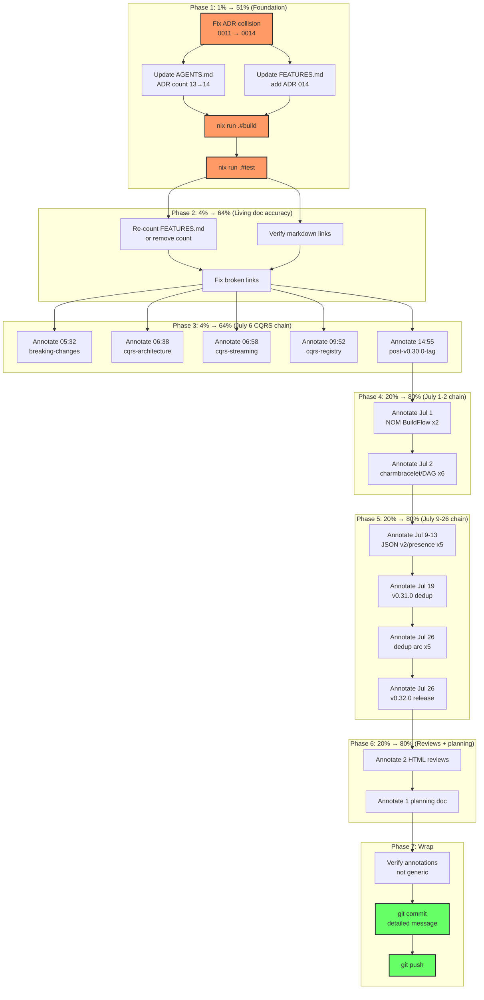

# Comprehensive Execution Plan — Docs Health Completion & Annotation Sweep

**Date:** 2026-08-04 00:43
**Status:** Active — executing immediately after planning
**Source:** `docs/status/2026-08-04_00-41_docs-health-audit-and-historical-annotation-pass.md` (self-review identifying gaps)
**Scope:** Fix correctness issues from prior session + complete the annotation pass over all 28 remaining historical files
**Verschlimmbesser prevention:** Every annotation cites specific commit hashes, version tags, or TODO_LIST cross-refs. No generic banners. Every file read before editing.

---

## Context

The prior session (00:14–00:41) rebuilt the living docs (TODO_LIST, ROADMAP, FEATURES) and annotated 12 of 48 historical files. The self-review identified 6 correctness failures and 28 un-annotated files. This plan closes both gaps.

**The two failure classes:**

1. **Correctness** — the ADR numbering collision was identified but not fixed; the wrong quality gate was run; the FEATURES count is imprecise; markdown links unverified
2. **Completeness** — 28 historical files still have stale "not done" / "NOT STARTED" claims that are now resolved

---

## Pareto Breakdown

### 1% → 51% (Foundation correctness — if these are wrong, nothing else matters)

| Task                                          | Why it's 1%                                                | Impact                                                  |
| --------------------------------------------- | ---------------------------------------------------------- | ------------------------------------------------------- |
| Fix ADR numbering collision (`0011` → `0014`) | Split brain in architecture docs — two files claim ADR 011 | Every ADR reference is ambiguous until fixed            |
| Run `nix run .#build`                         | Verify doc edits didn't break compilation                  | If build fails, all annotation work is moot             |
| Run `nix run .#test`                          | Verify all modules pass                                    | CI has been red for a month; need to know current state |

### 4% → 64% (Living doc accuracy + highest-signal annotations)

| Task                                             | Why it's 4%                                                                                    | Impact                                       |
| ------------------------------------------------ | ---------------------------------------------------------------------------------------------- | -------------------------------------------- |
| Update AGENTS.md ADR count (13→14) + add ADR 014 | Living doc must reflect reality                                                                | Every AI session reads AGENTS.md first       |
| Re-count FEATURES.md or remove count             | Imprecise count undermines trust in the whole file                                             | "If the count is wrong, what else is wrong?" |
| Verify internal markdown links                   | Broken links = ghosts (Critical severity per skill)                                            | Reader trust                                 |
| Annotate July 6 CQRS chain (5 files)             | Each session's "partially done" was resolved by the NEXT session — highest stale-claim density | 5 files with clear, traceable resolutions    |

### 20% → 80% (Remaining annotation chains — chronological completeness)

| Task                                                         | Why it's 20%                                                  | Impact  |
| ------------------------------------------------------------ | ------------------------------------------------------------- | ------- |
| Annotate July 1 NOM BuildFlow chain (2 files)                | First chain; items resolved by session 2 and v0.23.0          | 2 files |
| Annotate July 2 charmbracelet/DAG chain (6 files)            | Golden tests, dead code, PhysicalLineCount all done           | 6 files |
| Annotate July 9–13 JSON v2 / public presence chain (5 files) | v2 migration established; pointer deref superseded by v0.31.0 | 5 files |
| Annotate July 19 v0.31.0 dedup (1 file)                      | v0.31.0 shipped; blockers resolved                            | 1 file  |
| Annotate July 26 dedup arc (5 files)                         | All dedup work closed (t=4=0)                                 | 5 files |
| Annotate July 26 v0.32.0 release (1 file)                    | Tag defect worked around by v0.34.0/v0.35.0                   | 1 file  |
| Annotate 2 HTML reviews                                      | Open items likely resolved                                    | 2 files |
| Annotate 1 remaining planning doc                            | Tier 2–4 shipped in v0.23.0                                   | 1 file  |

### Other 20% (Backlog — real work, not docs-health)

These are in TODO_LIST.md already. Not part of this plan's execution but listed for completeness: TUI deadlock, art-dupl CI, retract v0.34.0, bogus-tag root cause, dependabot, pin Actions, d2 error migration, cross-module error test, GitHub releases, consumer repo pushes, TUI Flush, v1.0.0 tag, community launch.

---

## Macro Tasks (30–100 min each)

Sorted by importance × impact ÷ effort.

| #   | Phase   | Task                                                                                                                                             | Effort  | Impact                       |
| --- | ------- | ------------------------------------------------------------------------------------------------------------------------------------------------ | ------- | ---------------------------- |
| M1  | 1%→51%  | Fix ADR collision: rename `0011-api-stability-tiers.md` → `0014-api-stability-tiers.md`, update title, update AGENTS.md + FEATURES.md references | 30 min  | Critical — split brain       |
| M2  | 1%→51%  | Run quality gate: `nix run .#build` + `nix run .#test` — verify no breakage from doc edits                                                       | 30 min  | Critical — foundation        |
| M3  | 4%→64%  | Living doc fixes: re-count FEATURES.md, verify markdown links, fix any broken references                                                         | 30 min  | High — trust                 |
| M4  | 4%→64%  | Annotate July 6 CQRS chain (5 files: 05:32, 06:38, 06:58, 09:52, 14:55)                                                                          | 50 min  | High — 5 stale-claim files   |
| M5  | 20%→80% | Annotate July 1–2 chain (8 files: NOM BuildFlow 2, charmbracelet/DAG 6)                                                                          | 80 min  | Medium — chronological chain |
| M6  | 20%→80% | Annotate July 9–26 chain (12 files: JSON v2 2, public presence 3, v0.31.0 1, dedup 5, v0.32.0 1)                                                 | 100 min | Medium — 12 files            |
| M7  | 20%→80% | Annotate reviews + planning (3 files: 2 HTML reviews, 1 planning doc)                                                                            | 30 min  | Low — lowest traffic         |
| M8  | Wrap    | Commit with detailed message + push                                                                                                              | 10 min  | Required                     |

**Total estimated effort:** ~5 hours

---

## Micro Tasks (≤12 min each)

### Phase 1: 1% → 51% (Foundation)

| #   | Task                                                                               | Effort | Depends on |
| --- | ---------------------------------------------------------------------------------- | ------ | ---------- |
| 1   | `git mv docs/adr/0011-api-stability-tiers.md docs/adr/0014-api-stability-tiers.md` | 1 min  | —          |
| 2   | Edit `0014-api-stability-tiers.md`: title `ADR 011` → `ADR 014`                    | 2 min  | 1          |
| 3   | Update AGENTS.md: `13 ADRs` → `14 ADRs`, add `(014)` to ADR list                   | 3 min  | 2          |
| 4   | Update FEATURES.md: add ADR 014 row, fix any 011 references                        | 3 min  | 2          |
| 5   | `nix run .#build` — verify all 19 modules compile                                  | 5 min  | 1-4        |
| 6   | `nix run .#test` — verify all 19 modules pass                                      | 5 min  | 5          |

### Phase 2: 4% → 64% (Living doc accuracy)

| #   | Task                                                                                | Effort | Depends on |
| --- | ----------------------------------------------------------------------------------- | ------ | ---------- |
| 7   | Count actual FULLY_FUNCTIONAL rows in FEATURES.md tables                            | 5 min  | —          |
| 8   | Update or remove FEATURES.md count at bottom                                        | 3 min  | 7          |
| 9   | Run `grep -roE '\]\([^)]+\)' *.md docs/adr/*.md` and verify each link target exists | 7 min  | —          |
| 10  | Fix any broken markdown links found                                                 | 5 min  | 9          |

### Phase 3: 4% → 64% (July 6 CQRS chain — 5 files)

| #   | Task                                                                            | Effort | Depends on |
| --- | ------------------------------------------------------------------------------- | ------ | ---------- |
| 11  | Read + annotate `2026-07-06_05-32_v0.30.0-breaking-changes-execution-status.md` | 10 min | —          |
| 12  | Read + annotate `2026-07-06_06-38_cqrs-architecture-completion-status.md`       | 10 min | —          |
| 13  | Read + annotate `2026-07-06_06-58_cqrs-streaming-fix-status.md`                 | 10 min | —          |
| 14  | Read + annotate `2026-07-06_09-52_cqrs-registry-rewire-status.md`               | 10 min | —          |
| 15  | Read + annotate `2026-07-06_14-55_post-v0.30.0-tag-self-review.md`              | 10 min | —          |

### Phase 4: 20% → 80% (July 1–2 chain — 8 files)

| #   | Task                                                                                          | Effort | Depends on |
| --- | --------------------------------------------------------------------------------------------- | ------ | ---------- |
| 16  | Read + annotate `2026-07-01_12-33_NOM-BUILDFLOW-INTEGRATION-EVENTS.md`                        | 10 min | —          |
| 17  | Read + annotate `2026-07-01_18-40_NOM-BUILDFLOW-INTEGRATION-COMPLETION.md`                    | 10 min | —          |
| 18  | Read + annotate `2026-07-02_00-53_comprehensive-status-post-charmbracelet-x-integration.html` | 10 min | —          |
| 19  | Read + annotate `2026-07-02_01-31_comprehensive-status-pre-v1-readiness.md`                   | 10 min | —          |
| 20  | Read + annotate `2026-07-02_02-12_comprehensive-status-post-testing-round.md`                 | 10 min | —          |
| 21  | Read + annotate `2026-07-02_03-54_daghtml-sdk-cross-project-extraction.md`                    | 10 min | —          |
| 22  | Read + annotate `2026-07-02_07-06_dag-innovations-comprehensive-status.html`                  | 10 min | —          |
| 23  | Read + annotate `2026-07-02_10-03_v0.23.0-release-status.md`                                  | 10 min | —          |

### Phase 5: 20% → 80% (July 9–26 chain — 12 files)

| #   | Task                                                                           | Effort | Depends on |
| --- | ------------------------------------------------------------------------------ | ------ | ---------- |
| 24  | Read + annotate `2026-07-09_05-20_buildflow-breakage-and-json-import-fix.html` | 10 min | —          |
| 25  | Read + annotate `2026-07-10_23-18_json-v2-migration-brutal-self-review.md`     | 10 min | —          |
| 26  | Read + annotate `2026-07-13_21-18_public-presence-status.md`                   | 10 min | —          |
| 27  | Read + annotate `2026-07-13_21-45_domains-firebase-hosting-status.md`          | 10 min | —          |
| 28  | Read + annotate `2026-07-13_21-59_docs-health-audit-honest-self-review.md`     | 10 min | —          |
| 29  | Read + annotate `2026-07-19_04-58_v0.31.0-dedup-sweep-and-debt.md`             | 12 min | —          |
| 30  | Read + annotate `2026-07-26_09-04_type-aware-dedup-session-status.html`        | 10 min | —          |
| 31  | Read + annotate `2026-07-26_09-29_type-aware-dedup-sweep-continued.md`         | 10 min | —          |
| 32  | Read + annotate `2026-07-26_09-48_deduplication-closure-self-review.md`        | 10 min | —          |
| 33  | Read + annotate `2026-07-26_17-14_dedup-t2-sweep-self-review.md`               | 10 min | —          |
| 34  | Read + annotate `2026-07-26_17-26_followup-sweep-self-review.md`               | 10 min | —          |
| 35  | Read + annotate `2026-07-26_18-34_v0-32-0-release-self-review.md`              | 10 min | —          |

### Phase 6: 20% → 80% (Reviews + planning — 3 files)

| #   | Task                                                                                     | Effort | Depends on |
| --- | ---------------------------------------------------------------------------------------- | ------ | ---------- |
| 36  | Read + annotate `docs/reviews/2026-07-02_01-30_brutal-self-review.html`                  | 10 min | —          |
| 37  | Read + annotate `docs/reviews/2026-07-02_07-30_brutal-self-review-daghtml.html`          | 10 min | —          |
| 38  | Read + annotate `docs/planning/2026-07-02_04-41_innovating-beyond-nom-execution-plan.md` | 10 min | —          |

### Phase 7: Wrap

| #   | Task                                                           | Effort | Depends on |
| --- | -------------------------------------------------------------- | ------ | ---------- |
| 39  | Verify no annotation is generic (re-read 3 random annotations) | 5 min  | 11-38      |
| 40  | `git status` + commit with detailed message                    | 5 min  | 1-39       |
| 41  | `git push`                                                     | 2 min  | 40         |

---

## Mermaid Execution Graph

---

## Annotation Pattern (applied to every file)

Each annotation follows the update-old-docs skill rules:

1. **Read the file tail** to find the exact insertion point (last line before EOF)
2. **Write a `## Resolution (2026-08-04)` appendix** with:
   - What shipped (version tag + commit hashes if known)
   - Which items are still open (TODO_LIST cross-reference)
   - No generic text — must be specific to THIS file's claims
3. **For HTML files**: insert an HTML comment before `</body>` (non-destructive, no visual change)
4. **For files with stale opening/TL;DR claims**: inline-correct if the claim is load-bearing

**"So what?" test**: every annotation must tell a reader "this shipped in vX.Y.Z" or "this is still open, see TODO_LIST item N." If it doesn't, delete it.

---

## VERSCHLIMMBESSER Prevention Checklist

- [ ] No generic banners ("✅ Updated!")
- [ ] No annotation that could apply to any file
- [ ] No renumbering of existing list items
- [ ] No editing of historical content (append only)
- [ ] Every annotation cites a version tag or commit hash
- [ ] HTML annotations are comments (no visual change, no CSP violation)
- [ ] No `git restore` on files I didn't change
- [ ] Read before edit (every file, every time)
- [ ] Run build+test before committing
