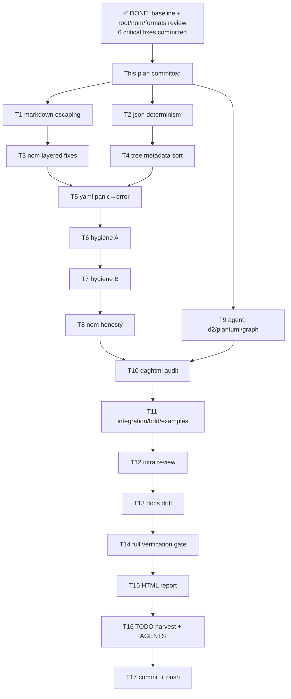

# SUPERB Code-Review Completion Plan — go-output

**Date:** 2026-08-16 09:00
**Context:** Deep full-code review (full-code-review skill) of 19 modules / 375 Go files / ~49.1k lines. Sessions 1-3 completed: green baseline, root + nom + format-module reviews, **6 verified-critical fixes committed** (`41683ad`, `c4e6069`, `e58c8bf`, `b28aa31`): Mermaid HTML-injection + entity smuggling, nom renderMode data race (with -race regression), XML footer loss + CQRS/Marshal unification, ActivityCounts custom-status gap (new `Other` bucket), nil guards (`SetActivityState`, `Finish`), TUI mouse-click mapping (with layout-pinning test).
**Remaining:** verified-findings fix batch, 5 module reviews, infra review, closeout artifacts.

**Prime directive: no VERSCHLIMMBESSER.** Every fix verified against rendered/actual behavior before changing; every agent claim line-verified before acting; goldens are the contract — if a fix changes a golden, the reason must be understood first.

---

## Pareto Breakdown

### The 1% that delivers 51% — ✅ DONE

Green baseline + root module + nom concurrency + the 6 verified-critical fixes (security, data loss, races, wrong click targets). Without these, everything else polishes a broken core.

### The 4% that delivers 64% — verified-findings fix batch (~3h)

Small, individually verified correctness/determinism/honesty bugs already located by the review. Each is a 5-25 min surgical fix + test. No design risk.

### The 20% that delivers 80% — remaining reviews (~2.5h)

d2/, plantuml/, daghtml/ (escaping/XSS surfaces — highest residual security risk), graph/ remainder, integration/bdd/examples, infra (go.mod Pattern B parity, CI, scripts, docs drift). Catches unknown-unknowns; agent-assisted with verify-before-fix.

### The other 20% to reach 100% — closeout (~1.5h)

Full-repo verification (build/test/lint/race-all), HTML review report (Bauhaus Dark kit → `docs/reviews/`), TODO_LIST.md harvest of unfixed/deferred findings, AGENTS.md pattern updates, final commit + push.

---

## Level 1 — Tasks (10-30 min each), sorted by importance/impact

| #   | Task                                                                                                  | Tier  | Impact                             | Effort | Value |
| --- | ----------------------------------------------------------------------------------------------------- | ----- | ---------------------------------- | ------ | ----- |
| T1  | Markdown cell escaping (`\|`, newline) — breaks tables today                                          | 4%    | High (user-facing correctness)     | 25m    | ★★★★★ |
| T2  | serialization determinism (2× `json.Deterministic`) + parity test                                     | 4%    | High (CQRS≡registry contract)      | 15m    | ★★★★★ |
| T3  | nom layered-mode fixes (priority inversion, map order, separator) — verify each first                 | 4%    | Med-High                           | 25m    | ★★★★  |
| T4  | tree metadata map-iteration sort + determinism golden                                                 | 4%    | Med-High (nondeterministic output) | 15m    | ★★★★  |
| T5  | yaml panic→error + flip panic test                                                                    | 4%    | Med (API honesty)                  | 15m    | ★★★   |
| T6  | Test hygiene batch A (no-op MarshalError ×6, xml_test `&&`→`\|\|`)                                    | 4%    | Med                                | 25m    | ★★★   |
| T7  | Test hygiene batch B (blind sleeps ×2, hermetic subscriber, colored footer golden, 2-metadata golden) | 4%    | Med                                | 25m    | ★★★   |
| T8  | nom honesty cleanups (doc.go concurrency rewrite, `snapshotRoots` dead code, FormatDuration dedup)    | 4%    | Med                                | 25m    | ★★★   |
| T9  | Agent review d2/ + plantuml/ + graph/ remainder (verify before fix)                                   | 20%   | Med                                | 30m    | ★★★★  |
| T10 | daghtml XSS/template audit (personal) + markup streaming HTML check                                   | 20%   | High (security surface)            | 20m    | ★★★★  |
| T11 | integration/ + bdd/ + examples/ review                                                                | 20%   | Med                                | 20m    | ★★★   |
| T12 | Infra review: go.mod parity (19×), .golangci allow-lists, scripts, CI workflows                       | 20%   | Med                                | 25m    | ★★★   |
| T13 | Docs drift check (AGENTS.md claims vs code, CHANGELOG)                                                | 20%   | Low-Med                            | 15m    | ★★    |
| T14 | Full verification: `nix run .#build && .#test && .#lint && .#test-race-all`                           | Close | Critical (gate)                    | 15m    | ★★★★★ |
| T15 | HTML review report → `docs/reviews/2026-08-16_*_full-code-review.html`                                | Close | High (deliverable)                 | 30m    | ★★★★★ |
| T16 | TODO_LIST.md harvest + AGENTS.md pattern updates                                                      | Close | High (deliverable)                 | 20m    | ★★★★  |
| T17 | Final commit + push                                                                                   | Close | Critical                           | 10m    | ★★★★★ |

---

## Level 2 — Subtasks (max 12 min each)

| #     | Subtask                                                                               | Parent | Est |
| ----- | ------------------------------------------------------------------------------------- | ------ | --- |
| S1.1  | Read markdown render paths; confirm `\|`/newline corruption                           | T1     | 8m  |
| S1.2  | Add `escape.MarkdownCell` + table tests + fuzz seed                                   | T1     | 10m |
| S1.3  | Wire into markdown renderer (cells, headers, footer)                                  | T1     | 10m |
| S1.4  | Regenerate goldens IF and ONLY IF drift reason understood; run module tests           | T1     | 10m |
| S2.1  | Add `json.Deterministic(true)` at serialization/json.go:32,64                         | T2     | 5m  |
| S2.2  | CQRS-vs-registry map-order parity test; run tests                                     | T2     | 10m |
| S3.1  | Verify statusPriority inversion (read tree_render_layered.go:160-175 + tree_priority) | T3     | 10m |
| S3.2  | Fix priority to `Status.Interest()`; update layered tests                             | T3     | 10m |
| S3.3  | Verify + fix collapsed-category map order (sort keys)                                 | T3     | 10m |
| S3.4  | Verify + fix ≥10-layer separator alignment                                            | T3     | 10m |
| S4.1  | Sort metadata keys in tree/tree.go:115-119                                            | T4     | 5m  |
| S4.2  | Golden with 2 metadata keys (regression guard); run tests                             | T4     | 10m |
| S5.1  | Wrap yaml.Marshal with recover→error; check existing panic test                       | T5     | 10m |
| S6.1  | Read + fix xml_test.go:162 boolean operator                                           | T6     | 5m  |
| S6.2  | Rewrite/delete 6 no-op MarshalError tests (make them assert real errors)              | T6     | 12m |
| S7.1  | Replace blind sleep at nom/inline_renderer_test.go:226 with renderNotify/t.Cleanup    | T7     | 12m |
| S7.2  | Replace blind sleep at nom/timing_cache_test.go:216                                   | T7     | 10m |
| S7.3  | Hermetic `newTestSubscriber` for progress_events_test                                 | T7     | 10m |
| S7.4  | Colored footer golden + tree metadata golden (if not S4.2)                            | T7     | 10m |
| S8.1  | Rewrite nom/doc.go concurrency section (snapshot model, not shared pointers)          | T8     | 10m |
| S8.2  | Delete `snapshotRoots` dead code; build                                               | T8     | 5m  |
| S8.3  | Consolidate FormatDuration/formatDuration                                             | T8     | 12m |
| S9.1  | Launch agent: review d2/ (escaping, typed errors, domain model)                       | T9     | 5m  |
| S9.2  | Launch agent: review plantuml/ + graph/ remainder                                     | T9     | 5m  |
| S9.3  | Verify every agent claim (line-check) before fixing                                   | T9     | 12m |
| S10.1 | Audit daghtml template.CSS/JS/HTML injection typing + data flow                       | T10    | 12m |
| S10.2 | Audit markup/streaming.go HTML template + daghtml dagToJSON                           | T10    | 10m |
| S11.1 | Skim integration/ (20 files) for coverage gaps + encoding-bug tests                   | T11    | 12m |
| S11.2 | Skim bdd/ + examples/                                                                 | T11    | 10m |
| S12.1 | Script: verify 19× go.mod Pattern B sentinels + replace parity                        | T12    | 10m |
| S12.2 | Review scripts/*.sh + .github/workflows/{ci,release}.yml                              | T12    | 12m |
| S12.3 | Depguard allow-list audit vs actual imports                                           | T12    | 8m  |
| S13.1 | AGENTS.md/README/CHANGELOG claim spot-check vs code                                   | T13    | 12m |
| S14.1 | Run full nix verification suite; triage failures                                      | T14    | 12m |
| S15.1 | Draft report stats + findings inventory                                               | T15    | 12m |
| S15.2 | Write HTML report from Bauhaus Dark template                                          | T15    | 12m |
| S15.3 | Inline review graph; final read-through                                               | T15    | 8m  |
| S16.1 | Harvest unfixed/deferred findings → TODO_LIST.md                                      | T16    | 12m |
| S16.2 | AGENTS.md: new invariants (mouse mapping, layout pin test, Other bucket)              | T16    | 10m |
| S17.1 | git status review; detailed commit; push                                              | T17    | 10m |

---

## Execution Graph (mermaid.js)

## Rules of Engagement

1. **Verify before fix** — every claim (mine or agent's) gets read/probed at the exact lines first. This session: 7/7 verified claims were real; keep the ratio.
2. **Goldens are the contract** — regeneration only after the drift reason is understood and named.
3. **Tests must not encode bugs** — a test deriving expectations from the same constant as the implementation verifies nothing (3 such cases found and fixed this review).
4. **Commit after each green module** — never leave the tree broken across an interrupt; the auto-git daemon commits whatever state exists.
5. **No push until the verification gate (T14) passes.**
